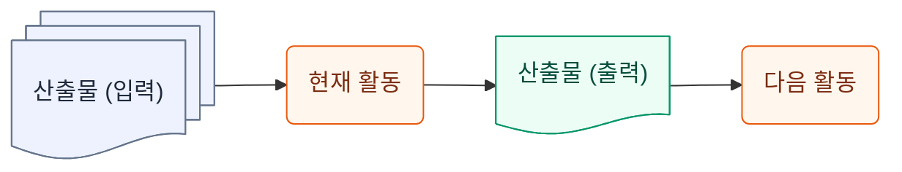
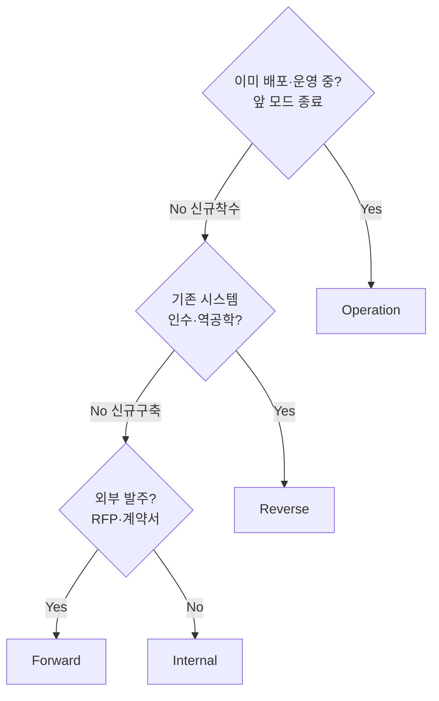

> AgiTeamBuilder가 찍어내는 모든 자식 프로젝트의 **공통 기준 문서**.
> ActionNpaper 매트릭스(외부 참조)를 AgiTeamBuilder 컨텍스트로 이식·정합화한 표준이다.

---

## 1. 적용 범위

본 매트릭스는 AgiTeamBuilder 로 생성되는 AgiTeam에 적용한다. 

## 2. 설계 원칙

### 2.1 기본 원칙

각 프로젝트 활동은 입력 산출물 또는 외부 자료를 참고하여 수행되고, 그 결과로 하나 이상의 산출물을 만든다.



### 2.2 핵심 원칙 (오케스트레이터 합의)

- **오케스트레이터(Human Orchestrator)** 는 AI Agent가 아닌 실제 사람이다 — RACI에서 1급 시민 컬럼으로 포함한다.
- 산출물을 읽고 활동하면 산출물이 나오는 구조로 만든다.
- 인풋은 입력 산출물이고, 아웃풋은 작성해야 할 출력 산출물이다.
- 프로젝트 단계는 **착수준비·분석·설계·구현·테스트·이행·운영**의 7단계로 구분한다.
- 활동별로 책임 관계를 표시한다.
- **IA 설계가 먼저 있어야 UI 설계 범위와 화면 개수를 알 수 있다.**
- 산출물 코드값은 **10 단위로 증가**한다 (사이 삽입 필요 시 5 단위 사용).
- 활동에는 별도 코드를 부여하지 않는다.
- 모든 산출물은 산출물 코드로 명명하고 관리한다.
- 표의 구조는 깨지지 않게 유지한다.

### 2.3 단계와 활동 정의


| 구분     | 의미                                                                                             |
| ---------- | -------------------------------------------------------------------------------------------------- |
| **단계** | 착수준비·분석·설계·구현·테스트·이행·운영으로 구분한 프로젝트 수행 구간                     |
| **활동** | 각 단계 안에서 산출물을 만들기 위해 수행하는 구체 작업 단위. 책임 매트릭스의 각 행이 하나의 활동 |

### 2.4 요구사항 문서 구분


| 문서                        | 의미                                                                                   |
| ----------------------------- | ---------------------------------------------------------------------------------------- |
| **요구사항 목록** (AN-10)   | 요구사항 수집 활동의 결과물이며, 아직 정제 전의 요구사항 목록                          |
| **요구사항 정의서** (AN-20) | 요구사항 목록을 정제하여 오케스트레이터와 합의하고, 프로젝트의 범위를 기술한 기준 문서 |
| **요구사항 명세서** (AN-40) | 요구사항을 구현 관점으로 상세화한 문서이며 설계의 단초가 되는 문서                     |

### 2.5 IA와 UI의 관계


| 구분                | 설명                                                             |
| --------------------- | ------------------------------------------------------------------ |
| **IA 설계** (DS-10) | 메뉴, 화면 목록, 화면 흐름을 정의하여 UI 설계 대상과 개수를 확정 |
| **UI 설계** (DS-50) | IA에서 도출된 화면 단위별로 화면을 구체 설계                     |

---

## 3. 코드 체계

### 3.1 단계 코드


| 코드   | 단계                  |
| -------- | ----------------------- |
| **IN** | 착수준비 (Initiation) |
| **AN** | 분석 (Analysis)       |
| **DS** | 설계 (Design)         |
| **DV** | 구현 (Development)    |
| **TS** | 테스트 (Test)         |
| **IM** | 이행 (Implementation) |
| **OP** | 운영 (Operation)      |

### 3.2 산출물 코드 부여 원칙


| 원칙                 | 내용                                                                                             |
| ---------------------- | -------------------------------------------------------------------------------------------------- |
| **10단위 증가**      | `[단계코드]-[10단위 순번]` (사이 삽입 필요 시 5 단위)                                            |
| **다음 활동의 입력** | 출력 산출물은 후속 활동의 재료가 된다                                                            |
| **명명 (현행본)**    | `{산출물 코드}_{산출물명}.latest.{ext}` 고정 (예: `AN-20_요구사항정의서.latest.md`). **파일명에 날짜·버전을 넣지 않는다** — 링크가 깨지지 않도록 현행본은 항상 `.latest` 고정. 버전·날짜는 파일 안 frontmatter로 관리 (§3.3) |

### 3.3 버전 관리 규칙

**현행본 파일명은 항상 `.latest`로 고정하고, 버전·날짜는 파일 안 frontmatter와 본문 개정이력으로 관리한다**:

```yaml
---
doc: AN-20 요구사항정의서
version: v0.4
last_updated: 2026-06-03
---
```

- frontmatter `version`(`v0.1` → `v0.2` → ...): **단순 증가 참고 라벨** — 에이전트가 갱신할 때마다 자율로 올린다 (몇 번째 개정인지 표시일 뿐). `last_updated`도 함께 갱신.
- **메이저/마이너 구분·`v1.0` 정식 릴리즈 승격·유저 승인 게이트는 없다.** version 숫자는 어떤 행위도 게이트하지 않는다.
- 개정 이력은 문서 본문 말미 "변경이력" 표에 누적
- 버전업 시에는 `.latest` 갱신 직전 직전본을 같은 폴더의 `_archive/` 아래에 타임스탬프 파일명으로 백업한 뒤, `.latest` 파일을 덮어쓴다 (§3.4)

### 3.4 백업 규칙

현행본(`.latest`)을 덮어쓰기 전 과거본을 반드시 보존한다:

- 백업 위치: 현행본과 같은 폴더의 `_archive/`
- 백업 파일명: `{산출물 코드}_{산출물명}_{YYYYMMDDhhmmss}.{ext}` (초 단위까지 — 같은 날 다회 백업 충돌 방지)
- 예: `_archive/AN-20_요구사항정의서_20260603143052.md`
- 절차: ① 현재 `.latest` 파일을 `_archive/`에 복사 → ② `.latest`의 frontmatter `version`·`last_updated`와 본문 개정이력 갱신 → ③ `.latest` 덮어쓰기
- 백업 파일은 **참조(링크) 대상이 아니다** — 모든 링크는 `.latest`만 가리킨다.

---

## 4. 산출물 기반 책임 매트릭스

본 매트릭스는 **정보공학방법론의 산출물 중심 접근**을 기반으로 하고, **PMP RACI Matrix의 책임 배분 개념을 상속하여 R·A·C만 사용**한다.

### 4.1 RACI 코드 정의


| 코드  | 의미                                                                              |
| ------- | ----------------------------------------------------------------------------------- |
| **R** | Responsible — 산출물 작성 책임                                                   |
| **A** | Accountable — 산출물에 대한 최종 책임                                            |
| **C** | Consulted — R이 활동 수행 또는 산출물 작성 과정에서 의견을 구해야 하는 협의 대상 |

**I(Informed)는 사용하지 않는다.** 활동 결과의 전달과 참조는 산출물 코드와 `재료(입력 산출물)` 열로 관리한다.

**하나의 산출물에는 하나의 R만 지정한다.** 복수 역할의 기여가 필요한 경우 대표 작성 책임자를 R로 두고, 나머지 역할은 C로 둔다.

**C는 R↔C 직접 자문으로 운용하지 않는다 — C = 산출물 참조(기본) + PM 중개(예외).** C의 기여는 C가 작성한 산출물을 R이 `재료(입력 산출물)`로 참조하는 형태로 전달되며, 그 순서·의존은 PM이 통제한다(분석 단계는 병렬 작업 후 상호 참조, 구현·운영 단계는 충돌 방지를 위한 엄격한 순서). 산출물만으로 풀리지 않는 실시간 협의가 필요한 경우에만 PM이 중개한다. **역할 간 직접 연락은 금지되며 협업·조정은 모두 PM을 경유한다.** (근거: Shared 원형 "역할 간 직접 연락 금지 — 협업·조정은 모두 PM 경유", KEAPMS §10 "역할 간 별도 합의는 없다 — PM이 작업 의존 관계를 순서로 지시")

### 4.2 7역할 + 오케스트레이터 컬럼


| 컬럼               | 역할                           |
| -------------------- | -------------------------------- |
| **오케스트레이터** | Human Orchestrator (실제 사람) |
| **PM**             | Project Manager                |
| **Design**         | Designer                       |
| **Arch**           | Architect                      |
| **DevOps**         | DevOps                         |
| **BE**             | DeveloperBE (백엔드 개발)      |
| **FE**             | DeveloperFE (프론트엔드 개발)  |
| **QA**             | QA (품질 감리)                 |

> 본 표는 **역할명만 정의**한다. 인스턴스 별칭(자식 프로젝트별 팀원 이름 — 예: 박피엠·장이너·김아키·김데옵·박개발·프개발·홍감리)은 각 자식 프로젝트의 `brain/Shared/team.md`에서 운용한다. **원형 표준 문서에는 어떤 별칭도 주입하지 않는다.**

### 4.3 매트릭스 본문 — Forward / Internal 전용

> **적용 모드**: Forward(RFP 수주) · Internal(내부 발의). 신규 구축 흐름 — `요구사항 → 설계 → 코드` 순방향.
> Forward와 Internal의 차이는 **AN-10(요구사항 수집)의 입력 하나뿐**이며(Forward=RFP·계약서 / Internal=유저 인터뷰), 그 뒤 흐름은 동일하다.
> **Reverse(인수·역공학) 모드는 흐름이 반대이므로 별도 — §4.4 참조.**


| NO | 단계     | 활동               | 산출물 코드 | 산출물명             | 산출물 설명                                                                                                                | 오케스트레이터 | PM | Design | Arch | DevOps | BE | FE | QA | 선행                                            | 재료(입력 산출물)                                                                                                                          | 정보공학 단계                   |
| :--: | ---------- | -------------------- | ------------- | ---------------------- | ---------------------------------------------------------------------------------------------------------------------------- | ---------------- | ---- | -------- | ------ | -------- | ---- | ---- | ---- | ------------------------------------------------- | -------------------------------------------------------------------------------------------------------------------------------------------- | --------------------------------- |
| 1 | 착수준비 | 수행계획 수립      | IN-10       | 수행계획서           | 프로젝트 수행 체계·범위·일정·관리 계획을 정의한 기준 문서 (A=오케스트레이터)                                            | A              | R  |        | C    | C      |    |    | C  | 없음                                            | PD010 RFP·PD030 계약서 / RD010 인수자료 / 유저 인터뷰                                                                                     | 프로젝트 착수·계획             |
| 2 | 착수준비 | WBS 수립           | IN-20       | WBS                  | 산출물·활동을 분해하여 일정·담당을 배분한 작업분해구조 (A=오케스트레이터)                                                | A              | R  |        | C    | C      |    |    | C  | 수행계획 수립                                   | IN-10 수행계획서                                                                                                                           | 프로젝트 착수·계획             |
| 3 | 착수준비 | 착수보고           | IN-30       | 착수보고서           | 프로젝트 공식 착수를 보고·승인받는 문서 (A=오케스트레이터)                                                                | A              | R  |        | C    | C      |    |    | C  | WBS 수립                                        | IN-10 수행계획서, IN-20 WBS                                                                                                                | 프로젝트 착수·계획             |
| 4 | 분석     | 요구사항 수집      | AN-10       | 요구사항 목록        | 오케스트레이터·RFP·계약서 등을 통해 수집한 정제 전 요구사항 목록                                                         | A              | R  |        | C    |        |    |    |    | 없음                                            | PD010 RFP, PD015 기술협상서, PD030 계약서                                                                                                  | BAA(업무 영역 분석)             |
| 5 | 분석     | 요구사항 정의      | AN-20       | 요구사항 정의서      | 요구사항 목록을 정제하여 오케스트레이터와 합의하고, 프로젝트의 범위를 기술한 기준 문서                                     | A              | R  |        | C    |        | C  | C  |    | 요구사항 수집                                   | AN-10 요구사항 목록                                                                                                                        | BAA(업무 영역 분석)             |
| 6 | 분석     | 요구사항 명세화    | AN-40       | 요구사항 명세서      | 합의된 요구사항을 구현·설계·테스트 관점으로 상세화한 문서                                                                | A              | R  | C      | C    |        | C  | C  | C  | 요구사항 정의                                   | AN-20 요구사항 정의서                                                                                                                      | BAA(업무 영역 분석)             |
| 7 | 분석     | 요구사항 추적      | AN-50       | 요구사항 추적표      | 요구사항↔설계↔구현↔테스트 추적표 (cross-cutting 상시 갱신)                                                              |                | R  | C      | C    | C      | C  | C  | C  | 요구사항 명세화                                 | AN-40, DS-40, DV-20, DV-40, TS-10, TS-20, TS-30                                                                                            | BAA + 품질 관리 (cross-cutting) |
| 8 | 설계     | IA 설계            | DS-10       | IA 구조도            | 메뉴·화면 목록·화면 흐름을 정의한 구조도 (PM이 기획자 역할 겸임)                                                         | A              | R  | C      |      |        |    | C  |    | 요구사항 명세화                                 | AN-20 요구사항 정의서, AN-40 요구사항 명세서                                                                                               | BSD(업무 시스템 설계)           |
| 9 | 설계     | 아키텍처 설계      | DS-20       | 아키텍처 설계서      | 시스템 구성·기술 구조·연계 구조를 정의한 문서                                                                            |                | A  |        | R    | C      | C  |    |    | 요구사항 명세화                                 | AN-40 요구사항 명세서                                                                                                                      | BSD(업무 시스템 설계)           |
| 10 | 설계     | 데이터 모델링      | DS-30       | DB 설계서            | 테이블·컬럼·관계·ERD 등을 정의한 문서                                                                                   |                | A  |        | R    |        | C  |    |    | 아키텍처 설계                                   | DS-20 아키텍처 설계서                                                                                                                      | BSD(업무 시스템 설계)           |
| 11 | 설계     | API 설계           | DS-40       | API 명세서           | API 요청·응답·인증·오류 코드 등을 정의한 문서                                                                           |                | A  |        | R    |        | C  | C  |    | 데이터 모델링                                   | AN-40 요구사항 명세서, DS-30 DB 설계서                                                                                                     | BSD(업무 시스템 설계)           |
| 12 | 설계     | 연동 설계          | DS-60       | 연동규격서           | 외부 프로젝트 또는 타 시스템과 연계하기 위한 대상·방식·전문·파일·인터페이스·제약 조건을 정의한 문서                   | C              | A  |        | R    | C      | C  | C  | C  | 아키텍처 설계                                   | AN-40 요구사항 명세서, DS-20 아키텍처 설계서                                                                                               | BSD(업무 시스템 설계)           |
| 13 | 설계     | UI 설계            | DS-50       | 화면 설계서          | IA 구조도를 기준으로 화면 단위 UI를 정의한 문서 (PM이 기획자 역할 겸임)                                                    | A              | R  | C      |      |        |    | C  |    | IA 설계                                         | DS-10 IA 구조도                                                                                                                            | BSD(업무 시스템 설계)           |
| 14 | 설계     | 디자인 시안 작성   | DS-55       | 디자인 시안          | 메인 화면·핵심 화면의 시각 시안. IA·화면 설계서 후속, 오케스트레이터 시각 컨펌 후 DV-50 퍼블리싱 진행 (A=오케스트레이터) | A              | C  | R      |      |        |    | C  |    | UI 설계                                         | DS-10 IA 구조도, DS-50 화면 설계서                                                                                                         | BSD(업무 시스템 설계)           |
| 15 | 구현     | 환경 구축          | DV-10       | 환경구성서           | 구현·테스트·운영 환경 구성 정보를 정리한 문서                                                                            |                | A  |        | C    | R      |    |    |    | 아키텍처 설계                                   | DS-20 아키텍처 설계서                                                                                                                      | SC(시스템 구축)                 |
| 16 | 구현     | 백엔드 구현        | DV-20       | 백엔드 코드          | 서버·비즈니스 로직·API 구현 코드                                                                                         |                | A  |        | C    |        | R  |    |    | API 설계, 연동 설계                             | DS-40 API 명세서, DS-60 연동규격서, DS-30 DB 설계서                                                                                        | SC(시스템 구축)                 |
| 17 | 구현     | 백엔드 구현        | DV-30       | 단위테스트 코드      | 백엔드 기능 검증을 위한 단위테스트 코드                                                                                    |                | A  |        |      |        | R  |    | C  | API 설계, 연동 설계                             | DS-40 API 명세서, DS-60 연동규격서, DS-30 DB 설계서, DV-20 백엔드 코드                                                                     | SC(시스템 구축)                 |
| 18 | 구현     | 퍼블리싱           | DV-50       | HTML/CSS 산출물      | 화면 퍼블리싱 결과물                                                                                                       |                | A  | R      |      |        |    | C  |    | UI 설계                                         | DS-50 화면 설계서                                                                                                                          | SC(시스템 구축)                 |
| 19 | 구현     | 프론트 구현        | DV-40       | 프론트 코드          | 화면·상태관리·API 연동을 구현한 프론트엔드 코드                                                                          |                | A  | C      |      |        | C  | R  |    | 퍼블리싱, API 설계, 연동 설계                   | DS-50 화면 설계서, DS-40 API 명세서, DS-60 연동규격서, DV-50 HTML/CSS 산출물                                                               | SC(시스템 구축)                 |
| 20 | 구현     | 코드 리뷰          | DV-60       | 코드리뷰 리포트      | 코드 품질·규칙 준수·개선 사항을 정리한 검토 결과                                                                         |                | A  | C      | C    |        | C  | C  | R  | 백엔드 구현, 프론트 구현                        | DV-20 백엔드 코드, DV-40 프론트 코드, DV-50 HTML/CSS 산출물                                                                                | SC(시스템 구축)                 |
| 21 | 테스트   | 시험 계획          | TS-05       | 시험계획서           | 테스트 범위·방법·일정·환경·역할 등 사전 계획                                                                           |                | A  |        | C    | C      | C  | C  | R  | 요구사항 명세화, IA 설계                        | AN-40 요구사항 명세서, DS-10 IA 구조도                                                                                                     | SC(시스템 구축)                 |
| 22 | 테스트   | 단위 테스트        | TS-10       | 단위 테스트 결과서   | 기능 단위 테스트 수행 결과                                                                                                 |                | A  |        |      |        | R  | C  | C  | 시험 계획, 백엔드·프론트 구현                  | TS-05 시험계획서, DV-20 백엔드 코드, DV-30 단위테스트 코드, DV-40 프론트 코드                                                              | SC(시스템 구축)                 |
| 23 | 테스트   | 시나리오 설계      | TS-15       | 시험시나리오         | 단위·통합·QA 테스트의 구체 시나리오 정의 (재현 가능 형식)                                                                |                | A  |        |      |        | C  | C  | R  | 시험 계획                                       | TS-05 시험계획서, AN-40 요구사항 명세서                                                                                                    | SC(시스템 구축)                 |
| 24 | 테스트   | 테스트 데이터 준비 | TS-16       | 테스트데이터         | 시드 데이터·시나리오 템플릿·개별 시나리오 문서·재현용 데이터셋 (QA 자문 반영)                                           |                | A  |        |      | C      | C  | C  | R  | 시나리오 설계, 데이터 모델링                    | TS-15 시험시나리오, DS-30 DB 설계서, AN-40 요구사항 명세서                                                                                 | SC(시스템 구축)                 |
| 25 | 테스트   | 통합 테스트        | TS-20       | 통합 테스트 결과서   | 모듈·API·화면 간 통합 검증 결과                                                                                          |                | A  |        |      | C      | C  | C  | R  | 단위 테스트, 환경 구축, 시나리오, 테스트 데이터 | TS-10 단위 테스트 결과서, TS-15 시험시나리오, TS-16 테스트데이터, DV-10 환경구성서, DV-20 백엔드 코드, DV-40 프론트 코드, DS-60 연동규격서 | SC(시스템 구축)                 |
| 26 | 테스트   | 성능 테스트        | TS-25       | 성능시험결과서       | 응답시간·처리량·부하·자원 사용량 등 비기능 검증 결과                                                                    |                | A  |        | C    | C      | C  | C  | R  | 통합 테스트, 환경 구축                          | TS-20 통합 테스트 결과서, DV-10 환경구성서                                                                                                 | SC(시스템 구축)                 |
| 27 | 테스트   | QA 테스트          | TS-30       | 결함 리스트          | QA 과정에서 식별된 결함 목록                                                                                               | C              | A  |        |      |        | C  | C  | R  | 통합 테스트                                     | TS-20 통합 테스트 결과서                                                                                                                   | SC(시스템 구축)                 |
| 28 | 테스트   | 버그 수정          | TS-40       | 수정 코드            | 결함 수정이 반영된 코드                                                                                                    |                | A  |        | C    |        | R* | C* | C  | QA 테스트                                       | TS-30 결함 리스트                                                                                                                          | SC(시스템 구축)                 |
| 29 | 테스트   | 버그 수정          | TS-50       | 수정 내역서          | 결함별 수정 내용과 조치 결과                                                                                               |                | A  |        |      |        | R* | C* | C  | QA 테스트                                       | TS-30 결함 리스트, TS-40 수정 코드                                                                                                         | SC(시스템 구축)                 |
| 30 | 테스트   | 릴리스 검증        | TS-60       | 릴리스 승인서        | 테스트 결과와 결함 조치 상태를 확인하여 배포 가능 여부를 승인한 문서                                                       | C              | A  |        | C    | C      | C  | C  | R  | QA 테스트, 버그 수정(결함 발생 시)              | TS-20 통합 테스트 결과서, TS-30 결함 리스트, TS-40 수정 코드, TS-50 수정 내역서                                                            | SC(시스템 구축)                 |
| 31 | 테스트   | 보안 점검          | TS-70       | 보안취약성점검결과서 | 보안 취약점 스캔·진단·조치 결과                                                                                          |                | A  |        | C    | R      | C  | C  | C  | 통합 테스트, 환경 구축                          | TS-20 통합 테스트 결과서, DV-10 환경구성서, DV-20 백엔드 코드                                                                              | SC(시스템 구축)                 |
| 32 | 이행     | 마이그레이션 설계  | IM-05       | 마이그레이션절차서   | 기존 시스템 → 신규 시스템 데이터·환경 이관 절차                                                                          |                | A  |        | C    | R      | C  |    |    | 환경 구축, 데이터 모델링                        | DV-10 환경구성서, DS-30 DB 설계서                                                                                                          | SC(시스템 구축)                 |
| 33 | 이행     | 배포               | IM-10       | 배포 결과            | 배포 성공 여부 및 배포 대상 결과                                                                                           |                | A  |        | C    | R      |    |    |    | 릴리스 검증                                     | TS-60 릴리스 승인서, DV-20 백엔드 코드, DV-40 프론트 코드                                                                                  | SC(시스템 구축)                 |
| 34 | 이행     | 배포               | IM-20       | 배포 로그            | 배포 과정에서 발생한 로그 및 증적                                                                                          |                | A  |        |      | R      |    |    |    | 릴리스 검증                                     | TS-60 릴리스 승인서, DV-20 백엔드 코드, DV-40 프론트 코드                                                                                  | SC(시스템 구축)                 |
| 35 | 이행     | UAT                | IM-30       | 사용자 승인서        | 오케스트레이터가 검수 후 승인한 문서                                                                                       | R              | C  |        |      |        |    |    | C  | 배포                                            | IM-10 배포 결과                                                                                                                            | SC(시스템 구축)                 |
| 36 | 이행     | 운영 전환          | IM-40       | 운영 전환 보고서     | 운영 인수인계 및 전환 결과 보고서                                                                                          | A              | R  |        |      | C      |    |    |    | UAT                                             | IM-30 사용자 승인서                                                                                                                        | SC(시스템 구축)                 |
| 37 | 이행     | 사용자 매뉴얼 작성 | IM-50       | 사용자매뉴얼         | 최종 사용자용 기능 안내·화면 가이드·FAQ                                                                                  |                | R  | C      |      |        |    | C  | C  | UI 설계, 프론트 구현                            | DS-50 화면 설계서, DV-40 프론트 코드                                                                                                       | SC(시스템 구축)                 |
| 38 | 이행     | 운영자 매뉴얼 작성 | IM-60       | 운용자매뉴얼         | 운영자용 환경·배포·모니터링·장애 대응 가이드                                                                            |                | A  |        | C    | R      |    |    | C  | 운영 전환, 환경 구축                            | IM-40 운영 전환 보고서, DV-10 환경구성서                                                                                                   | SC(시스템 구축)                 |
| 39 | 운영     | 기술 검증          | OP-05       | 기술적용결과표       | 채택 기술 스택의 적용 결과·평가·교훈 정리                                                                                |                | A  |        | R    | C      | C  | C  |    | 운영 전환                                       | DS-20 아키텍처 설계서, IM-40 운영 전환 보고서                                                                                              | 운영/유지보수                   |
| 40 | 운영     | 모니터링           | OP-10       | 모니터링 리포트      | 운영 시스템 상태·성능·이상 징후 보고서                                                                                   |                | A  |        |      | R      |    |    |    | 운영 전환                                       | 운영 시스템, IM-40 운영 전환 보고서                                                                                                        | 운영/유지보수                   |
| 41 | 운영     | 장애 대응          | OP-20       | 장애 리포트          | 장애 발생 내용·영향도·원인 분석 자료                                                                                     | C              | A  |        | C    | R      | C  | C  |    | 모니터링                                        | OP-10 모니터링 리포트, 외부 이벤트: 장애 신고/알림                                                                                         | 운영/유지보수                   |
| 42 | 운영     | 장애 대응          | OP-30       | 장애 조치 보고서     | 장애 조치 결과와 재발 방지 내용을 정리한 보고서                                                                            | C              | A  |        | C    | R      | C  | C  |    | 모니터링                                        | OP-10 모니터링 리포트, OP-20 장애 리포트                                                                                                   | 운영/유지보수                   |

---

> **\* 결함 R 담당자 (TS-40·TS-50)**: 결함을 일으킨 산출물의 R 담당자가 본 산출물의 R이 된다. BE 코드 결함이면 BE가 R, FE 코드 결함이면 FE가 R, Design 산출물 결함이면 Design이 R이다. 본 원칙은 §4.1 "하나의 R" 단일 R 원칙의 보완이며, "결함 원인 R 담당자 = 결함 수정 R 담당자" 단일 책임 원칙을 따른다.

---

### 4.4 매트릭스 본문 — Reverse 전용 (역공학)


| NO | 단계   | 활동 (역공학)                      | 산출물 코드           | 산출물명                       | 용도          | 오케스트레이터 | PM | Design | Arch | DevOps | BE | FE | QA | 선행                       | 재료(인계 자산·입력)                         |
| :--: | -------- | ------------------------------------ | ----------------------- | -------------------------------- | --------------- | :--------------: | :--: | :------: | :----: | :------: | :--: | :--: | :--: | ---------------------------- | ----------------------------------------------- |
| 1 | 환경   | 개발 환경 구축                     | DV-10                 | 환경구성서                     | 의사결정+운영 |       A       |   |       |  C  |   R   |   |   |   | 없음                       | 인계 코드, 형상서버 접근                      |
| 2 | 분석   | 현황파악 — BE 분석 자료           | (02.reverse 분석자료) | 코드 인벤토리·호출 트레이스   | 의사결정      |       A       | C |       |  C  |   C   | R | C |   | 환경 구축                  | 인계 코드, 돌아가는 시스템                    |
| 3 | 분석   | 현황파악 — FE 분석 자료           | (02.reverse 분석자료) | 화면 인벤토리·라우팅 트레이스 | 의사결정      |       A       | C |   C   |     |       | C | R |   | 환경 구축                  | 인계 코드, 돌아가는 시스템                    |
| 4 | 분석   | 요구사항 역도출                    | AN-40                 | 요구사항 명세서                | 의사결정+운영 |       A       | R |       |  C  |       | C | C | C | BE·FE 분석 자료           | BE·FE 분석 자료, 돌아가는 시스템             |
| 5 | 설계   | DB 역추출 (환경 독립 병렬)         | DS-30                 | DB 설계서                      | 운영필수      |       A       |   |       |  R  |       | C |   |   | 없음(dump.sql 직접)        | dump.sql, 디비 접속정보와 권한                |
| 6 | 설계   | 아키텍처 역추출                    | DS-20                 | 아키텍처 설계서                | 의사결정+운영 |       A       |   |       |  R  |   C   | C | C |   | BE 분석 자료, 환경 구축    | 인계 코드, 환경구성서, 분석 자료              |
| 7 | 설계   | API 역추출                         | DS-40                 | API 명세서                     | 운영필수      |       A       |   |       |  R  |       | C | C |   | DB 역추출, BE 분석 자료    | BE 분석 자료, DS-30 DB 설계서                 |
| 8 | 설계   | IA 역추출                          | DS-10                 | IA 구조도                      | 운영필수      |       A       | R |   C   |     |       |   | C |   | FE 분석 자료               | 돌아가는 시스템(메뉴), FE 분석 자료           |
| 9 | 설계   | 화면 역추출                        | DS-50                 | 화면 설계서                    | 운영필수      |       A       | C |   C   |     |       |   | R |   | IA 역추출                  | DS-10 IA 구조도, FE 분석 자료, 시각 증거      |
| 10 | 설계   | 연동 역추출                        | DS-60                 | 연동규격서                     | 운영필수      |       C       | A |       |  R  |   C   | C | C | C | 아키텍처 역추출            | 인계 코드, DS-20 아키텍처 설계서              |
| 11 | 시각   | 시각 증거 수집 (1급)               | (시각 증거)           | 스크린샷·시안·동작 캡처      | 의사결정      |       A       | C |   R   |     |       |   | C |   | 환경 구축                  | 돌아가는 시스템 (메뉴 전수 클릭)              |
| 12 | 시험   | 시험 계획                          | TS-05                 | 시험계획서                     | 운영필수      |               | A |       |  C  |   C   | C | C | R | 요구사항 역도출, IA 역추출 | AN-40 요구사항 명세서, DS-10 IA 구조도        |
| 13 | 시험   | 시나리오 설계                      | TS-15                 | 시험시나리오                   | 운영필수      |               | A |       |     |       | C | C | R | 시험 계획                  | TS-05 시험계획서, AN-40 요구사항 명세서       |
| 14 | 시험   | 보안 점검                          | TS-70                 | 보안취약성점검결과서           | 운영필수      |               | A |       |  C  |   R   | C | C | C | 통합 분석, 환경 구축       | DS-40 API 명세서, DV-10 환경구성서, 인계 코드 |
| 15 | 이행   | 마이그레이션 설계                  | IM-05                 | 마이그레이션절차서             | 운영필수      |               | A |       |  C  |   R   | C |   |   | 환경 구축, DB 역추출       | DV-10 환경구성서, DS-30 DB 설계서             |
| 16 | 이행   | 운영자 매뉴얼 작성                 | IM-60                 | 운용자매뉴얼                   | 운영필수      |               | A |       |  C  |   R   |   |   | C | 아키텍처 역추출, 환경 구축 | DS-20 아키텍처 설계서, DV-10 환경구성서       |
| 17 | 정합   | 정합 매핑·결함 ID 단일화          | AN-50                 | 요구사항 추적표 / 산출물 INDEX | 운영필수      |               | R |   C   |  C  |   C   | C | C | C | 설계도 복원                | DS-10·DS-40·DS-30·DS-50, 분석 자료         |
| 18 | 게이트 | 인수 게이트 (인수 전→후 baseline) | (인수 의사결정)       | 인수 승인 + 정적추론 승격      | 의사결정      |       A       | R |   C   |  C  |   C   | C | C | C | 전 baseline 복원           | 전 baseline + 실운영 시스템(NDA·SSH·실DB)   |
| 19 | 운영   | 운영 모드 진입                     | —                    | (operation.md 흐름으로 전환)   | —            |       A       | R |   C   |  C  |   C   | C | C | C | 인수 게이트                | 인수 후 baseline 일체                         |

## 5. 담당자별 역할

각 역할이 본 매트릭스 안에서 어떤 책임을 지는지 요약. 상세는 각 역할의 `brain/<역할>/persona.md` 참조.

### 5.1 오케스트레이터 (Human Orchestrator)

- 그 외 다수 활동에 A (최종 승인) 또는 C (자문)
- 유일한 인간

### 5.2 PM

- 본 매트릭스 대부분의 A(최종 책임자)
- 6역할 조율·우선순위·일정·이슈 관리 총괄 + IA·UI 기획자 역할 겸임
- **DS-10·DS-50의 A는 오케스트레이터** — PM이 R로 작성하고, 최종 책임은 외부 사업 결정권자가 진다

### 5.3 Design

- 디자인 시안 + 퍼블리싱 트랙 책임 (IA·UI 기획은 PM이 겸임하며 Design은 C로 자문). **DS-55 디자인 시안의 A는 오케스트레이터(시각 컨펌 필수)**

### 5.4 Arch

- 시스템 구조·데이터·API·연계·기술 검증 책임 (Supports 검증 사상 — Architect가 DB·API 설계 R, BE는 그 설계를 받아 구현 R)

### 5.5 DevOps

- 환경·배포·이행·보안·운영 전 트랙 책임

### 5.6 BE

- **결함 시 추가 R**: TS-40 수정 코드·TS-50 수정 내역서 (BE 코드 결함 시)
- 서버·비즈니스 로직·API 구현 책임 + 자기 코드 단위 테스트 결과 책임 (DB·API 설계는 Architect)

### 5.7 FE

- **결함 시 추가 R**: TS-40 수정 코드·TS-50 수정 내역서 (FE 코드 결함 시)
- 화면·상태관리·API 연동 구현 책임

### 5.8 QA

- 통합·시나리오·성능·결함·릴리스·코드리뷰 트랙 책임 (단위 테스트는 BE가 R, 보안은 DevOps가 R)

---

## 6. 기존 체계와의 매핑 (MD/DD ↔ AN/DS/DV/TS/IM/OP)

기존 AgiTeamBuilder 산출물 코드(MD·DD)는 본 매트릭스로 점진적 이행. 신규 자식부터 새 체계, 기존 자식은 옛 체계 유지(§9.2).

### 6.1 분석 단계


| 새 코드               | 기존 코드            | 정합 정도 | 비고                    |
| ----------------------- | ---------------------- | :---------: | ------------------------- |
| AN-10 요구사항 목록   | (없음)               |   신규   | 정제 전 입력            |
| AN-20 요구사항 정의서 | DD010 요구사항정의서 | 거의 정합 | 합의 기준 문서          |
| AN-40 요구사항 명세서 | (없음)               |   신규   | 구현 관점 상세화        |
| AN-50 요구사항 추적표 | DD240 요구사항추적표 |   정합   | cross-cutting 상시 갱신 |

### 6.2 설계 단계


| 새 코드               | 기존 코드                                  |  정합 정도  |
| ----------------------- | -------------------------------------------- | :-----------: |
| DS-10 IA 구조도       | DD030 메뉴구조도 + DD040 UI구성가이드 일부 |    정합    |
| DS-20 아키텍처 설계서 | DD060 아키텍처설계서                       |    정합    |
| DS-30 DB 설계서       | DD090 ERD + DD100 테이블명세서 통합        | 정합 (통합) |
| DS-40 API 명세서      | DD070 프로그램명세서                       |    정합    |
| DS-50 화면 설계서     | DD120 화면설계서                           |    정합    |
| DS-60 연동규격서      | DD080 연동규격서                           |    정합    |

### 6.3 구현 단계


| 새 코드               | 기존 코드                        |         정합 정도         |
| ----------------------- | ---------------------------------- | :--------------------------: |
| DV-10 환경구성서      | (DD220 이행설계서 일부)          |         부분 정합         |
| DV-20 백엔드 코드     | DD160-BE 소스코드                |            정합            |
| DV-30 단위테스트 코드 | (DD170 단위시험명세서 코드 부분) | 정합 (코드 vs 명세서 분리) |
| DV-40 프론트 코드     | DD160-FE 소스코드                |            정합            |
| DV-50 HTML/CSS 산출물 | DD150 UI원본소스                 |            정합            |
| DV-60 코드리뷰 리포트 | (없음)                           |            신규            |

### 6.4 테스트 단계


| 새 코드                    | 기존 코드                                    |      정합 정도      |
| ---------------------------- | ---------------------------------------------- | :-------------------: |
| TS-05 시험계획서           | DD130 시험계획서                             |        정합        |
| TS-10 단위 테스트 결과서   | (DD170 일부)                                 |      부분 정합      |
| TS-15 시험시나리오         | DD140 시험시나리오                           |        정합        |
| TS-16 테스트데이터         | (없음, 기존 산출물리스트 외 — QA 운영 영역) | 신규 (QA 자문 반영) |
| TS-20 통합 테스트 결과서   | DD180 통합시험결과서                         |        정합        |
| TS-25 성능시험결과서       | DD190 성능시험결과서                         |        정합        |
| TS-30 결함 리스트          | (MG-40 품질관리대장 일부)                    |      부분 정합      |
| TS-40 수정 코드            | (없음)                                       |        신규        |
| TS-50 수정 내역서          | (MG-60 변경관리대장 일부)                    |      부분 정합      |
| TS-60 릴리스 승인서        | (없음)                                       |        신규        |
| TS-70 보안취약성점검결과서 | DD230 보안취약성점검결과서                   |        정합        |

### 6.5 이행 단계


| 새 코드                  | 기존 코드                                | 정합 정도 |
| -------------------------- | ------------------------------------------ | :---------: |
| IM-05 마이그레이션절차서 | DD110 마이그레이션절차서                 |   정합   |
| IM-10 배포 결과          | (없음)                                   |   신규   |
| IM-20 배포 로그          | (없음)                                   |   신규   |
| IM-30 사용자 승인서      | (없음)                                   |   신규   |
| IM-40 운영 전환 보고서   | DD220 이행설계서 일부 + MG-20 완료보고서 | 부분 정합 |
| IM-50 사용자매뉴얼       | DD200 사용자매뉴얼                       |   정합   |
| IM-60 운용자매뉴얼       | DD210 운용자매뉴얼                       |   정합   |

### 6.6 운영 단계


| 새 코드                | 기존 코드                       |        정합 정도        |
| ------------------------ | --------------------------------- | :-----------------------: |
| OP-05 기술적용결과표   | DD250 기술적용결과표            |          정합          |
| OP-10 모니터링 리포트  | (없음)                          | 신규 (운영 모드 산출물) |
| OP-20 장애 리포트      | (MG-70 이슈및위험관리대장 일부) |        부분 정합        |
| OP-30 장애 조치 보고서 | (없음)                          |          신규          |

### 6.7 관리 산출물 (IN/MG 시리즈) — 별도 트랙

본 매트릭스는 **매트릭스 산출물 흐름**에 집중. 다음 관리 산출물은 본 매트릭스 외부에서 별도 트랙으로 운영:


| 기존 코드                         | 산출물명           | 본 매트릭스 관계               |
| ----------------------------------- | -------------------- | -------------------------------- |
| IN-10 수행계획서                  | PM 작성 (상시)     | 본 매트릭스를 참조 문서로 인용 |
| IN-20 WBS                         | PM 작성 (상시)     | 본 매트릭스의 단계·활동 기반  |
| IN-30·MG-10·MG-20 착수·중간·완료 보고서 | PM 작성 (시점별)   | 본 매트릭스 진척 보고          |
| MG-30 주간보고서                  | PM 작성 (주간)     | 본 매트릭스 활동 진척 집계     |
| MG-40 품질관리대장                | QA 작성 (상시)     | TS-30 결함 리스트와 연계       |
| MG-50 보안관리대장                | DevOps 작성 (상시) | DV-10·IM·OP·TS-70와 연계    |
| MG-60 변경관리대장                | PM 작성 (상시)     | TS-50 수정 내역서와 연계       |
| MG-70 이슈및위험관리대장          | PM 작성 (상시)     | OP-20 장애 리포트와 연계       |
| MG-80 회의록                      | PM 작성 (상시)     | —                             |
| MG-90 ActionItem관리대장          | PM 작성 (상시)     | —                             |

→ **IN/MG 시리즈는 본 매트릭스를 통제·기록하는 메타 레이어**로 유지.

### 6.8 매핑 요약


| 구분                   |      기존 DD      |                             새 매트릭스                             |
| ------------------------ | :-----------------: | :-------------------------------------------------------------------: |
| 1:1 정합               |       16건       |                                16건                                |
| 신규 도입 (기존 없음)  |        —        | 9건 (DV-60·TS-16·TS-40·TS-60·IM-10·IM-20·IM-30·OP-10·OP-30) |
| 부분 정합 (분할·통합) |        5건        |                                 5건                                 |
| IN/MG 별도 트랙        |       10건       |                          — (메타 레이어)                          |
| **총계**               | **25 DD + 10 IN/MG** |                      **38건 + IN/MG 별도**                       |

기존 DD 25건 중 **사라지는 산출물 0건**. 모두 새 체계에 매핑됨. TS-16(테스트데이터)는 QA 자문(2026-05-16)으로 신규 도입.

---

## 7. 모드별 운영 정의 (Forward · Internal · Reverse · Operation)

> 본 장은 옛 `mode/` 폴더(forward·internal·reverse·operation.md)를 RACI매트릭스로 통합한 것이다(SSOT — 모드 정의의 단일 원천). 모드 공통 규칙(폴더·SSOT·결함ID·정합매핑)은 §7.1에 1벌로 두고, 모드별 고유(정의·흐름·판정·종료·평가)는 §7.3~§7.6에 압축한다.

### 7.1 모드 공통 규칙 (4모드 동일)

모든 모드가 공유하는 규칙. 모드별 문서에서 반복하지 않고 여기 1벌로 둔다.

**① 표준 폴더 분리**


| 폴더              | 용도                                             | 비고                            |
| ------------------- | -------------------------------------------------- | --------------------------------- |
| `00.standard/`    | RACI매트릭스·폴더구조 표준                      | 모든 모드 공통, 읽기 전용       |
| `01.proposal/`    | PD010~040 (RFP·제안서·계약·변경요청)          | **Forward 전용**                |
| `02.reverse/`     | RD010~050 (인수자료·현황·자산·이관·운영인수) | **Reverse 전용**                |
| `03.management/`  | IN/MG 관리 산출물 (메타 레이어)               | 모든 모드                       |
| `04.development/` | AN·DS·DV·TS·IM 매트릭스 산출물               | 신규 구축 모드 풀 / 운영은 참조 |
| `05.operation/`   | OP-05·10·20·30                                | 운영 모드 본 영역               |
| `system/`         | 실 코드·실행 자산                               | 코드 산출물                     |

**② SSOT 룰** — RACI매트릭스(본 문서)·폴더구조·산출물리스트가 단일 원천. 산출물은 **코드(AN-20·DS-40)로 참조**(명칭 변경 안전). 카운팅 기준(요청 진입점·데이터 엔티티 등)은 §4.3 정의를 따른다.

**③ 핵심 결함 ID 단일화** — 여러 통제장부·시나리오·점검결과서가 같은 결함을 다룰 때 ID는 하나(운영 모드는 레드마인 이슈 번호). 다중 ID 금지.

**④ 산출물 간 정합 매핑** — 화면(DS-50) → 진입점(DS-40) → 엔티티(DS-30) → 자료항목, 결함(TS-30) ↔ 시나리오(TS-15), 요구사항(AN-40) ↔ 산출물(AN-50 추적표). 이 매핑이 빠지면 변경 영향 분석 불가.

**⑤ 활동·산출물 RACI** — Forward/Internal은 §4.3, Reverse는 §4.4. 운영 모드 OP는 §7.6 참조.

### 7.2 모드 선택 · 진입로 수렴



> **판정 순서 주의**: ① 라이프사이클 상태(이미 운영 중인가)를 **맨 먼저** 가른다 → Operation은 진입 선택지가 아니라 종료 후 상태다. ② 그다음 **신규 구축 vs 기존 인수**를 가른다 → 인수·역공학 사업은 RFP·계약으로 발주돼도 Reverse다(외부 발주 여부보다 인수 여부가 우선). ③ 신규 구축 안에서 외부 발주면 Forward, 내부 발의면 Internal.

세 진입 모드(Forward·Internal·Reverse)는 모두 **프로젝트 모드(WBS 기반)** 를 거쳐 **운영 모드(레드마인 이슈 기반)** 로 수렴한다. 운영 모드 진입은 두 경로다 — ① 세 진입 모드가 프로젝트 완료 후 수렴, ② 이미 배포·운영 중인 시스템 재진입(Q0).


| 항목          |            Forward            |        Internal        |            Reverse            |             Operation             |
| --------------- | :------------------------------: | :----------------------: | :------------------------------: | :----------------------------------: |
| 진입자료 폴더 |         `01.proposal/`         |         (없음)         |         `02.reverse/`         |               (없음)               |
| 1차 입력      |       요구사항 목록·RFP       |   오케 인터뷰·엑셀   |          코드·시스템          |           레드마인 이슈           |
| 활동          | 분석→설계→구현→테스트→이행 |          동일          | 코드분석+시스템관찰→설계 역산 | 모니터링·장애·변경·릴리즈·지원 |
| RACI          |             §4.3             |         §4.3         |             §4.4             |               §7.6               |
| WBS           |  `IN-20_WBS_Forward_Internal`  |          동일          |      `IN-20_WBS_Reverse`      |            (이슈 기반)            |
| 종료 조건     |        UAT 승인 + IM-40        | UAT(본인 승인) + IM-40 |     인수 후 baseline 충족     |          **없음** (지속)          |
| 후속          |           Operation           |       Operation       |           Operation           |    (재구축 시 Forward/Reverse)    |

> **모드 변경**: PM 임의 변경 금지. 오케스트레이터 명시 지시 시에만. 변경 시 MG-60 변경관리대장 + MG-80 회의록 기록.

### 7.3 Forward 모드

**정의**: (요구사항 목록 또는 RFP)을 입력으로 ① 실제 동작하는 신규 시스템 ② 운영 모드 에이전트가 이어받을 baseline 설계도 둘 다 생산. 진입 경로 2가지 — 요구사항 직접 입력 / RFP·제안서 기반(`01.proposal/`). 둘 다 AN-10 요구사항 목록으로 정규화 후 설계로.

**흐름**: `요구사항/RFP → 분석(AN) → 설계(DS) → 구현(DV) → 테스트(TS) → 이행(IM) → UAT 게이트(IM-30+IM-40) → 운영 진입`

**판정 라벨 (5단계)**: ① 요구확정(AN-20 합의) ② 설계확정(DS 6건 정합) ③ 구현완료(DV+코드리뷰) ④ 테스트통과(TS-60 릴리스 승인) ⑤ 배포완료(IM-10+30+40)

**종료(운영 진입 게이트)**: IM-30 사용자 승인서 + IM-40 운영 전환 보고서 합의 + MG-20 완료보고서 + MG-40 품질 Critical/High 0 + MG-50 보안 Critical/High 0 + 운영진입 hard gate 3종(DV-10 환경구성서·IM-60 운용자매뉴얼·OP-05 기술적용결과표) 확인. 운영 유지보수 baseline 전체목록은 3-Tier 17종으로 별도 관리하며, 이슈별 실사용은 평균 2~4종이다.

### 7.4 Internal 모드

**정의**: 오케스트레이터 본인이 자체 발의한 신규 시스템. **Forward와 차이는 제안 단계(`01.proposal/`) 부재 하나뿐** — 활동·산출물·RACI 전부 Forward와 동일. 입력 출처만 오케스트레이터 인터뷰/엑셀(PM 페르소나 §3.10 첫 세션 탐문 프로토콜).

**특수성**: 오케스트레이터가 발주처+검수자 동시 수행 → AN-10·IM-30 모두 오케 R/A. 빠른 결정 ↔ 외부 객관성 부재. **QA 감리·6역할 리뷰가 외부 객관성 대리**.

**흐름**: `오케 인터뷰/엑셀 → §3.10 탐문 → 분석 → 설계 → 구현 → 테스트 → 이행 → UAT 게이트 → 운영 진입` (Forward와 동일, 진입 절차만 탐문 프로토콜)

**판정 라벨·종료**: Forward(§7.3)와 동일. 단 IM-30은 오케스트레이터 본인 자기 검수 → QA가 발급 전 추가 감리 권장.

### 7.5 Reverse 모드

**정의**: (소스 + 돌아가는 시스템) 현황 파악으로 ① 개발자가 일할 환경(형상서버→로컬→커밋→고객서버 흐름, 운영 진입 선결 조건) ② 운영 유지보수 baseline 17종(3-Tier), 둘 다 생산. **소스만=코드리딩 / 시스템만=블랙박스 — 둘 다 봐야 리버스.** 흐름이 역방향(코드가 설계를 낳음). RACI는 §4.4.

**흐름**: `인계 자산(코드·dump.sql·시스템) → 현황파악 → 설계도 역추출(DS·AN) + 시각 증거 → 시험/이행 baseline → 인수 게이트 → 운영 진입` (앞부분 역방향, 뒷부분 순방향 하이브리드). 실전 검증: KEAPMS.

**판정 라벨 (5단계, mode 고유)**: ① 식별(근거 미수집) ② 정적 근거(코드·문서 인용) ③ 정적 재현(인용만으로 시나리오) ④ 동적 재현(재현 환경 실행 관찰) ⑤ 운영 확인(실운영 관찰, 인수 후)

**종료 (인수 단계 분리)**:

- **인수 전 baseline**: 운영 유지보수 baseline 17종(3-Tier)의 정적 분석 + 재현 환경 동작 관찰 완료 → 인수 의사결정 게이트
- **인수 후 baseline**: 실운영 관찰로 정적추론을 운영 확인으로 승격 → 운영 유지보수 baseline 17종(3-Tier) 현행화 → 운영 모드 정상 가동

**운영 유지보수 baseline 17종(3-Tier)**:

- **Tier 1 개발 필수 설계도 6종**: DS-30·DS-40·DS-50·DS-20·AN-50·DV 코드INDEX(DV-20/DV-40)
- **Tier 2 검증·배포 5종**: TS-05·TS-15·TS-70·IM-05·DV-10
- **Tier 3 진입갖춤 6종**: DS-10·DS-60·IM-40·IM-50·IM-60·AN-40

`OP-05` 기술적용결과표는 운영진입 hard gate 3종에는 포함하지만, 운영 유지보수 baseline 17종(3-Tier)에는 포함하지 않는다.

### 7.6 Operation 모드

**정의**: 앞 모드 종료 후 진입하는 **상시 운영·유지보수 단계. 종착 조건 없음** (시스템 폐기·이관·재구축 시에만 종료). 매 사이클(모니터링·장애·변경·릴리즈)이 단위 작업, 각 단위는 산출물로 바인딩. 레드마인 이슈 = 단위 작업.

**본질**: 변경의 안전성 최우선(새 기능보다 기존 동작 유지). 앞 모드의 운영 유지보수 baseline 17종(3-Tier) **활용 + 상시 현행화** 양축. 코드/DB/설정 변경 시 영향받는 설계도(DS-40·DS-30·DS-50 등) 동시 갱신(미갱신 시 다음 사이클 baseline 신뢰도 하락).

**흐름**: `운영 유지보수 baseline 17종(3-Tier) → OP-05 기술검증(1회) → 모니터링(상시 루프) → [외부 이벤트] → 장애대응/변경처리 → 검증 → PM 검토 status=5 → 다음 사이클`

**판정 라벨 (5단계, 레드마인 정합)**: ① 신규(status=1) ② 분석(status=2) ③ 조치(status=2) ④ 해결(status=3) ⑤ 완료(status=5 Closed)

**OP 활동 RACI**:


| 활동      | 산출물                 | 오케 | PM | Arch | DevOps | QA | 비고             |
| ----------- | ------------------------ | :----: | :--: | :-----: | :------: | :--: | ------------------ |
| 기술 검증 | OP-05 기술적용결과표   |     | A | **R** |   C   |   | 운영 진입 시 1회 |
| 모니터링  | OP-10 모니터링 리포트  |     | A |       | **R** |   | 상시             |
| 장애 대응 | OP-20 장애 리포트      |  C  | A |   C   | **R** |   | 상시             |
| 장애 대응 | OP-30 장애 조치 보고서 |  C  | A |   C   | **R** |   | 상시             |

> 메타 레이어(MG-30 주간·MG-40 품질·MG-50 보안·MG-60 변경·MG-70 이슈·MG-80 회의록·MG-90 액션)가 운영 모드에서 가장 활발히 갱신된다.

**종료 판정**: 종료 조건 없음. 시스템 폐기·소유권 이관·재구축 결정 시에만 종료(이관 시 운영 유지보수 baseline 17종(3-Tier) 인수, 종료 시 MG-20 완료보고서 권고).

---

### 7.7 마일스톤 코드 정의 (PM 진척 마킹 기준)

> **본 절이 마일스톤 코드의 SSOT다.** `project_state.yaml`의 `milestone` 값은 본 절을 참조해 해석한다. 세부 진행 상태는 `project_state.yaml`의 `milestones` 리스트에 마킹한다.

#### 7.7.1 최상위 마일스톤 (3개 — project_state.yaml에 마킹)

WBS를 1줄(프로젝트 본체)로 본 큰 틀. PM 부팅 시 `project_state.yaml`의 `milestone` 값으로 현재 위치를 인지한다.

| 코드 | 마일스톤 | 위치 | 의미 | 승인 등급 |
|:---:|---|---|---|:---:|
| **M0** | 착수준비 | WBS 앞 | WBS를 만드는 단계(착수준비 IN — RACI §3.1 정식 단계). 수행계획서·WBS·착수보고 완성 → WBS 진입 | 오케 승인 |
| **M1** | WBS | 프로젝트 모드 | 프로젝트 모드 본체. 트랙별 세부 마일스톤(§7.7.2)의 진행 상태는 project_state.yaml milestones에서 관리. WBS는 Rolling Wave 작업분해로 유지 | (세부 §7.7.2) |
| **M-X** | 운영진입 | 운영 전환 상태 | 마지막 세부 마일스톤 통과 → 운영 모드(레드마인) 진입. 종착 없음 | 오케 승인 |

#### 7.7.2 M1 세부 마일스톤 (project_state.yaml milestones에 마킹)

트랙별로 구성이 다르다. WBS 종류(`wbs_track`)에 따라 적용.

> **분담 원칙**: 최상위 마일스톤(M0·M1·M-X)과 세부 마일스톤(A1~A5/B1~B3)은 `project_state.yaml`로 일원화한다. `milestone` 스칼라는 최상위 현재 코드, `milestones` 리스트는 트랙별 세부 진행 상태다. WBS는 작업분해만 담당한다.

**트랙 A — Forward / Internal WBS** (RACI §4.3 순방향)

| 코드 | 마일스톤 | 통과 조건 (요약) | 승인 등급 |
|:---:|---|---|:---:|
| A1 | 분석종료 | AN-10·AN-20·AN-40 finalized + AN-50 착수 (§7.3 요구확정) | 오케 승인 |
| A2 | 설계종료 | DS-10~DS-60 정합 + 매핑 검증 (§7.3 설계확정) | PM 자율 |
| A3 | 구현종료 | DV 코드 + DV-60 코드리뷰 통과 (§7.3 구현완료) | PM 자율 |
| A4 | 릴리스승인 | TS-60 릴리스승인서 + MG-40·MG-50 Critical/High 0 (§7.3 테스트통과) | 오케 승인 |
| A5 | 이행/UAT | 이행 산출물 작성(IM-05·10·20·30·40·50·60) + IM-30 사용자승인서 (§7.3 배포완료 = IM-10+30+40) | 오케 승인 |

> **A5(이행/UAT) ↔ M-X(운영진입) 경계**: A5는 마지막 세부 마일스톤으로 배포·UAT·이행 산출물을 만들고 IM-30 사용자승인서로 닫는다. M-X는 A5 완료를 근거로 운영진입 hard gate 3종 + 운영 유지보수 baseline 17종(3-Tier) 현행화 + MG-20 완료보고서·품질/보안 0 + 오케스트레이터 최종 전환 허락을 기록하는 최상위 상태다. **IM-40은 A5에서 작성되고, M-X는 그 IM-40을 운영 전환 결정의 입력으로 쓴다.**

**트랙 B — Reverse WBS** (RACI §4.4 역공학)

| 코드 | 마일스톤 | 통과 조건 (요약) | 승인 등급 |
|:---:|---|---|:---:|
| B1 | 환경·역추출 | DV-10 환경구성서 + DS·AN 설계도 역추출 + 시각증거 | PM 자율 |
| B2 | 시험·이행 baseline | TS-05·TS-15·TS-70 + IM-05·IM-60 + AN-50 정합매핑 (§7.5 운영 유지보수 baseline 17종 중 Tier 2 + 정합매핑) | PM 자율 |
| B3 | 인수 | 운영 유지보수 baseline 17종(3-Tier) 인수 전 완료 → 인수 의사결정(실DB·SSH), 인수 후 실운영 관찰로 승격 (§7.5) | 오케 승인 |

#### 7.7.3 승인 등급 2종

- **PM 자율**: 내부 산출물 완료·정합으로 판정 가능 (QA 감리 첨부). PM이 project_state.yaml milestones에 직접 마킹.
- **오케 승인**: 사람(오케스트레이터)이 닫는 마일스톤. PM은 조건 충족 보고만, 승인 수령 후 마킹.

#### 7.7.4 milestones 마킹 상태 5단계

`대기 → 진행 → 조건충족 → 승인완료 → 반려`. "완료" 단일 상태 금지 — PM 내부 판정(조건충족)과 사람 승인(승인완료)을 구분.

#### 7.7.5 project_state.yaml 연계

```yaml
current_mode: project        # project / operation
milestone: M1                # M0 착수준비 / M1 WBS / M-X 운영진입 (§7.7.1)
wbs_track: A                 # A(Forward/Internal) / B(Reverse)
milestones:
  - code: A1
    status: 대기
    evidence: ""
```

PM 부팅 시: ① yaml `milestone`으로 큰 위치(M0/M1/M-X) 인지 → ② M1이면 `milestones` 리스트로 세부 마일스톤(A1~A5 / B1~B3) 진행 상태 인지 → ③ 다음 마일스톤 통과 조건(§7.7.2)을 들고 진행.

---

## 8. 최종 정의

이 매트릭스는 **산출물 기반 프로젝트 실행 체계**다.

핵심은 다음 다섯 가지:

1. **산출물이 다음 활동의 재료가 된다.**
2. **활동은 프로젝트 수행 단위다.**
3. **산출물 기반 책임 매트릭스는 각 활동의 수행 책임·최종 책임·협의 대상을 명확히 한다.**
4. **활동은 단계와 활동명으로 식별하고, 산출물은 산출물 코드로 식별한다.**
5. **프로젝트 관리는 활동 중심이 아니라 산출물 흐름 중심으로 통제한다.**
