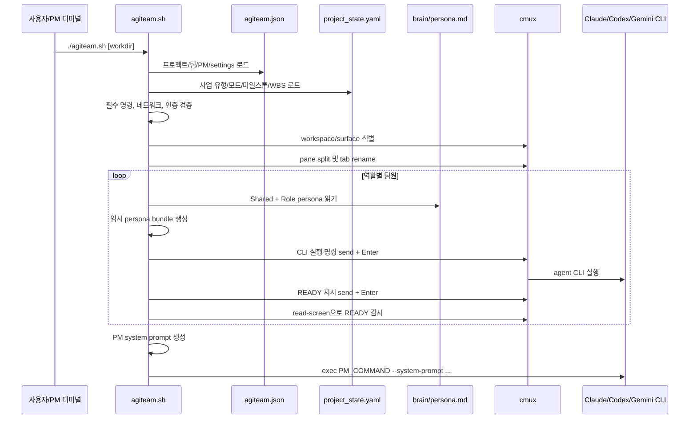
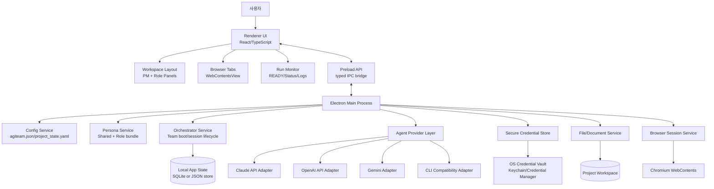

# RD020 아키텍처 분석 - AgiTeamBuilder 크로스플랫폼 GUI 전환

## 개정이력

| 버전 | 일자 | 작성자 | 내용 |
|------|------|--------|------|
| v0.1 | 2026-06-22 | Architect | `agiteam.sh`, `agiteam.json` 기반 As-Is 아키텍처 역추출 및 To-Be 기술 스택 권고 최초 작성 |

---

## 1. 분석 범위와 결론

### 1.1 분석 대상

| 구분 | 경로 | 비고 |
|------|------|------|
| 부팅 엔진 | `/Users/patrickukim/Projects/patricks/system/patricks/agiteam.sh` | Bash 기반, 약 974행 |
| 팀 구성 설정 | `/Users/patrickukim/Projects/patricks/system/patricks/agiteam.json` | 프로젝트, 페르소나, 팀원, PM, 타이밍 설정 |
| 상태 설정 | `/Users/patrickukim/Projects/patricks/system/patricks/project_state.yaml` | 사업 유형, 모드, 마일스톤, WBS 트랙 |
| 페르소나 | `/Users/patrickukim/Projects/patricks/system/patricks/brain/**/persona.md` | Shared + 역할별 persona 번들링 대상 |

### 1.2 최종 권고

**권고 스택: Electron + TypeScript + React + Node.js 백엔드 프로세스 + Chromium WebContentsView**

선정 근거는 다음과 같다.

1. Windows/Mac 동일 동작이 필수인 조건에서 Electron은 Chromium을 앱에 포함하므로 렌더링·브라우저 동작 편차가 가장 작다.
2. 탭/패널형 내장 브라우저, 다중 web contents, 개발자도구, 세션/쿠키 격리 등 브라우저형 워크스페이스 구현 난이도가 가장 낮다.
3. Claude API, OpenAI API, 로컬 파일, 프로세스 실행, 설치 패키징을 모두 Node.js 생태계에서 일관되게 처리할 수 있다.
4. 현재 Bash 스크립트의 역할이 "오케스트레이션 엔진"에 가깝기 때문에 Rust/Tauri보다 Node.js 기반 이벤트·프로세스·IPC 모델로 전환하는 편이 생산성이 높다.

Tauri는 배포 크기와 보안 모델이 강점이지만, OS별 System WebView 차이로 동일 렌더링 보장이 약하다. Flutter Desktop은 UI 일관성은 좋지만, 내장 브라우저/다중 webview/웹 세션 패널 요구가 핵심인 본 프로젝트에는 부적합하다.

---

## 2. As-Is 아키텍처 역추출

### 2.1 현재 시스템 개요

현재 AgiTeamBuilder는 `agiteam.sh` 단일 Bash 스크립트가 팀 부팅 오케스트레이터 역할을 수행한다. `agiteam.json`에서 팀 구성을 읽고, `cmux` workspace/pane을 생성한 뒤, 각 pane에 Claude Code, Codex, Gemini CLI 실행 명령과 역할별 페르소나를 주입한다. PM pane에는 팀원 surface 매핑과 startupFiles 목록을 포함한 동적 시스템 프롬프트를 생성해 실행한다.

### 2.2 주요 컴포넌트 도식

```mermaid
flowchart TD
    A[CLI Entry<br/>agiteam.sh] --> B[Option Parser<br/>--force-reuse / --cleanup-existing]
    B --> C[Config Loader<br/>agiteam.json]
    C --> D[State Loader<br/>project_state.yaml]
    C --> E[Team Registry<br/>ROLE_CONFIG]
    D --> F[Environment Validator]
    E --> F
    F --> G[Auth / Network Checker<br/>curl + CLI login checks]
    G --> H[Workspace Resolver<br/>cmux identify]
    H --> I[Layout Manager<br/>cmux new-split]
    I --> J[Persona Bundler<br/>Shared + Role persona]
    J --> K[AI Agent Launcher<br/>claude/codex/gemini CLI]
    K --> L[READY Monitor<br/>cmux read-screen]
    L --> M[PM System Prompt Builder]
    M --> N[PM Launcher<br/>exec claude]

    C -. reads .-> C1[(agiteam.json)]
    D -. reads .-> D1[(project_state.yaml)]
    J -. reads .-> J1[(brain/Shared/persona.md)]
    J -. reads .-> J2[(brain/{Role}/persona.md)]
    I -. controls .-> X[cmux workspace/pane/surface]
    K -. sends .-> X
    L -. reads .-> X
```

### 2.3 컴포넌트별 책임

| 컴포넌트 | 현재 구현 | 책임 | 주요 입력 | 주요 출력 |
|----------|----------|------|-----------|-----------|
| 부팅 엔진 | `main()` | 전체 실행 순서 제어 | 작업 디렉토리, 실행 옵션 | 팀 workspace, PM 실행 |
| 옵션 파서 | while/case | `--force-reuse`, `--cleanup-existing`, `--help` 처리 | CLI 인자 | 전역 플래그 |
| 설정 로더 | `load_config()`, `json_value()` | `agiteam.json` 파싱 및 기본값 오버라이드 | JSON 설정 | workspace, persona, team, pm, settings |
| 상태 로더 | `yaml_scalar_value()` | `project_state.yaml` 최상위 스칼라 일부 로드 | YAML 파일 | business_type, current_mode, milestone, wbs_track |
| 팀 레지스트리 | `ROLE_CONFIG`, `set_role_surface()` | 역할별 명령·레이아웃·surface 매핑 관리 | team 배열 | 동적 Bash 변수 |
| 환경 검증기 | `validate_environment()` | 필수 CLI 존재 확인 | ROLE_CONFIG | 실패 시 종료 |
| 인증/네트워크 검사 | `validate_auth_and_network()` | API 도달성 및 CLI 로그인 상태 확인 | agent 종류 | 실패 시 종료 |
| 워크스페이스 식별기 | `resolve_workspace_context()` | 현재 cmux workspace/PM surface 식별 | cmux identify 결과 | WS_ID, PM_SURFACE |
| 레이아웃 매니저 | `create_layout_slots()` | 6개 팀원 pane 생성 및 슬롯 배정 | PM_SURFACE | middle/right 슬롯 surface |
| 페르소나 번들러 | `create_persona_bundle()` | Shared persona와 역할 persona 병합, READY 규칙 append | persona.md 파일 | mktemp 번들 파일 |
| AI 에이전트 런처 | `spawn_member()` | 각 CLI 실행, persona 주입, READY 지시 전송 | command template, persona bundle | 실행 중인 CLI 세션 |
| READY 모니터 | `wait_for_ready_signal()` | 화면 문자열 감지, 부팅 중 Enter 자동 제출 | cmux read-screen | READY 확인 또는 타임아웃 |
| PM 프롬프트 빌더 | `build_pm_system_file()` | PM용 시스템 프롬프트 동적 생성 | persona, surface map, startupFiles | PM system prompt 파일 |
| PM 런처 | `launch_pm()` | PM Claude CLI 실행으로 프로세스 교체 | PM_COMMAND | PM 세션 |

### 2.4 데이터 흐름



### 2.5 외부 의존성

| 의존성 | 현재 용도 | 크로스플랫폼 위험 | To-Be 대체 방향 |
|--------|-----------|------------------|-----------------|
| `cmux` | workspace/pane/surface 생성, 화면 읽기, 입력 전송 | Windows 미지원, 터미널 UI 종속 | Electron 내부 패널/탭 + 세션 오케스트레이터 + IPC |
| `bash` | 전체 실행 런타임 | Windows 기본 미지원, 문법 이식성 낮음 | TypeScript/Node.js 앱 코어 |
| `python3` | JSON 파싱 유틸리티 | 설치 여부 불확실 | Node.js `JSON.parse`, YAML 라이브러리 |
| `curl` | Anthropic/OpenAI API 도달성 확인 | 설치 여부/경로 차이 | Node.js `fetch`/HTTP client |
| `security` | macOS Keychain에서 Claude 인증 확인 | macOS 전용 | OS별 secure storage, OAuth/API key vault |
| `claude` CLI | Claude Code agent 실행 | 설치/로그인/터미널 의존 | Claude API 우선, 필요 시 CLI adapter |
| `codex` CLI | Codex agent 실행 | 설치/로그인/샌드박스/터미널 의존 | OpenAI API/Responses API adapter, 필요 시 CLI adapter |
| `gemini` CLI | Gemini agent 실행 | 설치/로그인/터미널 의존 | Provider adapter |
| 파일 시스템 | persona, documents, state 읽기 | 경로 구분자/권한 차이 | 앱 데이터 디렉토리 + 프로젝트 workspace abstraction |

### 2.6 As-Is 제약

| 영역 | 제약 |
|------|------|
| OS | macOS 중심. `security`, `brew`, cmux, Bash 사용으로 Windows 설치형 앱 요구와 충돌 |
| UI | 터미널 pane 기반이라 브라우저 탭/GUI 패널/상태 대시보드 구현이 어려움 |
| 상태관리 | Bash 전역 변수와 임시 파일 중심. 실패 복구와 장기 세션 저장에 취약 |
| 통신 | `cmux send`와 화면 문자열 파싱에 의존. 구조화된 이벤트/상태 모델 부재 |
| 에이전트 추상화 | CLI 명령 템플릿 수준. API provider별 모델/토큰/스트리밍/오류 처리가 추상화되지 않음 |
| 보안 | CLI 로그인 상태와 OS별 인증 저장소에 의존. 앱 차원의 키 저장/권한 모델 없음 |

---

## 3. 크로스플랫폼 기술 스택 비교

### 3.1 비교 기준

본 프로젝트의 핵심 요건은 다음 순서로 가중치를 둔다.

1. Windows/Mac 동일 동작
2. 브라우저 탭/패널 내장
3. Claude API/OpenAI API 연동
4. 설치 패키지 생성
5. 개발 생산성 및 기존 구조 전환 용이성

### 3.2 후보 비교표

| 후보 | a) Windows/Mac 동일 동작 | b) 웹 브라우저 내장 | c) Claude/OpenAI API 연동 | d) 설치 패키지 | e) 생산성/역량 적합성 | 종합 판단 |
|------|--------------------------|---------------------|----------------------------|----------------|------------------------|-----------|
| Electron | **상**. Chromium을 앱에 포함하므로 렌더링 편차가 작음 | **상**. BrowserWindow/WebContentsView로 탭·패널·다중 web contents 구현 용이 | **상**. Node.js SDK/HTTP/fetch, stream 처리, 파일/프로세스 접근 모두 자연스러움 | **상**. electron-builder 등으로 `.exe`, `.msi`, `.dmg` 구성 가능 | **상**. 기존 Bash 오케스트레이션을 TypeScript 이벤트/IPC로 옮기기 쉬움 | **권고** |
| Tauri | 중. 앱은 크로스플랫폼이나 Windows는 WebView2, macOS는 WKWebView라 렌더링 엔진이 다름 | 중. v2에서 webview API가 강화되었으나 브라우저형 다중 탭/세션 앱은 Electron보다 제약이 큼 | 중. Rust backend 또는 JS frontend에서 가능하나 Rust/IPC 설계 부담 증가 | 상. 작은 바이너리와 native installer 강점 | 중. Rust 역량과 OS별 webview 검증 비용 필요 | 보조 후보 |
| Flutter Desktop | 중상. 자체 렌더링으로 UI 일관성은 우수 | 하. 공식 webview_flutter는 macOS 지원은 있으나 Windows 데스크톱 webview 요구에는 공백이 큼 | 중. Dart HTTP 연동은 가능하나 Node 생태계보다 AI tooling/stream 처리 자료가 적음 | 중. Windows/macOS 빌드 가능하나 배포 자동화는 별도 구성 필요 | 중하. 터미널 오케스트레이터를 Flutter isolate/plugin 구조로 재설계해야 함 | UI 중심 앱이면 적합, 본 건 비권고 |
| .NET MAUI / WPF + WebView2 | 중. Windows 강점, macOS 품질/생태계는 상대적으로 약함 | 중. Windows WebView2 중심, Mac은 별도 검증 필요 | 중. C# SDK/HTTP 가능 | 상. Windows 배포 강점 | 중하. Mac 동등성을 맞추기 위한 비용 큼 | Windows 우선일 때만 고려 |
| Qt / PySide | 중. Native UI는 가능하나 웹/브라우저 패널은 QtWebEngine 의존 | 중. Chromium 기반 QtWebEngine 가능, 패키징 무거움 | 중. Python/Qt 또는 C++로 가능 | 중. 패키징 난이도 높음 | 중하. 팀 생산성과 웹 UI 재사용성이 낮음 | 특수 네이티브 요구 시 고려 |

### 3.3 후보별 상세 분석

#### Electron

Electron은 Chromium + Node.js 기반 데스크톱 앱 런타임이다. 본 프로젝트에서는 앱 Shell, 브라우저 패널, 에이전트 orchestration, 파일 접근, API streaming을 하나의 TypeScript 코드베이스로 처리할 수 있다.

장점:

- Chromium 동봉으로 Windows/Mac 간 렌더링 차이가 가장 작다.
- `WebContentsView`를 통해 탭/패널형 브라우저 뷰를 앱 내부에 배치할 수 있다.
- Node.js에서 Claude/OpenAI API 연동, SSE/stream, 파일 watch, child process 관리가 쉽다.
- 현재 `agiteam.sh`의 동작이 절차형 orchestration이므로 TypeScript service로 치환하기 쉽다.
- `.exe`, `.msi`, `.dmg` 배포 파이프라인 사례가 많다.

단점:

- 앱 용량과 메모리 사용량이 Tauri보다 크다.
- 보안 설정을 잘못하면 Node integration, preload, IPC 경계에서 위험이 생긴다.
- 자동 업데이트, 코드 서명, notarization은 별도 배포 설계가 필요하다.

적합 판단: **본 프로젝트 요구에 가장 적합**.

#### Tauri

Tauri는 Rust backend와 System WebView를 사용하는 데스크톱 앱 프레임워크다. 작은 앱 크기와 보안 모델이 장점이다.

장점:

- 앱 크기와 메모리 사용량이 작다.
- Rust backend로 OS 기능 접근과 보안 경계를 엄격하게 설계할 수 있다.
- Windows/Mac/Linux desktop target을 지원한다.

단점:

- Windows는 WebView2, macOS는 WKWebView를 사용하므로 브라우저 동작이 완전히 같지 않다.
- 브라우저형 다중 탭/패널, 세션 격리, 개발자도구 수준 제어는 Electron보다 구현 부담이 크다.
- Rust + frontend + IPC 모델로 팀 역량 요구가 증가한다.

적합 판단: 배포 크기와 보안이 최우선이면 후보이나, **Windows/Mac 동일 브라우저 동작 필수** 조건에서는 Electron보다 낮다.

#### Flutter Desktop

Flutter Desktop은 Windows/macOS/Linux 네이티브 데스크톱 앱 빌드를 지원하며, 자체 렌더링으로 일반 UI 일관성이 강하다.

장점:

- UI 렌더링 일관성이 높다.
- 단일 Dart 코드베이스로 desktop UI를 구성할 수 있다.
- 모바일 확장 가능성이 있으면 장점이 커진다.

단점:

- 본 프로젝트의 핵심인 내장 브라우저 탭/패널이 약하다.
- 공식 WebView 플러그인은 데스크톱에서 macOS 중심이며 Windows까지 동일하게 만족시키기 어렵다.
- AI 에이전트 orchestration, 파일/프로세스/streaming 중심 앱에는 Node 생태계 대비 생산성이 낮다.

적합 판단: 순수 UI 앱이면 가능하지만, **브라우저 내장형 AI 워크스페이스**에는 비권고.

---

## 4. 권고 To-Be 아키텍처 초안

### 4.1 목표 구조



### 4.2 주요 컴포넌트

| 컴포넌트 | 책임 |
|----------|------|
| Renderer UI | 팀 워크스페이스, 역할 패널, 상태 대시보드, 로그/문서 뷰어, 브라우저 탭 표시 |
| Preload API | Renderer와 Main 사이의 typed IPC 경계. 파일/토큰/프로세스 직접 접근 차단 |
| Main Process | 앱 생명주기, OS 통합, IPC 라우팅, 권한 경계 관리 |
| Config Service | `agiteam.json`, `project_state.yaml` 로드/검증/스키마화 |
| Persona Service | Shared persona + 역할 persona + 부팅 대기 규칙 조합. 임시 파일 대신 메모리/세션 저장 |
| Orchestrator Service | 팀 부팅, 에이전트 세션 생성, 상태 전이, 재시작/복구, 명령 큐 관리 |
| Agent Provider Layer | Claude/OpenAI/Gemini API 및 CLI 호환 어댑터 추상화 |
| Browser Session Service | 앱 내 탭/패널 web contents 생성, 세션/쿠키/권한 관리 |
| Secure Credential Store | API key, OAuth token, provider credential을 OS 보안 저장소에 저장 |
| File/Document Service | workspace 파일 읽기/쓰기, `_archive` 백업 정책, 문서 인덱싱 |
| Local App State | workspace, role, session, message, status, panel layout 저장 |
| Packaging/Updater | Windows `.exe/.msi`, macOS `.dmg`, 코드 서명, 자동 업데이트 관리 |

### 4.3 데이터 모델 초안

| 엔티티 | 주요 필드 | 설명 |
|--------|----------|------|
| Workspace | id, path, name, color, currentMode, milestone | 프로젝트 단위 작업공간 |
| Role | id, role, displayName, provider, layoutSlot | 팀원 역할 정의 |
| AgentSession | id, workspaceId, roleId, status, provider, model, startedAt | 실행 중인 AI 에이전트 세션 |
| Message | id, sessionId, direction, content, createdAt, status | PM/역할 간 지시 및 응답 로그 |
| PersonaBundle | id, roleId, contentHash, content, createdAt | 세션에 주입된 persona 스냅샷 |
| PanelLayout | workspaceId, panelId, type, bounds, visible | GUI 레이아웃 상태 |
| CredentialRef | provider, account, storageKey, lastValidatedAt | OS credential vault 참조 |

### 4.4 현재 기능 대체 매핑

| As-Is 기능 | 현재 구현 | To-Be 대체 |
|------------|-----------|------------|
| CLI 옵션 처리 | Bash case | 앱 실행 옵션 + 설정 화면 + workspace open dialog |
| JSON 파싱 | `python3 -c json.load` | TypeScript schema validation (`zod` 등) |
| YAML 스칼라 읽기 | `grep/sed` | YAML parser + typed ProjectState |
| cmux workspace 식별 | `cmux identify` | Electron BrowserWindow + Workspace entity |
| cmux pane 생성 | `cmux new-split` | React layout grid + Browser/Agent panel components |
| surface registry | Bash `eval ROLE_SURFACE_*` | RoleSession map in Orchestrator Service |
| tab rename | `cmux rename-tab` | UI panel title state |
| `cmux send` | 터미널 입력 문자열 전송 | Agent command queue + provider API call |
| `cmux send-key Enter` | 제출 트리거 | structured `submitMessage()` IPC/API |
| `cmux read-screen` | 화면 텍스트 파싱 | provider stream event, session state, logs |
| READY 문자열 감지 | `grep "READY: Role"` | explicit lifecycle state: booting -> ready |
| Enter 자동 제출 | 화면 prompt regex | provider/CLI adapter별 prompt handler |
| persona mktemp | 임시 파일 생성 후 CLI 인자 | PersonaBundle in memory + persisted snapshot |
| PM system prompt 생성 | Bash heredoc append | Prompt Builder service |
| 인증 확인 | `security`, `codex login status` | OS Credential Vault + provider token validation |
| 네트워크 확인 | `curl` | Node fetch health check |
| 실패 시 pane 정리 | `trap EXIT` | session cleanup/finalizer + persisted recovery |
| PM 실행 | `exec claude` | PM AgentSession 생성 + UI 패널 연결 |

### 4.5 에이전트 연동 방식

우선순위는 다음과 같다.

1. **API 직접 연동 우선**: Claude API, OpenAI API, Gemini API를 provider adapter로 직접 연동한다.
2. **CLI 호환 어댑터 보조**: 기존 Claude Code/Codex/Gemini CLI 워크플로우 보존이 필요한 경우 `node-pty` 또는 child process 기반 compatibility mode를 둔다.
3. **구조화 이벤트 표준화**: 모든 provider 응답을 `session.started`, `message.delta`, `tool.call`, `session.ready`, `session.failed` 같은 내부 이벤트로 변환한다.
4. **보안 저장 분리**: API key와 provider token은 project file이 아니라 OS secure storage에 저장한다.

### 4.6 권장 기술 구성

| 영역 | 권고 |
|------|------|
| Desktop runtime | Electron |
| Language | TypeScript |
| UI | React |
| State | Zustand 또는 Redux Toolkit 중 택1 |
| IPC | Electron `contextBridge` + typed IPC wrapper |
| Local DB | SQLite (`better-sqlite3`) 또는 초기 MVP는 JSON store |
| Config validation | `zod` |
| YAML | `yaml` npm package |
| AI API | 공식/표준 SDK 또는 `fetch` 기반 provider adapter |
| CLI compatibility | `node-pty` + provider-specific prompt handler |
| Packaging | electron-builder |
| Secure storage | OS Keychain/Credential Manager 연동 라이브러리 |
| Auto update | Electron autoUpdater/electron-updater 검토 |

---

## 5. 전환 전략

### 5.1 MVP 범위

1. `agiteam.json`과 `project_state.yaml` 로드 및 검증
2. Shared/Role persona bundle 생성
3. PM + 6개 역할 패널 UI 구성
4. Claude/OpenAI provider 중 1개 API 직접 연동
5. 역할별 세션 상태: idle, booting, ready, running, failed
6. 명령 전송/응답 스트리밍/로그 저장
7. Windows `.exe`와 macOS `.dmg` 빌드

### 5.2 단계별 이행

| 단계 | 목표 | 산출물 |
|------|------|--------|
| 1단계 | Electron shell + 프로젝트 설정 로더 | Workspace open, config validation report |
| 2단계 | UI layout + persona bundling | PM/Role 패널, persona preview |
| 3단계 | Provider API adapter | Claude/OpenAI 중 우선 provider streaming |
| 4단계 | Orchestrator state machine | boot/ready/run/fail lifecycle |
| 5단계 | CLI compatibility mode | 기존 Claude Code/Codex CLI 임시 호환 |
| 6단계 | 패키징/보안 저장소 | `.exe/.msi/.dmg`, credential vault |

### 5.3 주요 리스크와 대응

| 리스크 | 영향 | 대응 |
|--------|------|------|
| CLI 기반 기능과 API 기반 기능의 동작 차이 | 기존 워크플로우 일부 불일치 | Provider API 우선, CLI compatibility mode를 별도 제공 |
| Electron 보안 설정 미흡 | 토큰/파일 접근 위험 | contextIsolation, sandbox, preload whitelist, nodeIntegration 비활성화 |
| 코드 서명/Notarization 지연 | 배포 일정 지연 | 초기부터 Windows/macOS CI 빌드와 서명 요구사항 분리 설계 |
| 다중 세션 비용/토큰 관리 | 운영 비용 증가 | provider별 rate limit, token budget, session pause/resume 설계 |
| 기존 문서 버전관리 정책 누락 | 산출물 품질 저하 | File/Document Service에 `_archive` 백업 + `.latest` 규칙 내장 |

---

## 6. 후속 산출물 연계

| 후속 산출물 | 반영 필요 사항 |
|-------------|----------------|
| DS-20 아키텍처설계서 | Electron 기반 To-Be 컴포넌트, IPC, provider adapter 구조 확정 |
| DS-40 API명세서 | Renderer-Main IPC API, provider adapter 내부 API, workspace/document service API 정의 |
| DS-30 DB설계서 | Workspace, Role, AgentSession, Message, PersonaBundle, PanelLayout 테이블 설계 |
| DS-50 화면설계서 | PM/역할 패널, 브라우저 탭, 세션 상태, 로그 뷰 설계 |
| DV-10 환경구성서 | Electron/Node/TypeScript 빌드 환경, Windows/Mac 패키징 환경 정의 |
| TS-05 시험계획서 | Windows/Mac 동등성, provider streaming, credential storage, packaging 테스트 정의 |

---

## 7. 참고 근거

- Electron BrowserWindow 공식 문서: https://www.electronjs.org/docs/latest/api/browser-window
- Electron WebContentsView 공식 문서: https://www.electronjs.org/docs/latest/api/web-contents-view
- Electron 업데이트 공식 문서: https://www.electronjs.org/docs/latest/tutorial/updates
- electron-builder 문서: https://www.electron.build/
- Tauri v2 Architecture 공식 문서: https://v2.tauri.app/concept/architecture/
- Tauri v2 Webview API 공식 문서: https://v2.tauri.app/reference/javascript/api/namespacewebview/
- Flutter Desktop 공식 문서: https://docs.flutter.dev/platform-integration/desktop
- Flutter WebView package 문서: https://pub.dev/packages/webview_flutter

---

## 8. 최종 권고

본 프로젝트는 "터미널 멀티플렉서 기반 AI 팀 부팅 스크립트"를 "Windows/Mac 설치형 GUI AI 워크스페이스"로 전환하는 작업이다. 핵심 난도는 일반 네이티브 UI가 아니라, 다중 에이전트 세션, 내장 브라우저 패널, provider API streaming, 로컬 파일/문서/credential orchestration을 안정적으로 통합하는 데 있다.

따라서 **Electron + TypeScript + React + Node.js provider adapter 구조**를 최종 권고한다. Tauri와 Flutter는 각각 장점이 있으나, Windows/Mac에서 브라우저 내장 동작을 최대한 동일하게 보장해야 하는 본 요구에는 Electron이 가장 낮은 기술 리스크와 가장 높은 개발 생산성을 제공한다.
