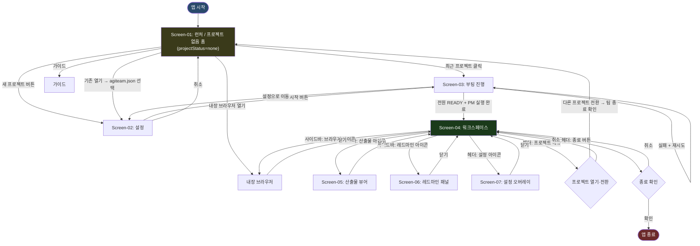

# DS-10 IA 구조도 — AgiTeamBuilder Desktop

> **목적**: GUI 앱의 정보 구조(Information Architecture) — 화면 계층, 내비게이션 흐름, 패널 라우팅, 전환 조건을 정의한다.  
> **입력**: AN-40 요구사항명세서, RD020_FE현황분析(9화면 인벤토리)  
> **기술 스택**: Tauri v2 + Vue 3 (Vue Router 기반 SPA 라우팅)

---

## 개정이력

| 버전 | 일자 | 작성자 | 내용 |
|------|------|--------|------|
| v0.1 | 2026-06-23 | PM | 최초 작성 — FE 현황분析 9화면 기반 IA 구조 정의 |
| v0.2 | 2026-07-15 | Architect | Redmine #27 **프로젝트 미선택 진입 허용** 설계(초안): 프로젝트 상태 모델(`none`/`configured`/`active`) 및 상태별 기능 가용성 매트릭스 신설(§8), 라우팅 가드 완화(§4 — `/boot` 미충족 시 `/settings` 강제 → `/launcher` 홈으로 변경, 무한 루프 제거), 워크스페이스 내 **프로젝트 열기·전환 진입점**(헤더 프로젝트 메뉴) 흐름 추가(§2), `/launcher`를 '프로젝트 없음 홈(앱 셸)'으로 재정의, LauncherView `newProject` dialog 폴백 결함 진단(§9) 반영 |
| v0.3 | 2026-07-15 | Architect | Redmine #27 **PM 결정 확정 반영**: (결정1) **A안 = 전용 홈(런처 확장)** 방식으로 확정 — 빈 워크스페이스 렌더 방식 폐기. (결정2) **프로젝트 전환 시 현재 팀 종료 확인** 정책 확정(§8.3). §9 dialog 폴백 개선 '제안' → '확정'. 상태모델·가드완화·매트릭스 확정. DS-60 v0.15와 교차 정합 |

---

## 1. 앱 전체 화면 계층 구조

```
AgiTeamBuilder Desktop (Tauri App)
│
├── /launcher                     ← Screen-01: 런처 / **프로젝트 없음 홈(앱 셸)**
│   ├── 최근 프로젝트 목록
│   ├── 새 프로젝트 → /settings (신규)
│   ├── 기존 열기  → /settings (로드)
│   └── [프로젝트 미선택 상태에서도 가용] 내장 브라우저 열기 · 가이드
│       └── ※ Redmine #27: 프로젝트를 선택하지 않아도 앱에 진입·체류할 수 있는
│           기본 상태(projectStatus=none). 팀 부팅·역할 채팅만 config를 요구한다(§8).
│
├── /settings                     ← Screen-02: 프로젝트 설정 (agiteam.json 에디터)
│   ├── 프로젝트 기본 정보 탭
│   ├── PM 설정 탭
│   ├── 팀 구성 탭
│   ├── 타이밍 설정 탭
│   ├── 페르소나 경로 탭
│   └── 저장 → /boot (부팅 시작)
│
├── /boot                         ← Screen-03: 팀 부팅 진행
│   ├── 단계 1: 설정 파일 로드
│   ├── 단계 2: 환경 검증
│   ├── 단계 3: 인증·네트워크 확인
│   ├── 단계 4: 프로젝트 구조 검증
│   ├── 단계 5: 워크스페이스 설정
│   ├── 단계 6: 팀원 순차 부팅
│   ├── 단계 7: PM 실행
│   └── 전원 READY → /workspace (자동 전환)
│
└── /workspace                    ← Screen-04: 팀 워크스페이스 (메인)
    │
    ├── [헤더 바] 프로젝트명 · 색상 · 상태 표시
    │
    ├── [좌측 대형 패널] PM 채팅           ← Screen-04a
    │   ├── 대화 로그 (스트리밍)
    │   ├── 메시지 입력창 + 전송
    │   └── startupFiles 빠른 링크
    │
    ├── [우측 2열 3행] 팀원 패널 ×6       ← Screen-04b
    │   ├── middle_top: DeveloperBE 패널
    │   ├── middle_mid: DeveloperFE 패널
    │   ├── middle_bottom: QA 패널
    │   ├── right_top: Architect 패널
    │   ├── right_mid: DevOps 패널
    │   └── right_bottom: Designer 패널
    │       └── 각 패널: 상태 뱃지 + 대화 로그 + 입력창
    │
    ├── [사이드바 토글] 우측 슬라이드
    │   ├── /workspace/deliverables        ← Screen-05: 산출물 뷰어/에디터
    │   │   ├── 파일 트리
    │   │   ├── 마크다운 렌더 뷰어
    │   │   ├── 편집 모드
    │   │   ├── frontmatter 메타 패널
    │   │   ├── _archive 이력 탐색기
    │   │   └── diff 뷰어
    │   ├── /workspace/redmine             ← Screen-06: 레드마인 패널
    │   │   ├── 이슈 목록 테이블
    │   │   ├── 이슈 상세 슬라이드오버
    │   │   ├── 이슈 생성 모달
    │   │   ├── 상태 전이 버튼
    │   │   └── 진척률 슬라이더
    │   └── /workspace/browser             ← 내장 브라우저 패널
    │       ├── 주소창 (뒤로/앞으로/새로고침)
    │       └── WebView 렌더 영역
    │
    └── [헤더 아이콘] 설정 → /settings-overlay  ← Screen-07: 설정/환경 (오버레이)
        ├── 로그인 상태 섹션
        ├── API 연결 테스트
        ├── project_state.yaml 편집기
        ├── API 키 관리
        └── 진단 도구 (doctor)
```

---

## 2. 화면 전환 흐름 (Navigation Flow)



> **Redmine #27 변경 요지**:
> 1. `/launcher`(홈)는 프로젝트 미선택(`none`) 상태에서도 앱 셸 기능(내장 브라우저·가이드·프로젝트 열기/생성)에 접근 가능한 **체류 가능 상태**다. 더 이상 프로젝트 선택을 강제하는 관문이 아니다.
> 2. 워크스페이스 헤더에 **프로젝트 메뉴**(열기·전환·홈으로)를 추가해 앱 실행 중 언제든 다른 프로젝트로 전환하거나 프로젝트를 닫고 홈으로 돌아갈 수 있다. 전환 시 현재 팀 세션 종료 확인을 거친다.

---

## 3. Vue Router 라우트 정의

| 경로 | 컴포넌트 | 화면 | 파라미터 |
|------|---------|------|---------|
| `/` (redirect) | → `/launcher` | — | — |
| `/launcher` | `LauncherView.vue` | Screen-01 | — |
| `/settings` | `SettingsView.vue` | Screen-02 | `?projectPath=` (선택) |
| `/boot` | `BootView.vue` | Screen-03 | — |
| `/workspace` | `WorkspaceView.vue` | Screen-04 | — |
| `/workspace/deliverables` | `DeliverablePanel.vue` | Screen-05 | `?file=` (선택) |
| `/workspace/redmine` | `RedminePanel.vue` | Screen-06 | `?issue=` (선택) |
| `/workspace/browser` | `BrowserPanel.vue` | 내장 브라우저 | `?url=` (선택) |

> **주의**: Screen-07(설정) 및 패널 최대화는 **오버레이/모달** 방식으로 라우트 변경 없이 처리.

---

## 4. 상태별 접근 제어 (Guard) — Redmine #27 완화

> **설계 원칙(#27)**: 프로젝트 미선택(`projectStatus=none`)은 **정상 상태**다. 가드는 "config가 필요한 화면"만 막고, 미충족 시 사용자를 막다른 곳(`/settings` 강제)으로 보내지 않고 **홈(`/launcher`)으로 안전 복귀**시킨다. 상태 정의는 §8 참조.

| 경로 | 접근 조건 | 미충족 시 리다이렉트 | #27 변경 |
|------|----------|-------------------|---------|
| `/launcher` (홈) | 항상 | — | 앱 셸 진입점으로 재정의 |
| `/settings` | 항상 | — | (신규 작성은 config 없이도 가능) |
| `/guide` | 항상 | — | — |
| `/boot` | `config` 로드 완료(`configured`↑) | **`/launcher`** | 기존 `/settings` → `/launcher`로 변경(무한 루프 제거) |
| `/workspace` | 부팅 완료(`active`) | config 있으면 `/boot`, 없으면 `/launcher` | 미부팅+config없음 케이스 홈 복귀 명시 |
| `/workspace/deliverables` | `/workspace` 활성 | `/workspace` | — |
| `/workspace/redmine` | `/workspace` 활성 + 레드마인 URL 설정 | 설정 안내 토스트 | — |
| `/workspace/browser` | `/workspace` 활성 | `/workspace` | — |

> **가드 완화 상세**
> - **왜 `/settings` 강제가 문제였나**: 기존 가드는 `to.meta.requiresConfig && !config → /settings`. 그러나 `/settings`에서 경로 없이 저장하면 "메모리에만 저장" 상태에 머물러 `config`가 온전히 서지 않아 다시 `/boot` 진입이 막히는 순환이 발생(§9 dialog 폴백 결함과 결합 시 사용자 체감 악화).
> - **개선**: `requiresConfig` 미충족은 **홈(`/launcher`)** 으로 보낸다. 홈에서 사용자는 브라우저·가이드 등 셸 기능을 쓰거나, 준비되면 프로젝트 생성/열기를 진행한다.
> - 내장 브라우저 독립 창(#17)은 workspace 밖에서도 열 수 있으므로(§8 매트릭스) 홈에서의 "브라우저 열기"는 `/workspace/browser` 라우트 진입 없이 백엔드 `browser_open`을 직접 호출하는 경로로 설계한다(FE 구현 범위, DS-60 §참조).

---

## 5. 레이아웃 구성 (Layout 계층)

### 5.1 최상위 레이아웃

```
AppLayout.vue (Tauri Window)
├── AppHeader.vue          ← 공통 헤더 (워크스페이스 진입 후)
├── <router-view>          ← 각 화면 컴포넌트
└── AppToastContainer.vue  ← 전역 토스트 알림
```

### 5.2 Screen-04 워크스페이스 내부 레이아웃

```
WorkspaceView.vue
├── WorkspaceHeader.vue       ← 프로젝트명, 색상 바, 상태 바
├── WorkspaceContent.vue
│   ├── PmChatPanel.vue       ← 좌측 1/3 (PM 채팅, Screen-04a)
│   └── TeamPanelGrid.vue     ← 우측 2/3
│       ├── RoleChatPanel.vue × 6 (Screen-04b)
│       │   ├── PanelHeader.vue (역할명 + 상태뱃지)
│       │   ├── ChatLog.vue (스트리밍 렌더)
│       │   └── MessageInput.vue (입력창 + 전송)
│       └── (패널 최대화 시 MaximizedPanel.vue 오버레이)
├── WorkspaceSidebar.vue      ← 사이드바 (토글)
│   ├── DeliverablePanel.vue  (Screen-05)
│   ├── RedminePanel.vue      (Screen-06)
│   └── BrowserPanel.vue      (내장 브라우저)
└── SettingsOverlay.vue       ← 모달 오버레이 (Screen-07)
```

---

## 6. Pinia 스토어 구조 (프론트엔드 상태)

| 스토어 | 관리 상태 | 주요 화면 |
|--------|----------|----------|
| `useProjectStore` | agiteam.json 파싱 결과, 최근 프로젝트 목록 | Screen-01, 02 |
| `useBootStore` | 부팅 단계 상태 (7단계), 에러 목록 | Screen-03 |
| `useWorkspaceStore` | 워크스페이스 활성화 상태, 레이아웃 슬롯 배치 | Screen-04 |
| `useRoleStore` | 역할별 상태 뱃지 (READY/BUSY/ERROR), 대화 로그 | Screen-04a, 04b |
| `useDeliverableStore` | 현재 열린 파일, 편집 내용, 아카이브 목록 | Screen-05 |
| `useRedmineStore` | 이슈 목록, 선택 이슈, 필터 상태 | Screen-06 |
| `useSettingsStore` | 로그인 상태, API 키 (마스킹), project_state 값 | Screen-07 |
| `useBrowserStore` | 현재 URL, 방문 이력 | 내장 브라우저 |

---

## 7. 화면별 핵심 컴포넌트 목록 (요약)

| 화면 | 컴포넌트 파일 (예정) | 주요 역할 |
|------|-------------------|---------|
| Screen-01 | `LauncherView.vue`, `RecentProjectList.vue` | 프로젝트 진입점 |
| Screen-02 | `SettingsView.vue`, `TeamRoleCard.vue`, `StartupFileList.vue` | agiteam.json 편집 |
| Screen-03 | `BootView.vue`, `BootStepBar.vue`, `RoleBootCard.vue` | 부팅 시각화 |
| Screen-04 | `WorkspaceView.vue`, `WorkspaceHeader.vue`, `WorkspaceContent.vue` | 메인 작업공간 |
| Screen-04a | `PmChatPanel.vue`, `ChatLog.vue`, `MessageInput.vue` | PM 채팅 |
| Screen-04b | `RoleChatPanel.vue`, `StatusBadge.vue` | 팀원 채팅 ×6 |
| Screen-05 | `DeliverablePanel.vue`, `FileTree.vue`, `MarkdownViewer.vue`, `DiffViewer.vue` | 산출물 뷰어 |
| Screen-06 | `RedminePanel.vue`, `IssueTable.vue`, `IssueDetail.vue`, `IssueForm.vue` | 레드마인 |
| Screen-07 | `SettingsOverlay.vue`, `AuthStatus.vue`, `ProjectStateEditor.vue` | 설정/환경 |
| 브라우저 | `BrowserPanel.vue`, `AddressBar.vue` | 내장 브라우저 |

---

## 8. 프로젝트 상태 모델 & 기능 가용성 (Redmine #27)

> **구현 방식 확정(PM 결정, 2026-07-15)**: 프로젝트 없음 상태는 **A안 = 전용 홈(런처 확장)** 으로 구현한다. WorkspaceView는 config에 강결합되어 있으므로 '빈 워크스페이스 렌더' 방식은 채택하지 않는다. 즉 `none` 상태의 화면 실체는 `/launcher`(홈)이며, 워크스페이스(`/workspace`)는 `active` 상태에서만 진입한다.

### 8.1 상태 정의 — `projectStatus`

프로젝트 컨텍스트를 3상태로 파생한다(스토어 교차 파생값, FE `useProjectStatus()` 컴포저블 권장).

| 상태 | 조건 | 의미 |
|------|------|------|
| `none` | `projectStore.config === null` | **프로젝트 없음(홈)**. 앱은 켜져 있고 셸 기능만 가용 |
| `configured` | `config !== null && !workspaceStore.isActive` | 프로젝트 설정 로드됨, 팀 미부팅 |
| `active` | `workspaceStore.isActive === true` | 팀 부팅 완료, 워크스페이스 운용 중 |

> 기존 스토어(`useProjectStore.config`, `useWorkspaceStore.isActive`, `useBootStore.isDone`)만으로 파생 가능하므로 신규 영속 상태는 필요 없다. 상태 전이: `none →(프로젝트 생성/열기)→ configured →(팀 부팅)→ active`. 역방향: `active →(프로젝트 닫기/전환)→ none`.

### 8.2 상태별 기능 가용성 매트릭스

| 기능 | `none` | `configured` | `active` | 비고 |
|------|:---:|:---:|:---:|------|
| 앱 진입·체류 (홈) | ✅ | ✅ | ✅ | #27 핵심 — 미선택으로도 켜짐 |
| 가이드(`/guide`) | ✅ | ✅ | ✅ | config 무관 |
| 내장 브라우저(독립 창, #17) | ✅ | ✅ | ✅ | `browser_open`은 config 불요 |
| 프로젝트 생성/열기 | ✅ | ✅(전환) | ✅(전환) | 홈·헤더 프로젝트 메뉴 |
| 프로젝트 설정 편집(`/settings`) | ⚠️ 신규 작성만 | ✅ | ✅ | none에선 `mode=new`로 새 config 작성 |
| 팀 부팅(`/boot`) | ❌ | ✅ | (부팅됨) | **config 필수** |
| 역할/PM 채팅 | ❌ | ❌ | ✅ | **부팅(active) 필수** |
| 산출물 뷰어 | ❌ | ⚠️ 경로 의존 | ✅ | 워크스페이스 경로 필요 |
| 레드마인 패널 | ❌ | ⚠️ 설정 의존 | ✅ | 레드마인 URL/키 설정 필요 |
| 팀 종료 | — | — | ✅ | active에서만 의미 |

- ✅ 가용 / ⚠️ 조건부(전제 미충족 시 안내) / ❌ 비가용(진입점 비활성 또는 홈 유도) / — 해당 없음
- **비가용 처리 원칙**: 버튼/메뉴를 숨기거나 `disabled`로 두고, 클릭 시 "프로젝트를 먼저 열어주세요" 안내(토스트) + 홈/설정으로 유도. 에러 토스트 반복(예: "메모리에만 저장") 대신 **다음 행동을 제시**한다.

### 8.3 프로젝트 열기·전환 진입점 (goal #2)

| 위치 | 진입점 | 동작 |
|------|--------|------|
| 홈(`/launcher`) | 새 프로젝트 / 기존 열기 / 최근 목록 | `none → configured/active` |
| 워크스페이스 헤더 | **프로젝트 메뉴**(브랜드/프로젝트명 클릭) | 열기·전환·홈으로(프로젝트 닫기) |

- **전환 절차**: 프로젝트 메뉴 → 대상 선택 → (현재 `active`면) **팀 종료 확인 모달** → `stop_team`/세션 종료 → `projectStore.reset()` + `workspaceStore.deactivate()` + `roleStore` 초기화 → 새 프로젝트 `load` → `/boot` → `/workspace`.
- **홈으로(닫기)**: 위와 동일하게 세션 정리 후 `projectStatus=none`으로 복귀(`/launcher`). 이미 존재하는 종료 확인 모달(WorkspaceView `showExitConfirm`)을 재사용하되, "앱 종료"가 아닌 "프로젝트 닫기(홈으로)"로 분기.

---

## 9. LauncherView `newProject` 폴더 다이얼로그 폴백 결함 진단 (Redmine #27 부속)

### 9.1 현상

`newProject`(LauncherView L68–81)가 `tauri-plugin-dialog`의 `open({directory:true})` 호출에 실패(throw)하면 `catch`에서 **경로 없이** `/settings?mode=new`로 이동한다. 이후 ProjectSettingsView `save()`(L136–138)는 `route.query.path`도 `workspaceId`도 없어 `else` 분기 → **"메모리에만 저장되었습니다" 토스트만 반복**, 프로젝트가 디스크에 서지 못한다.

### 9.2 원인 분석

- **플러그인 자체는 정상 등록**: `Cargo.toml`(`tauri-plugin-dialog = "2"`), `lib.rs`(`.plugin(tauri_plugin_dialog::init())`), `capabilities/default.json`(`"dialog:default"`) 모두 존재 → 정상 Tauri 런타임에선 dialog가 동작해야 함.
- 따라서 폴백 진입 트리거는 (a) Tauri 런타임이 아닌 순수 웹 dev 컨텍스트, (b) 일시적 invoke 실패, (c) 특정 OS/권한 환경에서의 dialog 예외 등 **런타임 예외**다.
- **진짜 결함은 폴백 UX 공백**: `openExisting`은 실패 시 **인라인 경로 직접 입력 UI**(`showPathInput`)를 제공하지만, `newProject`는 동일 폴백이 **없어** 곧장 경로 없는 설정 화면으로 밀려 막다른 길이 된다. 게다가 `catch{}`가 예외를 삼켜 **원인 로깅도 없다**.

### 9.3 개선 설계(확정)

1. **`newProject` 폴백 대칭화**: dialog 실패 시 `openExisting`과 동일하게 **폴더 경로 직접 입력 인라인 UI**를 띄우고, 입력 경로를 `path` 쿼리로 실어 `/settings?mode=new&path=…`로 이동. (경로 없는 `mode=new` 강제 이동 제거)
2. **ProjectSettingsView(mode=new) 보강**: "워크스페이스 폴더" 필드 + "폴더 선택…" 버튼(dialog 재호출) 추가. 경로 미설정 시 **저장/부팅 버튼 비활성** + 안내. "메모리에만 저장"은 명시적 옵션일 때만.
3. **예외 로깅**: `catch(e)`에서 `console.error`/진단 로그를 남겨 필드 원인 분석 가능하게. (silent swallow 금지)
4. dialog capability는 이미 충족이나, 회귀 방지를 위해 DS-60 capability 절에 `dialog:default`(→ `allow-open` 포함) 근거를 명시(§DS-60 반영).

---

*본 IA 구조도는 DS-50 화면 설계서 및 DS-55 디자인 시안 작업의 기준 문서로 사용된다.*  
*VIS(시각 증거·디자인 시안) 완성 후 DS-50 화면 설계서 작성 시 본 구조에서 각 화면별 세부 스펙으로 전개한다.*
