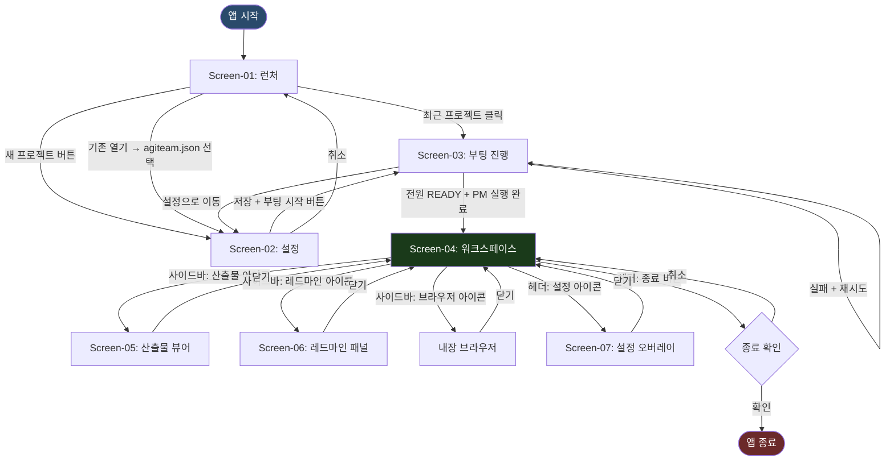

# DS-10 IA 구조도 — AgiTeamBuilder Desktop

> **목적**: GUI 앱의 정보 구조(Information Architecture) — 화면 계층, 내비게이션 흐름, 패널 라우팅, 전환 조건을 정의한다.  
> **입력**: AN-40 요구사항명세서, RD020_FE현황분析(9화면 인벤토리)  
> **기술 스택**: Tauri v2 + Vue 3 (Vue Router 기반 SPA 라우팅)

---

## 개정이력

| 버전 | 일자 | 작성자 | 내용 |
|------|------|--------|------|
| v0.1 | 2026-06-23 | PM | 최초 작성 — FE 현황분析 9화면 기반 IA 구조 정의 |

---

## 1. 앱 전체 화면 계층 구조

```
AgiTeamBuilder Desktop (Tauri App)
│
├── /launcher                     ← Screen-01: 런처 / 시작 화면
│   ├── 최근 프로젝트 목록
│   ├── 새 프로젝트 → /settings (신규)
│   └── 기존 열기  → /settings (로드)
│
├── /settings                     ← Screen-02: 프로젝트 설정 (agiteam.json 에디터)
│   ├── 프로젝트 기본 정보 탭
│   ├── PM 설정 탭
│   ├── 팀 구성 탭
│   ├── 타이밍 설정 탭
│   ├── 페르소나 경로 탭
│   └── 저장 → /boot (부팅 시작)
│
├── /boot                         ← Screen-03: 팀 부팅 진행
│   ├── 단계 1: 설정 파일 로드
│   ├── 단계 2: 환경 검증
│   ├── 단계 3: 인증·네트워크 확인
│   ├── 단계 4: 프로젝트 구조 검증
│   ├── 단계 5: 워크스페이스 설정
│   ├── 단계 6: 팀원 순차 부팅
│   ├── 단계 7: PM 실행
│   └── 전원 READY → /workspace (자동 전환)
│
└── /workspace                    ← Screen-04: 팀 워크스페이스 (메인)
    │
    ├── [헤더 바] 프로젝트명 · 색상 · 상태 표시
    │
    ├── [좌측 대형 패널] PM 채팅           ← Screen-04a
    │   ├── 대화 로그 (스트리밍)
    │   ├── 메시지 입력창 + 전송
    │   └── startupFiles 빠른 링크
    │
    ├── [우측 2열 3행] 팀원 패널 ×6       ← Screen-04b
    │   ├── middle_top: DeveloperBE 패널
    │   ├── middle_mid: DeveloperFE 패널
    │   ├── middle_bottom: QA 패널
    │   ├── right_top: Architect 패널
    │   ├── right_mid: DevOps 패널
    │   └── right_bottom: Designer 패널
    │       └── 각 패널: 상태 뱃지 + 대화 로그 + 입력창
    │
    ├── [사이드바 토글] 우측 슬라이드
    │   ├── /workspace/deliverables        ← Screen-05: 산출물 뷰어/에디터
    │   │   ├── 파일 트리
    │   │   ├── 마크다운 렌더 뷰어
    │   │   ├── 편집 모드
    │   │   ├── frontmatter 메타 패널
    │   │   ├── _archive 이력 탐색기
    │   │   └── diff 뷰어
    │   ├── /workspace/redmine             ← Screen-06: 레드마인 패널
    │   │   ├── 이슈 목록 테이블
    │   │   ├── 이슈 상세 슬라이드오버
    │   │   ├── 이슈 생성 모달
    │   │   ├── 상태 전이 버튼
    │   │   └── 진척률 슬라이더
    │   └── /workspace/browser             ← 내장 브라우저 패널
    │       ├── 주소창 (뒤로/앞으로/새로고침)
    │       └── WebView 렌더 영역
    │
    └── [헤더 아이콘] 설정 → /settings-overlay  ← Screen-07: 설정/환경 (오버레이)
        ├── 로그인 상태 섹션
        ├── API 연결 테스트
        ├── project_state.yaml 편집기
        ├── API 키 관리
        └── 진단 도구 (doctor)
```

---

## 2. 화면 전환 흐름 (Navigation Flow)



---

## 3. Vue Router 라우트 정의

| 경로 | 컴포넌트 | 화면 | 파라미터 |
|------|---------|------|---------|
| `/` (redirect) | → `/launcher` | — | — |
| `/launcher` | `LauncherView.vue` | Screen-01 | — |
| `/settings` | `SettingsView.vue` | Screen-02 | `?projectPath=` (선택) |
| `/boot` | `BootView.vue` | Screen-03 | — |
| `/workspace` | `WorkspaceView.vue` | Screen-04 | — |
| `/workspace/deliverables` | `DeliverablePanel.vue` | Screen-05 | `?file=` (선택) |
| `/workspace/redmine` | `RedminePanel.vue` | Screen-06 | `?issue=` (선택) |
| `/workspace/browser` | `BrowserPanel.vue` | 내장 브라우저 | `?url=` (선택) |

> **주의**: Screen-07(설정) 및 패널 최대화는 **오버레이/모달** 방식으로 라우트 변경 없이 처리.

---

## 4. 상태별 접근 제어 (Guard)

| 경로 | 접근 조건 | 미충족 시 리다이렉트 |
|------|----------|-------------------|
| `/launcher` | 항상 | — |
| `/settings` | 항상 | — |
| `/boot` | agiteam.json 로드 완료 | `/settings` |
| `/workspace` | 부팅 완료 (전원 READY + PM 실행) | `/boot` |
| `/workspace/deliverables` | `/workspace` 활성 | `/workspace` |
| `/workspace/redmine` | `/workspace` 활성 + 레드마인 URL 설정 | 설정 안내 토스트 |
| `/workspace/browser` | `/workspace` 활성 | `/workspace` |

---

## 5. 레이아웃 구성 (Layout 계층)

### 5.1 최상위 레이아웃

```
AppLayout.vue (Tauri Window)
├── AppHeader.vue          ← 공통 헤더 (워크스페이스 진입 후)
├── <router-view>          ← 각 화면 컴포넌트
└── AppToastContainer.vue  ← 전역 토스트 알림
```

### 5.2 Screen-04 워크스페이스 내부 레이아웃

```
WorkspaceView.vue
├── WorkspaceHeader.vue       ← 프로젝트명, 색상 바, 상태 바
├── WorkspaceContent.vue
│   ├── PmChatPanel.vue       ← 좌측 1/3 (PM 채팅, Screen-04a)
│   └── TeamPanelGrid.vue     ← 우측 2/3
│       ├── RoleChatPanel.vue × 6 (Screen-04b)
│       │   ├── PanelHeader.vue (역할명 + 상태뱃지)
│       │   ├── ChatLog.vue (스트리밍 렌더)
│       │   └── MessageInput.vue (입력창 + 전송)
│       └── (패널 최대화 시 MaximizedPanel.vue 오버레이)
├── WorkspaceSidebar.vue      ← 사이드바 (토글)
│   ├── DeliverablePanel.vue  (Screen-05)
│   ├── RedminePanel.vue      (Screen-06)
│   └── BrowserPanel.vue      (내장 브라우저)
└── SettingsOverlay.vue       ← 모달 오버레이 (Screen-07)
```

---

## 6. Pinia 스토어 구조 (프론트엔드 상태)

| 스토어 | 관리 상태 | 주요 화면 |
|--------|----------|----------|
| `useProjectStore` | agiteam.json 파싱 결과, 최근 프로젝트 목록 | Screen-01, 02 |
| `useBootStore` | 부팅 단계 상태 (7단계), 에러 목록 | Screen-03 |
| `useWorkspaceStore` | 워크스페이스 활성화 상태, 레이아웃 슬롯 배치 | Screen-04 |
| `useRoleStore` | 역할별 상태 뱃지 (READY/BUSY/ERROR), 대화 로그 | Screen-04a, 04b |
| `useDeliverableStore` | 현재 열린 파일, 편집 내용, 아카이브 목록 | Screen-05 |
| `useRedmineStore` | 이슈 목록, 선택 이슈, 필터 상태 | Screen-06 |
| `useSettingsStore` | 로그인 상태, API 키 (마스킹), project_state 값 | Screen-07 |
| `useBrowserStore` | 현재 URL, 방문 이력 | 내장 브라우저 |

---

## 7. 화면별 핵심 컴포넌트 목록 (요약)

| 화면 | 컴포넌트 파일 (예정) | 주요 역할 |
|------|-------------------|---------|
| Screen-01 | `LauncherView.vue`, `RecentProjectList.vue` | 프로젝트 진입점 |
| Screen-02 | `SettingsView.vue`, `TeamRoleCard.vue`, `StartupFileList.vue` | agiteam.json 편집 |
| Screen-03 | `BootView.vue`, `BootStepBar.vue`, `RoleBootCard.vue` | 부팅 시각화 |
| Screen-04 | `WorkspaceView.vue`, `WorkspaceHeader.vue`, `WorkspaceContent.vue` | 메인 작업공간 |
| Screen-04a | `PmChatPanel.vue`, `ChatLog.vue`, `MessageInput.vue` | PM 채팅 |
| Screen-04b | `RoleChatPanel.vue`, `StatusBadge.vue` | 팀원 채팅 ×6 |
| Screen-05 | `DeliverablePanel.vue`, `FileTree.vue`, `MarkdownViewer.vue`, `DiffViewer.vue` | 산출물 뷰어 |
| Screen-06 | `RedminePanel.vue`, `IssueTable.vue`, `IssueDetail.vue`, `IssueForm.vue` | 레드마인 |
| Screen-07 | `SettingsOverlay.vue`, `AuthStatus.vue`, `ProjectStateEditor.vue` | 설정/환경 |
| 브라우저 | `BrowserPanel.vue`, `AddressBar.vue` | 내장 브라우저 |

---

*본 IA 구조도는 DS-50 화면 설계서 및 DS-55 디자인 시안 작업의 기준 문서로 사용된다.*  
*VIS(시각 증거·디자인 시안) 완성 후 DS-50 화면 설계서 작성 시 본 구조에서 각 화면별 세부 스펙으로 전개한다.*
