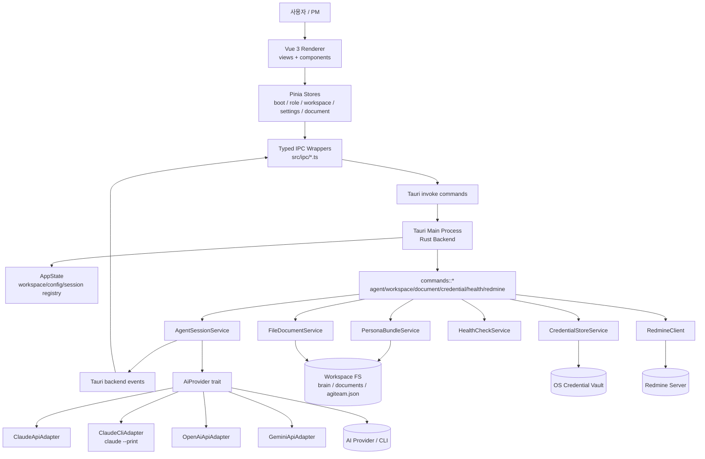
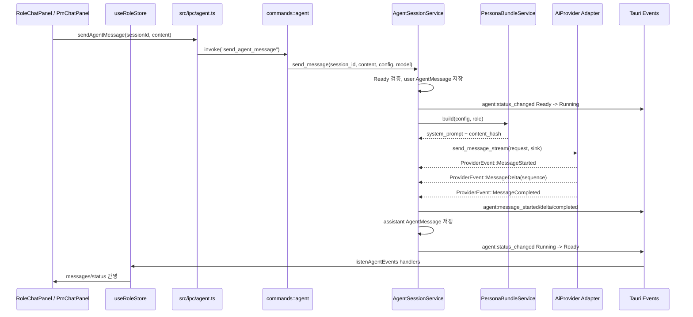
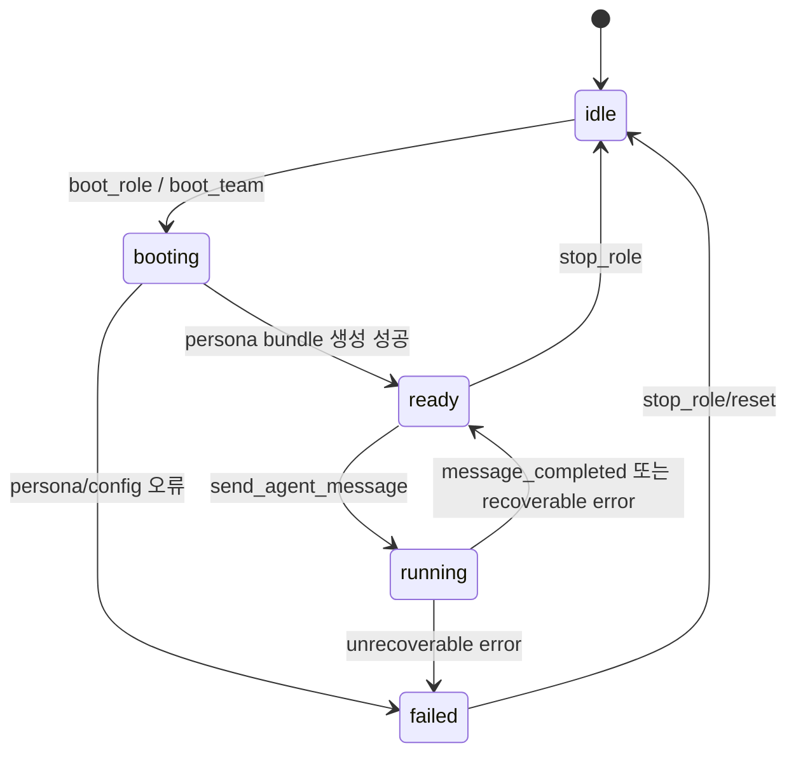

# DS-20 아키텍처설계서 - lugh

## 개정이력

| 버전 | 일자 | 작성자 | 내용 |
|------|------|--------|------|
| v0.1 | 2026-06-23 | Architect | Tauri v2 + Rust 백엔드 + Vue 3 + TypeScript 기반 To-Be 아키텍처 최초 작성 |
| v0.2 | 2026-07-02 | Architect | `system/lugh` 현행 구현 기준 아키텍처, 데이터 흐름, 핵심 데이터 모델, 설계 결정 사항 갱신 |

---

## 1. 문서 개요

### 1.1 목적

본 문서는 `system/lugh`의 현행 시스템 아키텍처를 정의한다. lugh는 AgiTeamBuilder GUI 클라이언트로, Tauri v2 데스크톱 런타임 안에서 Rust 백엔드와 Vue 3 프론트엔드를 결합해 프로젝트 워크스페이스, 역할별 AI 에이전트 세션, 문서, 인증, Redmine 연동을 관리한다.

### 1.2 분석 기준

- 대상 프로젝트: `/Users/patrickukim/Projects/patricks/system/lugh`
- 백엔드 분석 범위: `src-tauri/src/`
- 주요 백엔드 모듈: `agent_session`, `persona_bundle`, `provider`, `commands`, `models`
- 프론트엔드 분석 범위: `src/views`, `src/stores`, `src/components`, `src/ipc`
- 문서 기준일: 2026-07-02

### 1.3 기술 스택

| 계층 | 기술/구성 |
|------|-----------|
| Desktop Runtime | Tauri v2 |
| Backend | Rust, Tokio, serde, reqwest, keyring 계열 OS Credential Store |
| Frontend | Vue 3, TypeScript, Vite |
| Frontend State | Pinia |
| IPC | Tauri `invoke` command + backend event `emit` |
| AI Provider | Claude API, Claude CLI adapter, OpenAI API, Gemini API |
| Local Workspace | `agiteam.json`, `project_state.yaml`, `brain/**/persona.md`, `documents/**` |
| Document Versioning | `.latest.md` 갱신 전 `_archive` 자동 백업 |

---

## 2. 시스템 구성도

### 2.1 전체 구성



### 2.2 런타임 책임 분리

| 영역 | 책임 |
|------|------|
| Vue views/components | 부팅 화면, 워크스페이스, 역할 채팅 패널, 문서/레드마인/브라우저 패널, 설정 화면 렌더링 |
| Pinia stores | 부팅 단계, 역할별 세션/메시지/스트리밍 버퍼, 워크스페이스 레이아웃, 인증/헬스 상태 관리 |
| `src/ipc/*.ts` | Tauri command와 event를 타입이 있는 함수로 감싼 프론트엔드 IPC 경계 |
| `commands::*` | Tauri invoke entrypoint. 요청 DTO를 받고 AppState와 서비스에 위임 |
| `AppState` | `workspace_id -> path/config/session service` 등록, `session_id -> workspace_id` 역조회 |
| `AgentSessionService` | 역할 세션 생명주기, 메시지 저장, provider 요청, provider event를 frontend event로 변환 |
| `PersonaBundleService` | Shared persona, 역할 persona, PM startup files, READY 대기 규칙을 메모리 번들로 결합 |
| `provider::*` | provider별 인증/요청/응답/스트리밍 차이를 내부 표준 `ProviderEvent`로 정규화 |
| `FileDocumentService` | workspace root 하위 안전 경로 처리, 문서 트리/읽기/`.latest.md` 쓰기/백업 |
| `CredentialStoreService` | API key와 Redmine credential을 OS vault에 저장하고 secret을 renderer로 반환하지 않음 |

---

## 3. 백엔드 구조

### 3.1 현행 `src-tauri/src/` 구조

```text
src-tauri/src/
  lib.rs                       # Tauri builder, plugin, AppState, invoke handler 등록
  main.rs                      # 앱 엔트리포인트
  app_state.rs                 # workspace/config/session service registry
  agent_session.rs             # AgentSessionService, 메시지 전송과 event bridge
  persona_bundle.rs            # PersonaBundleService
  credential.rs                # OS credential vault 서비스
  file_document.rs             # 문서 읽기/쓰기와 _archive 백업
  health_check.rs              # workspace/provider/tool/network health check
  redmine_client.rs            # Redmine HTTP client
  commands/
    agent.rs                   # boot_team, boot_role, stop_role, send_agent_message 등
    workspace.rs               # open/load/validate/save workspace
    document.rs                # list/read/write latest document
    credential.rs              # save/delete/validate/masked credential, Claude OAuth check
    health.rs                  # run_health_check
    persona.rs                 # build_persona_bundle
    browser.rs                 # system browser open
    redmine.rs                 # Redmine issue CRUD
  models/
    error.rs                   # AppError, AppResult
    workspace.rs               # WorkspaceConfig, AgiteamConfig, ProjectState
    session.rs                 # AgentSession, AgentLifecycleState, event payload
    message.rs                 # AgentMessage, MessagePage, streaming event payload
    provider.rs                # AiProviderKind, ProviderEvent, ProviderMessageRequest
    persona.rs                 # PersonaBundle, PersonaBundlePreview
    role.rs                    # 역할 관련 DTO
  provider/
    mod.rs                     # AiProvider trait, factory, SSE utility
    claude.rs                  # Anthropic API adapter
    claude_cli.rs              # Claude CLI subprocess adapter
    openai.rs                  # OpenAI adapter
    gemini.rs                  # Gemini adapter
```

### 3.2 Tauri command 등록

`lib.rs`에서 다음 command 그룹을 등록한다.

| 그룹 | Command |
|------|---------|
| Workspace | `open_workspace`, `load_workspace_config`, `validate_workspace`, `save_workspace_config`, `write_project_state` |
| Agent | `boot_team`, `boot_role`, `stop_role`, `send_agent_message`, `get_agent_session`, `list_agent_messages` |
| Persona | `build_persona_bundle` |
| Document | `list_documents`, `read_document`, `write_latest_document` |
| Credential | `save_credential`, `delete_credential`, `validate_credential`, `get_masked_credential`, `check_claude_oauth` |
| Health | `run_health_check` |
| Browser | `open_url_in_browser` |
| Redmine | `redmine_list_issues`, `redmine_get_issue`, `redmine_create_issue`, `redmine_update_issue` |

### 3.3 AppState

`AppState`는 앱 전역 공유 상태이며 Tauri managed state로 주입된다.

| 필드 | 역할 |
|------|------|
| `workspaces` | `workspace_id -> workspace_path` |
| `configs` | `workspace_id -> AgiteamConfig` |
| `sessions` | `workspace_id -> Arc<AgentSessionService>` |
| `session_workspace_map` | `session_id -> workspace_id` 역방향 조회용. 현행 구현은 서비스 전체 탐색도 병행 |
| `app_handle` | backend event emit에 사용하는 Tauri `AppHandle` |

---

## 4. 프론트엔드 구조

### 4.1 현행 `src/` 구조

```text
src/
  main.ts
  App.vue
  router/index.ts
  ipc/
    agent.ts, workspace.ts, document.ts, credential.ts, health.ts, redmine.ts, events.ts, types.ts
  stores/
    boot.ts, role.ts, workspace.ts, settings.ts, deliverable.ts, redmine.ts, project.ts, browser.ts, theme.ts
  views/
    LauncherView.vue, SettingsView.vue, BootView.vue, WorkspaceView.vue
    DeliverableView.vue, RedmineView.vue, ProjectSettingsView.vue, GuideView.vue
  components/
    RoleChatPanel.vue, PmChatPanel.vue, TeamStatusPanel.vue, BrowserPanel.vue
    StatusBadge.vue, AppModal.vue, AppToast.vue
  composables/
    useAgentHealthPoll.ts, toast.ts
```

### 4.2 주요 화면/컴포넌트

| 컴포넌트 | 역할 |
|----------|------|
| `LauncherView` | 앱 시작/프로젝트 진입 화면 |
| `SettingsView`, `ProjectSettingsView` | 프로젝트 설정, 인증, `project_state.yaml`, Redmine 설정 |
| `BootView` | 7단계 부팅 상태 머신 표시, `boot_team` 호출, agent event 구독 |
| `WorkspaceView` | 역할 패널, 사이드바, 문서/레드마인/브라우저 작업 영역 |
| `RoleChatPanel` | 역할별 메시지 입력, 상태 뱃지, 스트리밍 응답 표시 |
| `PmChatPanel` | PM 대화 패널 |
| `TeamStatusPanel` | 역할별 상태 요약 |
| `BrowserPanel` | 외부 URL/참조 브라우징 보조 패널 |

### 4.3 Pinia store

| Store | 핵심 상태/책임 |
|-------|----------------|
| `boot` | 부팅 단계, 역할별 boot 상태, READY 카운트, 오류 상태 |
| `role` | PM 포함 역할별 `RoleSession`, 메시지 배열, 스트리밍 버퍼, sequence 보정 |
| `workspace` | 워크스페이스 활성화, 사이드바, 패널 최대화, 레이아웃 슬롯 |
| `settings` | provider/도구/network 상태, Redmine URL/API key 저장 여부, project state edit |
| `project` | 현재 workspace id/name/config/project state |
| `deliverable`, `redmine`, `browser`, `theme` | 문서 산출물, Redmine, 브라우저, 테마별 UI 상태 |

### 4.4 IPC 경계

프론트엔드는 `@tauri-apps/api/core`와 `@tauri-apps/api/event`를 직접 산발 호출하지 않고 `src/ipc/*.ts` 래퍼를 통해 접근한다. `src/ipc/types.ts`는 Rust DTO와 맞춘 TypeScript 타입의 단일 진입점이다.

---

## 5. 데이터 흐름

### 5.1 메시지 전송 흐름



### 5.2 ProviderEvent -> Frontend Store 변환

| 내부 이벤트 | Tauri event | Frontend 처리 |
|-------------|-------------|---------------|
| `ProviderEvent::MessageStarted` | `agent:message_started` | `useRoleStore.startStreaming()`으로 빈 assistant 메시지 생성 |
| `ProviderEvent::MessageDelta` | `agent:message_delta` | `sequence` 기준으로 누락/역순 delta 보정 후 streaming buffer에 append |
| `ProviderEvent::MessageCompleted` | `agent:message_completed` | streaming 메시지를 완료 상태로 전환 |
| `ProviderEvent::MessageFailed` | `agent:message_failed` | streaming 종료, 오류 표시, 역할 상태 갱신 |
| `ProviderEvent::ToolRequested` | `agent:tool_requested` | 도구 요청 이벤트로 전달. 승인 UX는 후속 보강 필요 |

### 5.3 부팅 흐름

1. `BootView`가 프로젝트 config를 기준으로 PM과 팀원 역할을 초기화한다.
2. `listenAgentEvents`로 상태 변경 이벤트를 구독한다.
3. `boot_team(workspace_id)`를 호출한다.
4. Rust는 `config.pm`으로 PM 세션을 먼저 생성한 뒤 `config.team`의 각 역할 세션을 생성한다.
5. 각 세션은 `Idle -> Booting -> Ready`로 전이하며 `agent:status_changed`를 emit한다.
6. `boot_team` 완료 후 PM `startupMessage`가 있으면 500ms 뒤 비동기로 PM 세션에 자동 전송한다.
7. 프론트엔드는 전원 READY를 감지하면 workspace 화면으로 이동한다.

---

## 6. 핵심 데이터 구조

### 6.1 AgentSession

```rust
pub struct AgentSession {
    pub id: String,
    pub workspace_id: String,
    pub role: String,
    pub display_name: String,
    pub provider: AiProviderKind,
    pub state: AgentLifecycleState,
    pub persona_hash: String,
    pub created_at: DateTime<Utc>,
    pub updated_at: DateTime<Utc>,
    pub failure_reason: Option<String>,
}
```

세션은 현행 구현에서 메모리 `HashMap<String, AgentSession>`에 저장된다. 메시지 로그도 세션별 메모리 `HashMap<String, Vec<AgentMessage>>`에 저장되며, 앱 재시작 후 영속 복원은 아직 제공하지 않는다.

### 6.2 AgentLifecycleState

| 상태 | 의미 |
|------|------|
| `idle` | 세션 미생성 또는 정지 상태 |
| `booting` | persona bundle 생성 및 provider 세션 준비 중 |
| `ready` | 사용자/PM 메시지를 받을 수 있는 상태 |
| `running` | provider 요청 처리 또는 응답 streaming 중 |
| `failed` | 복구 불가 오류 또는 세션 실패 상태 |

현행 전이:



### 6.3 ProviderEvent

```rust
#[serde(tag = "type", rename_all = "snake_case")]
pub enum ProviderEvent {
    MessageStarted { message_id: String },
    MessageDelta { message_id: String, delta: String, sequence: u32 },
    ToolRequested { tool_name: String, arguments: serde_json::Value },
    MessageCompleted { message_id: String, usage: Option<TokenUsage> },
    MessageFailed { message_id: String, error: AppError },
}
```

`sequence`는 프론트엔드의 `useRoleStore.appendMessageDelta()`에서 순서 보정에 사용한다.

### 6.4 PersonaBundle

```rust
pub struct PersonaBundle {
    pub role: String,
    pub content: String,
    pub content_hash: String,
    pub source_files: Vec<String>,
}
```

생성 규칙:

| 대상 | 포함 내용 |
|------|-----------|
| 공통 | `brain/Shared/persona.md`가 있으면 포함 |
| 역할 | `brain/<role>/persona.md` 필수 |
| PM | `pm.startupFiles`를 추가 포함. 이미 포함된 파일은 중복 제외 |
| 비-PM | PM 지시 전 작업 금지와 `READY: <role>` 출력 규칙 추가 |

### 6.5 WorkspaceConfig / AgiteamConfig

`load_workspace_config`는 `agiteam.json`과 `project_state.yaml`을 묶어 반환한다.

| 모델 | 주요 필드 |
|------|-----------|
| `AgiteamConfig` | `project`, `persona`, `team`, `pm`, `settings` |
| `TeamMemberConfig` | `role`, `name`, `agent`, `command`, `layout` |
| `PmConfig` | `name`, `agent`, `command`, `startupFiles`, `startupMessage` |
| `ProjectState` | `business_type`, `current_mode`, `milestone`, `wbs_track`, `milestones` |

### 6.6 AgentMessage

메시지는 역할 세션별로 저장된다.

| 필드 | 설명 |
|------|------|
| `id` | 메시지 UUID |
| `session_id` | 소속 AgentSession |
| `role` | `user`, `assistant`, `system` 중 하나. 프론트엔드 표시 타입은 user/assistant 중심 |
| `content` | 메시지 본문 |
| `created_at` | 생성 시각 |
| `usage` | provider token usage |
| `is_streaming` | 프론트엔드 표시용 streaming 상태 |

---

## 7. Provider Adapter 설계

### 7.1 AiProvider trait

```rust
#[async_trait]
pub trait AiProvider: Send + Sync {
    async fn validate_credential(&self, credential: CredentialRef) -> Result<ProviderHealth, AppError>;
    async fn start_session(&self, request: &ProviderMessageRequest) -> Result<ProviderSessionRef, AppError>;
    async fn send_message_stream(
        &self,
        request: ProviderMessageRequest,
        sink: ProviderEventSink,
    ) -> Result<ProviderMessageResult, AppError>;
}
```

`AgentSessionService`는 provider별 구현체가 아니라 `AiProvider` trait만 의존한다.

### 7.2 Adapter 목록

| Adapter | 용도 | 특징 |
|---------|------|------|
| `ClaudeApiAdapter` | Anthropic API 직접 호출 | OS credential vault의 Claude API key가 있을 때 사용 |
| `ClaudeCliAdapter` | `claude --print` subprocess 호출 | Claude API key가 없을 때 폴백. CLI 자체 인증 사용 |
| `OpenAiApiAdapter` | OpenAI API 호출 | OS credential vault에서 secret 조회 |
| `GeminiApiAdapter` | Gemini API 호출 | OS credential vault에서 secret 조회 |

### 7.3 Claude adapter 선택 정책

Claude는 다음 우선순위로 adapter를 선택한다.

1. `AgiTeamBuilder/claude` 계열 OS credential에 API key가 있으면 `ClaudeApiAdapter` 사용
2. API key가 없으면 `ClaudeCliAdapter` 사용
3. OAuth token 직접 API 호출 경로는 rate limit 위험 때문에 주 경로로 채택하지 않음

---

## 8. 설계 결정 사항

### 8.1 Claude CLI adapter 채택

| 항목 | 결정 |
|------|------|
| 문제 | Claude Code OAuth token을 직접 API에 사용하는 방식은 rate limit과 인증 정책 변동에 취약하다 |
| 결정 | API key가 없을 때 `claude --print --input-format stream-json --output-format stream-json --verbose` subprocess를 호출한다 |
| 근거 | 사용자의 Claude CLI 로그인 상태를 그대로 사용하고, GUI 앱이 OAuth secret을 직접 취급하지 않아도 된다 |
| 영향 | subprocess 실행 환경에 `claude` CLI 설치와 로그인 상태가 필요하다 |

### 8.2 Fake streaming 방식

Claude CLI adapter는 CLI stdout의 최종 `result` 텍스트를 수집한 뒤, 3글자 단위와 18ms 간격으로 `ProviderEvent::MessageDelta`를 emit한다.

| 항목 | 결정 |
|------|------|
| 문제 | CLI `result` 이벤트는 최종 응답 중심이며 API streaming과 동일한 token stream을 제공하지 않는다 |
| 결정 | 최종 응답을 작은 chunk로 나누어 UI에는 동일한 `agent:message_delta` 흐름으로 전달한다 |
| 근거 | 프론트엔드와 `AgentSessionService`가 provider 경로와 무관하게 같은 streaming UX와 store 로직을 사용할 수 있다 |
| 한계 | 실제 token 도착 시각이 아니므로 usage와 실시간 중간 사고 과정 표시에는 사용할 수 없다 |

### 8.3 PersonaBundle 메모리 결합

기존 CLI 오케스트레이션의 임시 persona 파일 대신 Rust 서비스가 persona content를 메모리에서 결합하고 SHA-256 `content_hash`를 세션에 기록한다.

장점:

- 임시 파일 정리 실패 가능성 감소
- 세션별 persona 입력 추적 가능
- PM과 팀원 persona 생성 규칙을 코드로 명확히 고정

### 8.4 Renderer secret 비보관

API key와 Redmine API key는 Pinia 또는 localStorage에 평문 저장하지 않는다. `settings` store는 저장 여부와 masked 조회 결과만 유지하고, 실제 secret은 Rust backend와 OS Credential Vault 사이에서만 이동한다.

### 8.5 문서 쓰기 정책

공식 문서 쓰기 경로는 `write_latest_document`이며, 기존 파일이 있으면 같은 폴더의 `_archive`에 timestamp 버전을 먼저 백업한 뒤 `.latest.md`를 갱신한다. 경로는 workspace root 하위인지 `canonicalize` 기반으로 검증한다.

---

## 9. 보안 및 오류 처리

### 9.1 보안 원칙

- Renderer는 provider secret 원문을 보관하지 않는다.
- 파일 접근은 Rust command에서 workspace root 하위로 제한한다.
- Provider HTTP 호출과 CLI subprocess 실행은 backend에서만 수행한다.
- Provider error와 로그에는 secret이 포함되지 않도록 정규화한다.
- Redmine API key도 OS Credential Vault 저장 대상으로 취급한다.

### 9.2 AppError

모든 command 오류는 `AppError`로 정규화된다.

```ts
type AppError = {
  code: string
  message: string
  detail?: unknown
  recoverable: boolean
}
```

대표 오류:

| 코드 | 의미 |
|------|------|
| `WORKSPACE_NOT_FOUND` | workspace 경로 또는 등록 정보 없음 |
| `CONFIG_INVALID` | `agiteam.json` 파싱/스키마 오류 |
| `PERSONA_NOT_FOUND` | 역할 persona 파일 없음 |
| `SESSION_NOT_FOUND` | session id 조회 실패 |
| `SESSION_NOT_READY` | ready 상태가 아닌 세션에 메시지 전송 |
| `CLI_SPAWN_ERROR` | Claude CLI subprocess 실행 실패 |
| `DOCUMENT_WRITE_FAILED` | 문서 백업 또는 latest 쓰기 실패 |
| `PATH_TRAVERSAL` | workspace 외부 경로 접근 시도 |

---

## 10. 개선 제안

| 우선순위 | 개선안 | 사유 |
|----------|--------|------|
| 높음 | 세션/메시지 영속 저장소 도입(SQLite 또는 app data JSON) | 현행 세션과 메시지는 메모리 저장이므로 앱 재시작 시 복원 불가 |
| 높음 | `session_workspace_map` 등록 흐름 정리 | 현재 역조회는 모든 session service 탐색에 의존한다. 세션 생성 시 map 등록을 일관화하면 성능과 의도가 명확해진다 |
| 높음 | BootView의 환경 검증 문구/로직 현행화 | 화면에는 `cmux`, `python3` 등 과거 CLI 기반 문구가 남아 있어 Tauri/Rust 현행 구조와 다르다 |
| 중간 | provider adapter fallback 정책을 설정화 | Claude API key 우선/CLI 폴백 정책을 사용자 또는 workspace 설정으로 노출할 수 있다 |
| 중간 | CLI subprocess 취소/timeout 제어 강화 | `stop_role`이 상태만 idle로 바꾸는 수준이면 실행 중 subprocess 취소와 불일치가 생길 수 있다 |
| 중간 | ToolRequested 승인 UX 구현 | 이벤트 모델은 있으나 frontend 승인 흐름과 command가 아직 명확하지 않다 |
| 중간 | Rust DTO와 TypeScript DTO 자동 동기화 검토 | snake_case/camelCase와 optional 필드 차이로 런타임 불일치가 생길 수 있다 |
| 낮음 | provider usage 통합 | CLI fake streaming은 usage가 `None`이므로 UI 통계와 비용 추적에는 별도 보강 필요 |

---

## 11. 후속 문서 연계

| 후속 산출물 | 연계 내용 |
|-------------|-----------|
| DS-30 DB설계서 | Workspace, AgentSession, AgentMessage, PersonaBundle, CredentialRef의 영속 저장 모델 확정 |
| DS-40 API명세서 | Tauri command, event payload, AppError schema 상세화 |
| DS-50 화면설계서 | BootView, WorkspaceView, RoleChatPanel, SettingsView 화면/상태 UX 반영 |
| DS-60 연동규격서 | Provider adapter, Claude CLI 경로, Redmine command/event 연동 규격 반영 |
| DV-10 환경구성서 | Tauri v2, Rust, Node/Vite, Claude CLI 설치/로그인 요구사항 정의 |
| TS-05 시험계획서 | IPC, provider adapter, persona bundle, credential vault, document write, Redmine 연동 테스트 정의 |

---

## 12. 참고 구현

- Backend entry: `/Users/patrickukim/Projects/patricks/system/lugh/src-tauri/src/lib.rs`
- Agent session: `/Users/patrickukim/Projects/patricks/system/lugh/src-tauri/src/agent_session.rs`
- Persona bundle: `/Users/patrickukim/Projects/patricks/system/lugh/src-tauri/src/persona_bundle.rs`
- Provider trait: `/Users/patrickukim/Projects/patricks/system/lugh/src-tauri/src/provider/mod.rs`
- Claude CLI adapter: `/Users/patrickukim/Projects/patricks/system/lugh/src-tauri/src/provider/claude_cli.rs`
- Frontend event bridge: `/Users/patrickukim/Projects/patricks/system/lugh/src/ipc/events.ts`
- Role store: `/Users/patrickukim/Projects/patricks/system/lugh/src/stores/role.ts`
