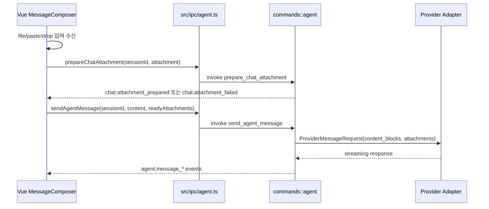
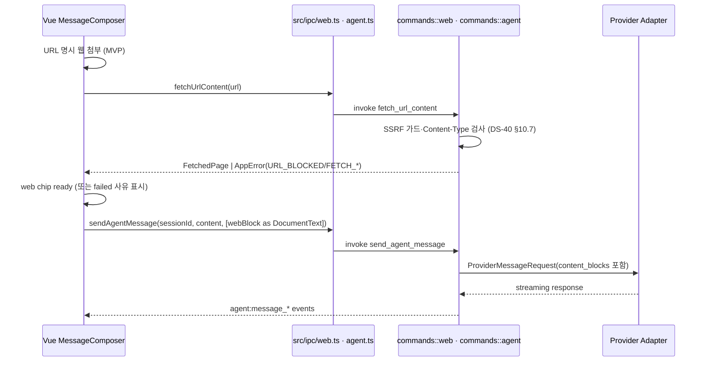
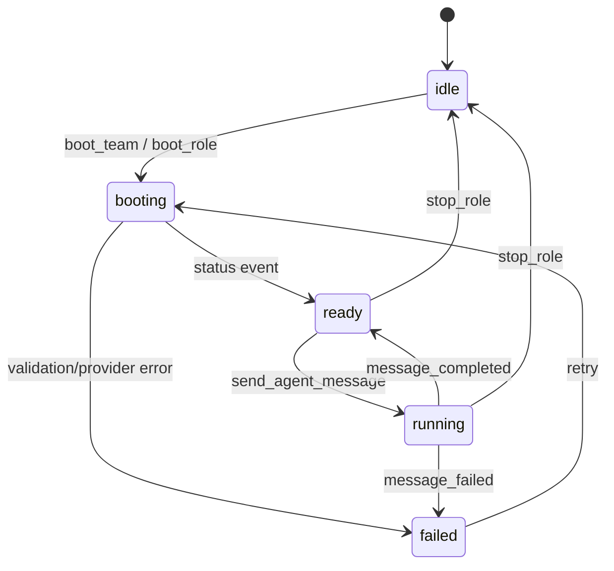

# DS-60 연동규격서 - Tauri IPC Vue/Rust 경계

## 개정이력

| 버전 | 일자 | 작성자 | 내용 |
|------|------|--------|------|
| v0.1 | 2026-06-23 | Architect | Tauri IPC invoke command 및 backend event 규격 최초 작성 |
| v0.2 | 2026-06-24 | Architect | `boot_team` 반환 sessions 배열에 PM 세션 포함 명시, `DocumentWriteResult` DTO를 실제 구현 기준으로 갱신 |
| v0.3 | 2026-06-24 | Architect | Redmine 이슈 단건 조회용 `redmine_get_issue` invoke command 추가 |
| v0.4 | 2026-06-24 | Architect | Redmine 목록/생성/수정 invoke command 추가, `DocumentWriteResult.last_updated` 제거 |
| v0.5 | 2026-07-02 | Architect | Browser history command/event와 Redmine `role?` 파라미터 추가 반영 |
| v0.6 | 2026-07-04 | Architect | generate_handler 누락 command와 `fetch_url_content`/`FetchedPage` 연동 규격 반영 |
| v0.7 | 2026-07-08 | Architect | Redmine #21 채팅 입력 이미지 첨부·문서 붙여넣기 UI/IPC/Rust 이벤트 규격 초안 추가 |
| v0.8 | 2026-07-08 | Architect | Redmine #18 2차 재검증 보완: DS-40 범위 예외 및 `prepare_chat_attachment` 현행/예정 구분 명시 |
| v0.9 | 2026-07-09 | Architect | Redmine #21 backend 구현 완료(`chat_attachment` 모듈, `generate_handler!` 등록, 단위테스트 85/85 PASS)에 따라 `prepare_chat_attachment` 상태를 현행으로 전환 (§3.2, §8.2) |
| v0.10 | 2026-07-11 | Architect | Redmine #17 설계전환: 임베디드 브라우저를 main 콘텐츠 영역 강제 핀 고정(child+좌표추종)에서 **독립 이동 가능 창**으로 전환. §3.8 Browser Commands `browser_open`(geometry 선택적 초기값)·`browser_resize`(폐기예정) 개정, §7 wrapper 6종→5종, §8.2 browser capability 전환상태 주석 추가. 구현 대기, DS-40 v0.8과 교차 정합 |
| v0.11 | 2026-07-11 | Architect | Redmine #17 **구현 완료 현행화**(BE/FE 구현 종료): `browser_open` parent 제거(완전 독립)·decorations/resizable true·geometry 전 인자 optional(기본 960×720) 확정, `browser_resize` command 완전 삭제(§3.8 하위절·§8.2 표·`generate_handler!` 등록 제거), main창 Moved 추종·`sync_embedded_browser_position`·throttle 제거 반영. §3.8 전환상태 주석 → 전환 완료(2026-07-11), §7 wrapper 5종 확정, §8.2 browser 5종 확정. DS-40 v0.9와 교차 정합 |
| v0.12 | 2026-07-12 | Architect | Redmine #24 **역할별 대화 초기화** 설계: §3.2 Agent Commands에 신규 `clear_session_messages` command 규격 추가(히스토리 삭제·`ClearSessionResult` 반환·`SESSION_NOT_FOUND`/`SESSION_BUSY` 에러·running/booting 상태 가드), **초기화 후 페르소나 자동 유지** 근거 명시(system_prompt는 MessageStore 비저장, `send_message`가 매 전송 시 `PersonaBundleService.build` 재주입 — `agent_session.rs` L341-344). §5.1 `agent:messages_cleared` event·§7 wrapper `clearSessionMessages`·§8.2 agent capability·§9 `SESSION_BUSY` 오류코드 반영 |
| v0.13 | 2026-07-12 | Architect | Redmine #24 **구현 완료 현행화**(BE/FE 구현 종료): `clear_session_messages`를 '예정' → '현행'으로 전환. BE `lib.rs` `generate_handler!` 등록·`agent_session.rs::clear_session_messages`·`ClearSessionResult`/`AgentMessagesCleared` DTO·`SESSION_BUSY` 에러·`agent:messages_cleared` emit·단위테스트, FE `ipc/agent.ts` `clearSessionMessages` wrapper·Pm/RoleChatPanel 초기화 버튼·`roleStore.applyMessagesCleared` 이벤트 구독 확인. §3.2 상태 주석·§7 wrapper 주석·§8.2 agent 그룹(예정 행 → 현행 병합) 현행화 |
| v0.14 | 2026-07-15 | Architect | Redmine #27 **프로젝트 미선택 진입 허용**의 연동 영향 정리(초안): §6.3 신설 — `projectStatus`(none/configured/active)별 IPC 가용성(browser_open·open_workspace 등은 config 불요, agent 계열·프로젝트 전환 시 세션 정리 IPC 순서), §8.1에 `dialog` plugin capability(`dialog:default`→`allow-open`) 근거 명시(LauncherView dialog 폴백 결함 진단, DS-10 §9 교차). 코드 변경 없음(설계 정리). DS-10 v0.2와 교차 정합 |
| v0.15 | 2026-07-15 | Architect | Redmine #27 **PM 결정 확정 반영**: A안(전용 홈) 및 **프로젝트 전환 시 팀 종료 확인** 정책 확정에 따라 §6.3 세션 정리 IPC 순서(전환/닫기 시 `stop_role`→스토어 초기화→재적재)를 확정 규격으로 명시. 신규 command/오류코드 불필요 재확인. DS-10 v0.3와 교차 정합 |
| v0.16 | 2026-07-16 | Architect | Redmine #29 **AI 에이전트 웹검색 연동** IPC 흐름 신설(초안): §4.4 웹 콘텐츠 fetch→주입 흐름(명시적 웹 첨부 → `fetch_url_content` → `DocumentText` content block 주입 → `send_agent_message` 단일 왕복, MVP), §5.3에 `agent:tool_requested` 배선 존재/실행루프 미구현(Phase 2) 명시, §8.2 `web` capability 주석 보강, §9에 `URL_BLOCKED` 오류코드 추가. DS-40 v0.11과 교차 정합 |
| v0.17 | 2026-07-16 | Architect | Redmine #29 **PM 결정 확정 반영**: §4.4 트리거를 **유저 명시 방식만(MVP)**으로 확정(자동감지 후속 분리), 주입 attachment `kind=Document 재사용`으로 확정(`Web` 신설 안 함), SSRF **전면 차단** 명시. DS-40 v0.12와 교차 정합 |

---

## 1. 문서 개요

### 1.1 목적

본 문서는 AgiTeamBuilder GUI의 Vue 3 프론트엔드와 Rust 백엔드 사이의 Tauri IPC 연동 규격을 정의한다. 프론트엔드는 `invoke` command로 요청하고, Rust 백엔드는 장시간 처리/상태 변화/스트리밍 응답을 event로 emit한다.

### 1.2 입력 산출물

| 산출물 | 참조 내용 |
|--------|-----------|
| DS-20 아키텍처설계서 | Tauri IPC Bridge, Rust Service, Vue Pinia Store, Agent lifecycle |

### 1.3 연동 원칙

- Vue 컴포넌트는 `invoke`를 직접 호출하지 않고 `src/ipc/*.ts` wrapper를 사용한다.
- Rust command는 JSON 직렬화 가능한 DTO만 입력/출력한다.
- 장시간 작업은 command 응답으로 시작 수락만 반환하고 진행상황은 event로 전달한다.
- 모든 오류는 `AppError` 표준 구조로 반환한다.
- IPC command는 Tauri capability allowlist에 등록된 것만 호출 가능하다.
- Tauri `generate_handler!` 등록 command 전량 대조의 정본 문서는 DS-60이다. DS-40은 외부 API, Provider Adapter, Browser/Web API 세부 연동 명세에 한정하며, `generate_handler!` 등록 command 전량 대조 대상이 아니다.
- 본 문서에서 `상태=현행`으로 표기한 command만 현재 `system/lugh/src-tauri/src/lib.rs`의 `generate_handler!` 등록 command로 간주한다. `상태=예정` 또는 `구현중` command는 설계 초안이며 구현 완료 전까지 현행 command 대조 PASS 기준에서 제외한다.

---

## 2. 공통 DTO

### 2.1 AppError

```ts
export type AppError = {
  code: string
  message: string
  detail?: unknown
  recoverable: boolean
}
```

### 2.2 CommandResult

```ts
export type CommandResult = {
  ok: boolean
  error?: AppError
}
```

### 2.3 AgentLifecycleState

```ts
export type AgentLifecycleState =
  | 'idle'
  | 'booting'
  | 'ready'
  | 'running'
  | 'failed'
```

### 2.4 주요 식별자

| 필드 | 타입 | 설명 |
|------|------|------|
| `workspace_id` | string | workspace 식별자 |
| `role` | string | PM, Architect, DeveloperBE 등 역할명 |
| `session_id` | string | AgentSession 식별자 |
| `message_id` | string | AgentMessage 식별자 |
| `provider` | string | `claude`, `openai`, `gemini`, `redmine` |

### 2.5 Chat Attachment DTO

```ts
type ChatAttachmentKind = 'image' | 'document'
type ChatAttachmentSource = 'file_picker' | 'clipboard' | 'drag_drop'
type ChatAttachmentStatus = 'pending' | 'ready' | 'failed'

type ChatAttachmentInput = {
  id: string
  kind: ChatAttachmentKind
  source: ChatAttachmentSource
  filename: string
  media_type: string
  size_bytes: number
  content_base64: string
}

type PreparedChatAttachment = {
  id: string
  kind: ChatAttachmentKind
  source: ChatAttachmentSource
  filename: string
  media_type: string
  size_bytes: number
  sha256: string
  status: ChatAttachmentStatus
  content_base64?: string
  extracted_text?: string
  truncated: boolean
  error?: AppError
}
```

`ChatAttachmentInput.content_base64`는 frontend가 File/Clipboard Blob을 읽어 Rust에 넘기는 transport 필드이다. Rust는 이미지면 base64를 검증해 `content_base64`를 유지하고, 문서면 `extracted_text` 생성 후 provider 전송 단계에서 원본 base64를 폐기할 수 있다.

---

## 3. Invoke Command 규격

### 3.1 Workspace Commands

#### `open_workspace`

| 항목 | 값 |
|------|----|
| 설명 | 로컬 프로젝트 workspace를 연다 |
| Request | `{ "path": string }` |
| Response | `WorkspaceSummary` |

```ts
type WorkspaceSummary = {
  workspace_id: string
  path: string
  name: string
  display_name?: string
}
```

#### `load_workspace_config`

| 항목 | 값 |
|------|----|
| 설명 | `agiteam.json`, `project_state.yaml`을 로드한다 |
| Request | `{ "workspace_id": string }` |
| Response | `WorkspaceConfig` |

#### `validate_workspace`

| 항목 | 값 |
|------|----|
| 설명 | workspace 필수 구조와 persona 파일을 검증한다 |
| Request | `{ "workspace_id": string }` |
| Response | `ValidationReport` |

#### `save_workspace_config`

| 항목 | 값 |
|------|----|
| 타입 | invoke |
| 설명 | `agiteam.json` 설정을 저장한다. 기존 파일이 있으면 `agiteam.json.bak`을 생성한 뒤 갱신한다 |
| Request | `{ "workspace_id": string, "config": AgiteamConfig }` |
| Response | `void` |

#### `write_project_state`

| 항목 | 값 |
|------|----|
| 타입 | invoke |
| 설명 | `project_state.yaml`을 저장한다 |
| Request | `{ "workspace_id": string, "state": ProjectState }` |
| Response | `void` |

### 3.2 Agent Commands

#### `boot_team`

| 항목 | 값 |
|------|----|
| 설명 | 전체 역할의 agent session booting을 시작한다 |
| Request | `{ "workspace_id": string }` |
| Response | `BootTeamResult` |
| Events | `agent:status_changed`, `agent:message_failed` |

```ts
type BootTeamResult = {
  workspace_id: string
  sessions: AgentSessionSummary[]
}
```

`sessions` 배열은 PM 세션을 포함한다. 배열 순서는 고정이며, `sessions[0]`은 PM 세션, `sessions[1]`부터 `sessions[6]`까지는 `agiteam.json`의 team 배열 순서에 따른 역할 팀원 세션이다.

#### `boot_role`

| 항목 | 값 |
|------|----|
| 설명 | 단일 역할 agent session booting을 시작한다 |
| Request | `{ "workspace_id": string, "role": string }` |
| Response | `AgentSessionSummary` |
| Events | `agent:status_changed` |

#### `stop_role`

| 항목 | 값 |
|------|----|
| 설명 | 실행 중인 역할 세션을 중지하고 상태를 idle로 전이한다 |
| Request | `{ "session_id": string }` |
| Response | `CommandResult` |
| Events | `agent:status_changed` |

#### `send_agent_message`

| 항목 | 값 |
|------|----|
| 설명 | ready 상태의 agent session에 사용자 메시지를 전송한다 |
| Request | `{ "session_id": string, "content": string, "attachments"?: PreparedChatAttachment[] }` |
| Response | `MessageAck` |
| Events | `agent:status_changed`, `agent:message_started`, `agent:message_delta`, `agent:message_completed`, `agent:message_failed` |

```ts
type MessageAck = {
  session_id: string
  user_message_id: string
  accepted_at: string
}
```

`attachments`가 없거나 빈 배열이면 기존 텍스트 전용 동작과 동일하다. 첨부가 있으면 Rust는 provider capability를 확인한 뒤 DS-40의 `ProviderContentBlock`으로 변환한다. 하나라도 `status !== 'ready'`이거나 provider가 지원하지 않는 유형이면 메시지를 전송하지 않고 `AppError`를 반환한다.

#### `get_agent_session`

| 항목 | 값 |
|------|----|
| 설명 | 세션 상세 상태를 조회한다 |
| Request | `{ "session_id": string }` |
| Response | `AgentSessionDetail` |

#### `list_agent_messages`

| 항목 | 값 |
|------|----|
| 설명 | 세션 메시지 로그를 페이지 단위로 조회한다 |
| Request | `{ "session_id": string, "cursor"?: string, "limit"?: number }` |
| Response | `MessagePage` |

#### `clear_session_messages`

| 항목 | 값 |
|------|----|
| 타입 | invoke |
| 상태 | 현행(등록 완료). Redmine #24 BE/FE 구현 완료로 `lib.rs` `generate_handler!` 등록 및 `commands::agent::clear_session_messages` 확인(단위테스트 포함) |
| 설명 | 지정 세션의 대화 히스토리를 전부 삭제한다. 세션 자체(lifecycle 상태·provider·startupFiles 등 메타)와 페르소나 주입은 유지한다 |
| Request | `{ "session_id": string }` |
| Response | `ClearSessionResult` |
| Events | `agent:messages_cleared` |

```ts
type ClearSessionResult = {
  session_id: string
  cleared_count: number   // 삭제된 메시지 건수
  cleared_at: string      // RFC3339 UTC
}
```

동작 규칙:

- `MessageStore`(`agent_session.rs`의 `HashMap<session_id, Vec<AgentMessage>>`)에서 해당 `session_id`의 메시지 벡터를 비운다. 세션 엔트리(`AgentSession`)와 lifecycle 상태는 변경하지 않는다.
- **상태 가드**: 세션이 `running` 또는 `booting` 상태이면 삭제하지 않고 `SESSION_BUSY`를 반환한다. 진행 중 streaming 완료 시 assistant 메시지가 다시 write되어 "user 없는 assistant" 불일치가 생기는 것을 방지한다. `idle`·`ready`·`failed`에서만 허용한다.
- 존재하지 않는 세션이면 `SESSION_NOT_FOUND`를 반환한다(`get_session`과 동일 규약).
- 삭제 성공 시 `cleared_count`(삭제 전 메시지 수)를 반환하고 `agent:messages_cleared` event를 emit한다.

**초기화 후 페르소나 자동 유지 (별도 재주입 로직 불필요)**:

- 페르소나(시스템 프롬프트)는 `MessageStore`의 대화 히스토리에 저장되지 않는다. 히스토리에는 user/assistant 대화 turn만 담긴다.
- `send_message`는 매 전송마다 `PersonaBundleService::build(config, role)`로 persona bundle을 재생성해 `ProviderMessageRequest.system_prompt`에 주입한다(`agent_session.rs` L341-344). 이 경로는 히스토리와 완전히 분리되어 있다.
- 따라서 `clear_session_messages`로 히스토리를 비워도, 초기화 직후 첫 전송부터 페르소나가 그대로 적용된다. 초기화 command는 페르소나를 건드리지 않으며, **재주입을 위한 별도 로직·재부팅이 필요 없다**.

#### `prepare_chat_attachment`

| 항목 | 값 |
|------|----|
| 타입 | invoke |
| 상태 | 현행(등록 완료). Redmine #21 backend 구현 완료로 2026-07-09 현재 `lib.rs` `pub mod chat_attachment` 선언 및 `generate_handler!` 등록 확인 (단위테스트 85/85 PASS) |
| 설명 | 채팅 입력창 첨부 1건을 검증하고 이미지 base64 또는 문서 추출 텍스트로 정규화한다 |
| Request | `{ "session_id": string, "attachment": ChatAttachmentInput }` |
| Response | `PreparedChatAttachment` |
| Events | `chat:attachment_prepared`, `chat:attachment_failed` |

처리 규칙:

- 이미지 MIME은 `image/png`, `image/jpeg`, `image/webp`, `image/gif`만 허용한다.
- 문서 MIME/확장자는 `md`, `markdown`, `txt`, `csv`, `json`, `yaml`, `yml`, `log`, `pdf`만 허용한다.
- 이미지 10MB/건, 문서 20MB/건, 메시지당 10건을 기본 한도로 한다.
- 문서 추출 결과는 100KB/건을 넘으면 truncate하고 `truncated=true`로 반환한다.
- PDF는 텍스트 레이어 추출만 지원한다. OCR은 MVP 범위에서 제외한다.

### 3.3 Persona Commands

#### `build_persona_bundle`

| 항목 | 값 |
|------|----|
| 설명 | Shared persona와 역할 persona를 조합해 bundle 미리보기를 생성한다 |
| Request | `{ "workspace_id": string, "role": string }` |
| Response | `PersonaBundlePreview` |

```ts
type PersonaBundlePreview = {
  role: string
  content_hash: string
  content: string
  source_files: string[]
}
```

### 3.4 Document Commands

#### `list_documents`

| 항목 | 값 |
|------|----|
| 설명 | workspace 문서 트리를 조회한다 |
| Request | `{ "workspace_id": string }` |
| Response | `DocumentTree` |

#### `read_document`

| 항목 | 값 |
|------|----|
| 설명 | workspace root 하위 문서를 읽는다 |
| Request | `{ "workspace_id": string, "path": string }` |
| Response | `DocumentContent` |

#### `write_latest_document`

| 항목 | 값 |
|------|----|
| 설명 | 기존 파일을 `_archive`에 백업한 뒤 `.latest.md`를 갱신한다 |
| Request | `{ "workspace_id": string, "path": string, "content": string }` |
| Response | `DocumentWriteResult` |
| Events | `document:changed` |

```ts
type DocumentWriteResult = {
  path: string
  archive_path?: string
  version_hint: string
}
```

`archive_path`는 기존 현행본이 있어 백업이 생성된 경우에만 반환한다. 신규 파일 작성처럼 백업 대상이 없으면 생략한다. `archived_at`와 `last_updated` 필드는 사용하지 않는다. `version_hint`는 문서 frontmatter 또는 저장 정책 기준으로 산출한 다음 참고 버전 라벨이다.

### 3.5 Credential Commands

#### `save_credential`

| 항목 | 값 |
|------|----|
| 설명 | provider credential을 OS vault에 저장한다 |
| Request | `{ "provider": string, "account": string, "secret": string }` |
| Response | `CredentialRef` |

#### `delete_credential`

| 항목 | 값 |
|------|----|
| 설명 | provider credential을 삭제한다 |
| Request | `{ "provider": string, "account": string }` |
| Response | `CommandResult` |

#### `validate_credential`

| 항목 | 값 |
|------|----|
| 설명 | provider credential 유효성을 검증한다 |
| Request | `{ "provider": string, "account": string }` |
| Response | `ProviderHealth` |
| Events | `credential:validated` |

#### `get_masked_credential`

| 항목 | 값 |
|------|----|
| 타입 | invoke |
| 설명 | credential 원문 없이 저장 여부와 마스킹 정보를 조회한다 |
| Request | `{ "provider": string, "account": string }` |
| Response | `MaskedCredential` |

```ts
type MaskedCredential = {
  provider: string
  account: string
  has_secret: boolean
  masked?: string
}
```

#### `check_claude_oauth`

| 항목 | 값 |
|------|----|
| 타입 | invoke |
| 설명 | Claude Code OAuth credential 존재 여부를 확인한다 |
| Request | `{}` |
| Response | `CommandResult` |

### 3.6 Health Commands

#### `run_health_check`

| 항목 | 값 |
|------|----|
| 설명 | workspace 구조, provider credential, network 상태를 점검한다 |
| Request | `{ "workspace_id": string }` |
| Response | `HealthCheckReport` |
| Events | `health:completed` |

### 3.7 Redmine Commands

#### `redmine_get_issue`

| 항목 | 값 |
|------|----|
| 타입 | invoke |
| 설명 | Redmine 이슈 단건을 조회한다 |
| Request | `{ "workspace_id": string, "issue_id": number, "role"?: string }` |
| Response | `RedmineIssue` |

```ts
type RedmineIssue = {
  id: number
  subject: string
  status_id: number
  done_ratio: number
  description: string
  assigned_to_id?: number
}
```

#### `redmine_list_issues`

| 항목 | 값 |
|------|----|
| 타입 | invoke |
| 설명 | Redmine 프로젝트 이슈 목록을 조회한다 |
| Request | `{ "workspace_id": string, "project_id"?: string, "status_id"?: string, "role"?: string }` |
| Response | `RedmineIssue[]` |

#### `redmine_create_issue`

| 항목 | 값 |
|------|----|
| 타입 | invoke |
| 설명 | Redmine 이슈를 생성한다 |
| Request | `{ "workspace_id": string, "project_id": string, "tracker_id": number, "subject": string, "description"?: string, "assigned_to_id"?: number, "role"?: string }` |
| Response | `RedmineIssue` |

#### `redmine_update_issue`

| 항목 | 값 |
|------|----|
| 타입 | invoke |
| 설명 | Redmine 이슈 상태, 진척률, 코멘트를 수정한다 |
| Request | `{ "workspace_id": string, "issue_id": number, "status_id"?: number, "done_ratio"?: number, "notes"?: string, "role"?: string }` |
| Response | `void` |

`role`이 지정되면 Rust backend는 OS Credential Vault에서 `redmine/api_key_${role}`를 먼저 조회한다. 역할별 key가 없거나 `role`이 생략되면 하위 호환을 위해 `redmine/api_key`를 fallback으로 조회한다.

### 3.8 Browser Commands

> **설계 모델: 독립 이동 가능 창 (Redmine #17)** — `embedded-browser`는 main 콘텐츠 영역에 강제로 겹쳐 붙는 child 창이 아니라, 사용자가 OS 창처럼 자유롭게 이동·리사이즈하는 독립 최상위 창이다. main 창의 이동/리사이즈/최소화를 좌표 추종하지 않으며, parent 지정 없이 `decorations(true)`·`resizable(true)`로 생성한다. 앱(main) 종료 시 함께 정리된다. 상세 규격은 DS-40 §9.
>
> **전환 완료(2026-07-11)**: Redmine #17 BE/FE 구현이 종료되어 본 절은 현행 규격이다. 코드는 더 이상 핀 고정(child `parent(&main)` + `Moved`/`Resized` 좌표 추종) 방식이 아니며, `sync_embedded_browser_position`·throttle 로직과 `browser_resize` command가 모두 제거되었다. 현행 browser command는 `browser_open`·`browser_navigate`·`browser_back`·`browser_forward`·`browser_close` 5종이다.

#### `browser_open`

| 항목 | 값 |
|------|----|
| 타입 | invoke |
| 설명 | `embedded-browser` 독립 창을 생성한다. 기존 창이 있으면 닫고 재생성한다. 위치/크기는 선택적 초기값이며 이후 OS·사용자가 소유한다 |
| Request | `{ "url": string, "x"?: number, "y"?: number, "width"?: number, "height"?: number }` |
| Response | `void` |
| Events | `browser:navigation` |

#### `browser_navigate`

| 항목 | 값 |
|------|----|
| 타입 | invoke |
| 설명 | 열린 `embedded-browser` 창에서 지정 URL로 이동한다 |
| Request | `{ "url": string }` |
| Response | `void` |
| Events | `browser:navigation` |

#### `browser_back`

| 항목 | 값 |
|------|----|
| 타입 | invoke |
| 설명 | 열린 `embedded-browser` 창에서 `history.back()`을 실행한다 |
| Request | `{}` |
| Response | `void` |
| Events | `browser:navigation` |

#### `browser_forward`

| 항목 | 값 |
|------|----|
| 타입 | invoke |
| 설명 | 열린 `embedded-browser` 창에서 `history.forward()`를 실행한다 |
| Request | `{}` |
| Response | `void` |
| Events | `browser:navigation` |

#### `browser_close`

| 항목 | 값 |
|------|----|
| 타입 | invoke |
| 설명 | `embedded-browser` 창을 닫는다 |
| Request | `{}` |
| Response | `void` |

> `browser_resize` command는 Redmine #17 독립 창 전환 완료(2026-07-11)로 삭제되었다. 독립 창은 사용자가 직접 이동·리사이즈하므로 좌표 동기화 command가 불필요하다. Rust command·`generate_handler!` 등록·`src/ipc/browser.ts` `resizeBrowser` wrapper·프론트 `ResizeObserver` 호출이 함께 제거되었다.

### 3.9 Web Commands

#### `fetch_url_content`

| 항목 | 값 |
|------|----|
| 타입 | invoke |
| 설명 | URL의 HTML을 가져와 script/style/comment/tag를 제거한 본문 텍스트를 반환한다 |
| Request | `{ "url": string }` |
| Response | `FetchedPage` |

```ts
type FetchedPage = {
  url: string
  title?: string
  text: string
  fetched_at: string
}
```

처리 규칙:

- URL에 `http://` 또는 `https://`가 없으면 `https://`를 자동 부여한다.
- HTTP 요청 timeout은 15초이다.
- `text`는 공백 정리 후 최대 50KB로 제한한다.
- JavaScript 실행 결과는 수집하지 않는다.

---

## 4. 채팅 입력 첨부 UI/IPC 흐름

### 4.1 입력 경로 3종

| 경로 | Frontend 처리 | Rust IPC |
|------|---------------|----------|
| 파일 선택 | MessageComposer의 첨부 버튼에서 OS file picker 호출, 복수 파일 선택 허용 | 각 파일을 base64로 읽어 `prepare_chat_attachment` 호출 |
| 클립보드 붙여넣기 | `paste` 이벤트에서 `clipboardData.items` 검사. 이미지 Blob과 텍스트/파일 item을 분기 | 이미지 Blob 또는 파일 item을 `ChatAttachmentInput`으로 변환 후 준비 |
| 드래그&드롭 | composer drop zone에서 `dragenter/dragover/drop` 처리, hover 상태 표시 | `DataTransfer.files`를 순회해 파일 선택과 동일하게 준비 |

세 경로 모두 frontend store에는 `pending -> ready | failed` 상태의 attachment chip을 표시한다. 사용자는 전송 전 chip을 제거할 수 있으며, failed chip은 전송 payload에서 제외하고 오류 사유를 표시한다.

### 4.2 전송 순서



### 4.3 문서 붙여넣기 처리

클립보드에 파일이 아닌 plain text가 들어온 경우에는 기존 텍스트 붙여넣기로 처리한다. 파일형 문서 또는 drag/drop 문서는 반드시 `prepare_chat_attachment`를 거친다. md/txt류는 Rust에서 UTF-8 텍스트로 추출하고, pdf는 텍스트 레이어만 추출한다. 추출 실패 파일은 `chat:attachment_failed`를 emit하고 메시지 본문에 자동 병합하지 않는다.

### 4.4 웹 콘텐츠 fetch → 프롬프트 주입 흐름 (Redmine #29, MVP)

에이전트가 웹 자료를 읽어 작업에 활용하기 위한 **결정적 pre-fetch 주입** 경로다. 트리거·주입 규격·보안 정책의 근거는 DS-40 §10.6–10.8.

- **트리거(MVP, PM 확정)**: 사용자가 메시지 입력에서 URL을 **명시적으로 "웹 첨부"** 하는 방식만. 자동 URL 감지는 후속 과제로 분리하며, MVP는 무단 자동 외부요청을 하지 않는다.
- **입력 경로 표(§4.1)에 대응하는 4번째 경로**: "웹 URL 첨부" — Frontend가 URL을 받아 `fetchUrlContent(url)`(`src/ipc/web.ts`)를 호출, 결과 `FetchedPage`를 attachment chip(`pending → ready | failed`)으로 표시.
- **주입 규격**: `FetchedPage`를 **`DocumentText` content block**으로 변환해 해당 user 메시지의 `content_blocks`에 포함(어댑터 변경 없음). 매핑은 DS-40 §10.6 표(`filename=title??url`, `media_type="text/html"`, `extracted_text=text`, `truncated`) 참조. **[PM 확정] BE는 `AttachmentKind`에 `Web`을 신설하지 않고 기존 `Document`를 재사용**하며 `FetchedPage → ProviderAttachment(kind=Document)` 변환 헬퍼만 추가.
- **보안(PM 확정)**: `fetch_url_content`는 loopback·link-local·사설대역·사내 레드마인 등 내부망을 **전면 차단**(SSRF 방지). 차단 시 `URL_BLOCKED`. 상세 DS-40 §10.7.



- **실패 처리**: `fetch_url_content` 오류(`URL_BLOCKED`/`FETCH_TIMEOUT`/`FETCH_FAILED`/`INVALID_URL`)는 web chip을 `failed`로 표시하고 메시지에 병합하지 않는다(기존 첨부 실패 규칙과 동일).
- **Phase 2(tool-use)**: 모델이 스스로 fetch하는 방식은 §5.3의 `agent:tool_requested` 실행 루프가 선행되어야 하며 본 흐름과 별도로 도입한다.

---

## 5. Backend Event 규격

### 5.1 Event 목록

| Event | Payload | 구독 Store |
|-------|---------|------------|
| `workspace:opened` | `WorkspaceSummary` | `useWorkspaceStore` |
| `workspace:validation_failed` | `ValidationReport` | `useWorkspaceStore`, `useHealthStore` |
| `agent:status_changed` | `AgentStatusChanged` | `useSessionStore` |
| `agent:message_started` | `AgentMessageStarted` | `useSessionStore` |
| `agent:message_delta` | `AgentMessageDelta` | `useSessionStore` |
| `agent:message_completed` | `AgentMessageCompleted` | `useSessionStore` |
| `agent:message_failed` | `AgentMessageFailed` | `useSessionStore`, `useHealthStore` |
| `agent:tool_requested` | `AgentToolRequested` | `useSessionStore` |
| `agent:messages_cleared` | `AgentMessagesCleared` | `useSessionStore` |
| `document:changed` | `DocumentChanged` | `useDocumentStore` |
| `chat:attachment_prepared` | `ChatAttachmentPrepared` | `useSessionStore` |
| `chat:attachment_failed` | `ChatAttachmentFailed` | `useSessionStore`, `useHealthStore` |
| `credential:validated` | `CredentialValidated` | `useCredentialStore` |
| `health:completed` | `HealthCheckReport` | `useHealthStore` |
| `browser:navigation` | `string` | `useBrowserStore` |

### 5.2 Event Payload

```ts
type AgentStatusChanged = {
  session_id: string
  role: string
  from: AgentLifecycleState
  to: AgentLifecycleState
  reason?: string
  changed_at: string
}

type AgentMessageDelta = {
  session_id: string
  message_id: string
  delta: string
  sequence: number
}

type AgentMessageCompleted = {
  session_id: string
  message_id: string
  usage?: {
    input_tokens?: number
    output_tokens?: number
    total_tokens?: number
  }
  completed_at: string
}

type AgentMessageFailed = {
  session_id: string
  message_id?: string
  error: AppError
}

type ChatAttachmentPrepared = {
  session_id: string
  attachment: PreparedChatAttachment
}

type ChatAttachmentFailed = {
  session_id: string
  attachment_id: string
  filename: string
  error: AppError
}

type AgentMessagesCleared = {
  session_id: string
  cleared_count: number
  cleared_at: string
}

type BrowserNavigation = string
```

### 5.3 Event 처리 규칙

- `agent:message_delta`는 `sequence` 기준으로 순서 보정한다.
- `agent:message_completed` 수신 전까지 assistant message는 streaming 상태로 표시한다.
- `agent:message_failed` 발생 시 해당 세션 상태는 `failed`로 전이한다.
- `chat:attachment_prepared` 수신 시 attachment chip을 ready 상태로 전환한다.
- `chat:attachment_failed` 수신 시 attachment chip을 failed 상태로 전환하고 전송 대상에서 제외한다.
- `agent:messages_cleared` 수신 시 해당 세션의 메시지 로그를 store에서 비운다(같은 세션이 여러 패널/최대화 뷰에 렌더링된 경우 동기 반영). 페르소나·세션 상태는 그대로 둔다.
- `agent:tool_requested`(payload `AgentToolRequested`)는 **배선만 존재**한다. 현재 `send_message`는 `tools`를 비워 보내므로 실제 emit되지 않으며, tool 실행→결과 재주입→스트리밍 지속의 **agentic 루프는 미구현(Redmine #29 Phase 2)**. MVP 웹검색(§4.4)은 이 이벤트를 사용하지 않는 결정적 pre-fetch 방식이다.
- `document:changed` 발생 시 문서 트리와 preview를 재조회한다.
- credential 관련 event는 secret을 포함하지 않는다.
- `browser:navigation` 발생 시 payload URL을 브라우저 store의 현재 URL과 주소창 값에 반영한다.

---

## 6. 상태 전이 연동

### 6.1 Agent Lifecycle



### 6.2 UI 제어 규칙

| 상태 | MessageComposer | Stop Button | Retry Button |
|------|-----------------|-------------|--------------|
| `idle` | disabled | disabled | disabled |
| `booting` | disabled | enabled | disabled |
| `ready` | enabled | enabled | disabled |
| `running` | disabled | enabled | disabled |
| `failed` | disabled | disabled | enabled |

### 6.3 프로젝트 상태(`projectStatus`)와 IPC 가용성 (Redmine #27)

프로젝트 미선택 상태에서도 앱이 켜지고 나중에 프로젝트를 설정할 수 있어야 한다(#27). 프론트엔드 라우팅/상태 모델은 DS-10 §8 참조. IPC 경계에서의 영향은 다음과 같다.

| IPC 그룹 | `none`(프로젝트 없음) | `active`(부팅됨) | 근거 |
|----------|:---:|:---:|------|
| `browser_*`(내장 브라우저) | ✅ 호출 가능 | ✅ | 독립 창(#17)은 workspace/agiteam config에 의존하지 않음. 홈에서 `browser_open` 직접 호출 가능 |
| `open_workspace`/`load_workspace_config`/`save_workspace_config` | ✅ (프로젝트 생성/열기 시) | ✅ | config 부재 상태에서 신규 프로젝트를 디스크에 세우는 진입 경로 |
| `agent_*`(boot/send/clear 등) | ❌ 비호출 | ✅ | config·부팅 전제. 홈에서는 채팅 UI 자체가 비활성(DS-10 §8.2) |
| `redmine_*`, `document_*` | ❌/⚠️ | ✅ | workspace 경로·설정 의존 |
| `run_health_check` | ✅(일반 진단) | ✅ | config 무관 진단 |

> **설계 원칙**: 프론트엔드는 `projectStatus=none`일 때 config를 요구하는 command(agent/document/redmine 계열)를 **호출하지 않도록 진입점(버튼/메뉴)을 비활성**한다. 백엔드는 config 부재 시 해당 command 호출을 방어적으로 거절(`WORKSPACE_NOT_FOUND`/`SESSION_NOT_FOUND` 등 기존 코드)한다. 즉 신규 오류 코드는 필요 없다.

**프로젝트 전환/닫기 시 IPC 정리 순서** (DS-10 §8.3):

1. (현재 `active`인 경우) 팀 종료 확인 → `stop_role`(또는 팀 일괄 종료) 호출로 실행 세션 정리.
2. 프론트엔드 스토어 초기화(`projectStore.reset()`·`workspaceStore.deactivate()`·`roleStore` 초기화).
3. 새 프로젝트 선택 시 `open_workspace` → `load_workspace_config`로 재적재, 미선택 시 `projectStatus=none`(홈)으로 복귀.

> `clear_session_messages`(#24)는 **한 세션의 대화 로그만** 비우는 것으로 프로젝트 전환과 목적이 다르다. 전환은 세션 자체를 종료·해제한다.

---

## 7. TypeScript IPC Wrapper 구조

```text
src/
  ipc/
    workspace.ts
    agent.ts
    persona.ts
    document.ts
    credential.ts
    health.ts
    redmine.ts
    browser.ts
    web.ts
    events.ts
    types.ts
```

브라우저 command은 `src/ipc/browser.ts` wrapper를 경유한다. #17 독립 창 전환 완료로 wrapper는 `openBrowser`·`navigateBrowser`·`browserBack`·`browserForward`·`closeBrowser` 5종이며, `resizeBrowser`는 제거되었다. `fetch_url_content`도 동일 원칙에 따라 `src/ipc/web.ts` 또는 동등한 typed wrapper를 경유한다.

대화 초기화 command `clear_session_messages`는 `src/ipc/agent.ts`의 `clearSessionMessages(sessionId)` wrapper를 경유한다(Redmine #24, 구현 완료).

### 7.1 호출 예시

```ts
import { invoke } from '@tauri-apps/api/core'

export async function sendAgentMessage(
  sessionId: string,
  content: string,
  attachments: PreparedChatAttachment[] = [],
) {
  return invoke<MessageAck>('send_agent_message', {
    sessionId,
    content,
    attachments,
  })
}

export async function prepareChatAttachment(
  sessionId: string,
  attachment: ChatAttachmentInput,
) {
  return invoke<PreparedChatAttachment>('prepare_chat_attachment', {
    sessionId,
    attachment,
  })
}
```

### 7.2 이벤트 등록 예시

```ts
import { listen } from '@tauri-apps/api/event'
import { useSessionStore } from '@/stores/session'

export async function registerAgentEvents() {
  const sessionStore = useSessionStore()

  const unlistenStatus = await listen<AgentStatusChanged>(
    'agent:status_changed',
    event => sessionStore.applyStatusChanged(event.payload),
  )

  const unlistenDelta = await listen<AgentMessageDelta>(
    'agent:message_delta',
    event => sessionStore.appendMessageDelta(event.payload),
  )

  return () => {
    unlistenStatus()
    unlistenDelta()
  }
}
```

---

## 8. 보안 및 Capability

### 8.1 Capability 원칙

| 영역 | 정책 |
|------|------|
| Command 호출 | allowlist에 등록된 command만 허용 |
| 파일 접근 | 채팅 첨부는 frontend가 Blob을 base64로 전달하고 Rust는 영구 경로를 저장하지 않음. 일반 문서 command는 workspace root 하위 경로만 허용 |
| Credential | secret은 Rust backend와 OS vault 사이에서만 이동 |
| Event payload | API key/token/Authorization header 포함 금지 |
| 외부 API | Vue에서 직접 호출 금지. Rust provider adapter만 호출 |
| 파일/폴더 선택 다이얼로그 | `tauri-plugin-dialog`(`Cargo.toml`·`lib.rs` `.plugin(tauri_plugin_dialog::init())`), capability `dialog:default`(→ `allow-open` 포함). LauncherView 폴더 선택은 이 권한으로 동작. dialog invoke 실패(비-Tauri 컨텍스트 등) 시 프론트엔드는 **경로 직접 입력 폴백**을 제공하고 예외를 로깅한다(silent swallow 금지) — 상세 진단 DS-10 §9 |

### 8.2 Command 권한 그룹

| Capability | 상태 | Commands |
|------------|------|----------|
| `agent` | 현행 | `boot_team`, `boot_role`, `stop_role`, `send_agent_message`, `get_agent_session`, `list_agent_messages`, `prepare_chat_attachment`, `clear_session_messages` |
| `document` | 현행 | `list_documents`, `read_document`, `write_latest_document` |
| `workspace` | 현행 | `open_workspace`, `load_workspace_config`, `validate_workspace`, `save_workspace_config`, `write_project_state` |
| `credential` | 현행 | `save_credential`, `delete_credential`, `validate_credential`, `get_masked_credential`, `check_claude_oauth` |
| `health` | 현행 | `run_health_check` |
| `redmine` | 현행 | `redmine_get_issue`, `redmine_list_issues`, `redmine_create_issue`, `redmine_update_issue` |
| `browser` | 현행 | `browser_open`, `browser_navigate`, `browser_back`, `browser_forward`, `browser_close` |
| `web` | 현행 | `fetch_url_content` (Redmine #29: SSRF/내부망 차단 가드·Content-Type 제한 추가 예정, 차단 시 `URL_BLOCKED` — DS-40 §10.7) |

`예정/구현중` command는 향후 구현 시 `lib.rs` `generate_handler!`, Tauri capability allowlist, `src/ipc/*.ts` wrapper, 관련 event DTO가 모두 반영된 뒤 `현행`으로 전환한다. Redmine #21 `prepare_chat_attachment`는 2026-07-09 backend 구현 완료(`chat_attachment` 모듈 신설, `generate_handler!` 등록, 단위테스트 85/85 PASS)로 `현행`으로 전환되어 현행 등록 command 전량 대조 대상에 포함된다.

Redmine #17 독립 창 전환 완료(2026-07-11)로 `browser_resize`는 코드(Rust command·`generate_handler!` 등록·capability·`src/ipc/browser.ts` wrapper)에서 완전 삭제되어 §8.2 표와 §3.8에서 제외되었다. 따라서 현행 browser capability는 `browser_open`·`browser_navigate`·`browser_back`·`browser_forward`·`browser_close` 5종이며, 이 5종이 현행 command 전량 대조 대상이다.

---

## 9. 오류 코드

| 코드 | 의미 | UI 처리 |
|------|------|---------|
| `WORKSPACE_NOT_FOUND` | workspace 경로 없음 | 경로 재선택 |
| `CONFIG_INVALID` | 설정 schema 오류 | 검증 결과 표시 |
| `PERSONA_NOT_FOUND` | 역할 persona 파일 없음 | 누락 파일 표시 |
| `CREDENTIAL_MISSING` | credential 없음 | 설정 화면 이동 |
| `AUTH_FAILED` | provider 인증 실패 | credential 재입력 |
| `PROVIDER_UNREACHABLE` | provider endpoint 도달 불가 | 네트워크 안내 |
| `SESSION_NOT_READY` | ready 이전 메시지 전송 | 상태 갱신 후 재시도 |
| `SESSION_NOT_FOUND` | 존재하지 않는 세션 지정 | 세션 목록 갱신 후 재시도 |
| `SESSION_BUSY` | running/booting 중 대화 초기화 시도 | 응답 완료·중지 후 재시도 |
| `STREAM_INTERRUPTED` | streaming 중단 | 재시도 버튼 표시 |
| `DOCUMENT_WRITE_FAILED` | 문서 백업/쓰기 실패 | 오류 상세 표시 |
| `INVALID_URL` | URL 파싱 실패 | URL 입력값 수정 |
| `URL_BLOCKED` | 내부망/비허용 호스트·scheme 차단(SSRF 가드, Redmine #29) | 외부 공개 URL로 변경 안내 |
| `FETCH_TIMEOUT` | URL 본문 조회 timeout | 네트워크 확인 후 재시도 |
| `FETCH_FAILED` | URL 요청, HTTP status, 본문 읽기 실패 | 오류 상세 확인 후 재시도 |
| `ATTACHMENT_INVALID_TYPE` | 허용되지 않은 첨부 MIME/확장자 | 해당 chip failed 표시 |
| `ATTACHMENT_TOO_LARGE` | 첨부 크기 또는 추출 텍스트 한도 초과 | 파일 축소 또는 제거 안내 |
| `ATTACHMENT_EXTRACT_FAILED` | 문서 텍스트 추출 실패 | 해당 chip failed 표시 |
| `ATTACHMENT_UNSUPPORTED` | provider/model이 첨부 유형 미지원 | provider 변경 또는 첨부 제거 안내 |

---

## 10. 후속 문서 연계

| 산출물 | 반영 필요 |
|--------|-----------|
| DS-40 API명세서 | Provider streaming 결과와 오류 모델 정합성 유지 |
| DS-50 화면설계서 | 상태별 버튼/패널/로그 표시 규칙 반영 |
| DS-30 DB설계서 | session, message, credential ref, health result 저장 모델 반영 |
| TS-05 시험계획서 | invoke command, event ordering, error handling 테스트 케이스 작성 |
