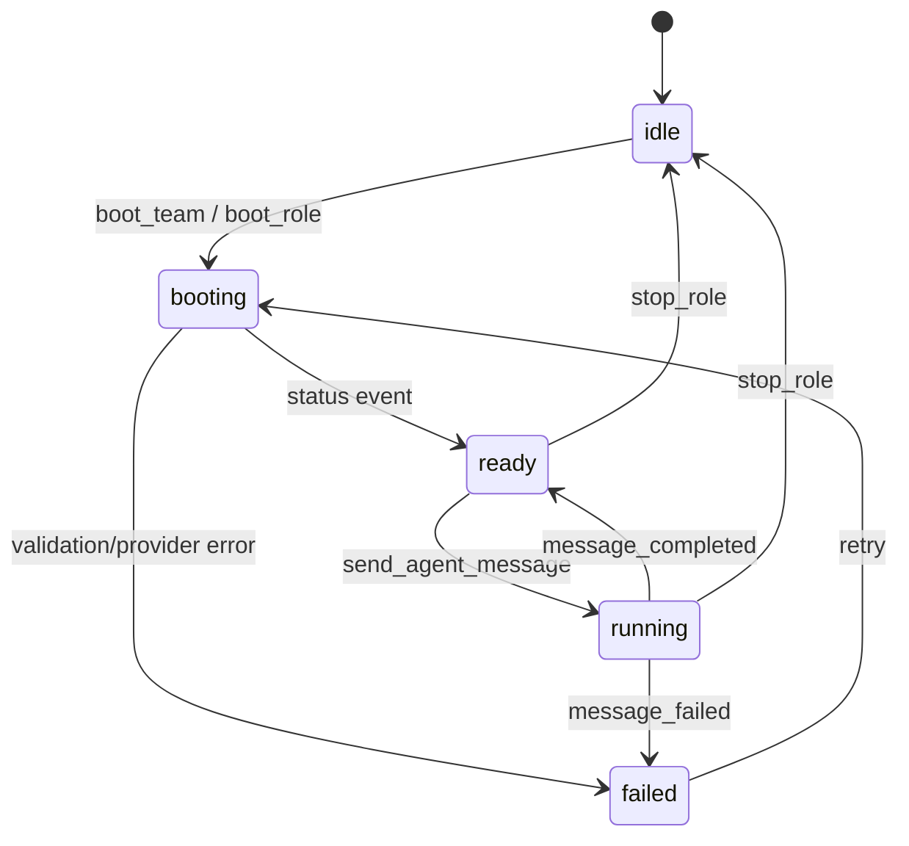

# DS-60 연동규격서 - Tauri IPC Vue/Rust 경계

## 개정이력

| 버전 | 일자 | 작성자 | 내용 |
|------|------|--------|------|
| v0.1 | 2026-06-23 | Architect | Tauri IPC invoke command 및 backend event 규격 최초 작성 |
| v0.2 | 2026-06-24 | Architect | `boot_team` 반환 sessions 배열에 PM 세션 포함 명시, `DocumentWriteResult` DTO를 실제 구현 기준으로 갱신 |
| v0.3 | 2026-06-24 | Architect | Redmine 이슈 단건 조회용 `redmine_get_issue` invoke command 추가 |
| v0.4 | 2026-06-24 | Architect | Redmine 목록/생성/수정 invoke command 추가, `DocumentWriteResult.last_updated` 제거 |
| v0.5 | 2026-07-02 | Architect | Browser history command/event와 Redmine `role?` 파라미터 추가 반영 |

---

## 1. 문서 개요

### 1.1 목적

본 문서는 AgiTeamBuilder GUI의 Vue 3 프론트엔드와 Rust 백엔드 사이의 Tauri IPC 연동 규격을 정의한다. 프론트엔드는 `invoke` command로 요청하고, Rust 백엔드는 장시간 처리/상태 변화/스트리밍 응답을 event로 emit한다.

### 1.2 입력 산출물

| 산출물 | 참조 내용 |
|--------|-----------|
| DS-20 아키텍처설계서 | Tauri IPC Bridge, Rust Service, Vue Pinia Store, Agent lifecycle |

### 1.3 연동 원칙

- Vue 컴포넌트는 `invoke`를 직접 호출하지 않고 `src/ipc/*.ts` wrapper를 사용한다.
- Rust command는 JSON 직렬화 가능한 DTO만 입력/출력한다.
- 장시간 작업은 command 응답으로 시작 수락만 반환하고 진행상황은 event로 전달한다.
- 모든 오류는 `AppError` 표준 구조로 반환한다.
- IPC command는 Tauri capability allowlist에 등록된 것만 호출 가능하다.

---

## 2. 공통 DTO

### 2.1 AppError

```ts
export type AppError = {
  code: string
  message: string
  detail?: unknown
  recoverable: boolean
}
```

### 2.2 CommandResult

```ts
export type CommandResult = {
  ok: boolean
  error?: AppError
}
```

### 2.3 AgentLifecycleState

```ts
export type AgentLifecycleState =
  | 'idle'
  | 'booting'
  | 'ready'
  | 'running'
  | 'failed'
```

### 2.4 주요 식별자

| 필드 | 타입 | 설명 |
|------|------|------|
| `workspace_id` | string | workspace 식별자 |
| `role` | string | PM, Architect, DeveloperBE 등 역할명 |
| `session_id` | string | AgentSession 식별자 |
| `message_id` | string | AgentMessage 식별자 |
| `provider` | string | `claude`, `openai`, `gemini`, `redmine` |

---

## 3. Invoke Command 규격

### 3.1 Workspace Commands

#### `open_workspace`

| 항목 | 값 |
|------|----|
| 설명 | 로컬 프로젝트 workspace를 연다 |
| Request | `{ "path": string }` |
| Response | `WorkspaceSummary` |

```ts
type WorkspaceSummary = {
  workspace_id: string
  path: string
  name: string
  display_name?: string
}
```

#### `load_workspace_config`

| 항목 | 값 |
|------|----|
| 설명 | `agiteam.json`, `project_state.yaml`을 로드한다 |
| Request | `{ "workspace_id": string }` |
| Response | `WorkspaceConfig` |

#### `validate_workspace`

| 항목 | 값 |
|------|----|
| 설명 | workspace 필수 구조와 persona 파일을 검증한다 |
| Request | `{ "workspace_id": string }` |
| Response | `ValidationReport` |

### 3.2 Agent Commands

#### `boot_team`

| 항목 | 값 |
|------|----|
| 설명 | 전체 역할의 agent session booting을 시작한다 |
| Request | `{ "workspace_id": string }` |
| Response | `BootTeamResult` |
| Events | `agent:status_changed`, `agent:message_failed` |

```ts
type BootTeamResult = {
  workspace_id: string
  sessions: AgentSessionSummary[]
}
```

`sessions` 배열은 PM 세션을 포함한다. 배열 순서는 고정이며, `sessions[0]`은 PM 세션, `sessions[1]`부터 `sessions[6]`까지는 `agiteam.json`의 team 배열 순서에 따른 역할 팀원 세션이다.

#### `boot_role`

| 항목 | 값 |
|------|----|
| 설명 | 단일 역할 agent session booting을 시작한다 |
| Request | `{ "workspace_id": string, "role": string }` |
| Response | `AgentSessionSummary` |
| Events | `agent:status_changed` |

#### `stop_role`

| 항목 | 값 |
|------|----|
| 설명 | 실행 중인 역할 세션을 중지하고 상태를 idle로 전이한다 |
| Request | `{ "session_id": string }` |
| Response | `CommandResult` |
| Events | `agent:status_changed` |

#### `send_agent_message`

| 항목 | 값 |
|------|----|
| 설명 | ready 상태의 agent session에 사용자 메시지를 전송한다 |
| Request | `{ "session_id": string, "content": string }` |
| Response | `MessageAck` |
| Events | `agent:status_changed`, `agent:message_started`, `agent:message_delta`, `agent:message_completed`, `agent:message_failed` |

```ts
type MessageAck = {
  session_id: string
  user_message_id: string
  accepted_at: string
}
```

#### `get_agent_session`

| 항목 | 값 |
|------|----|
| 설명 | 세션 상세 상태를 조회한다 |
| Request | `{ "session_id": string }` |
| Response | `AgentSessionDetail` |

#### `list_agent_messages`

| 항목 | 값 |
|------|----|
| 설명 | 세션 메시지 로그를 페이지 단위로 조회한다 |
| Request | `{ "session_id": string, "cursor"?: string, "limit"?: number }` |
| Response | `MessagePage` |

### 3.3 Persona Commands

#### `build_persona_bundle`

| 항목 | 값 |
|------|----|
| 설명 | Shared persona와 역할 persona를 조합해 bundle 미리보기를 생성한다 |
| Request | `{ "workspace_id": string, "role": string }` |
| Response | `PersonaBundlePreview` |

```ts
type PersonaBundlePreview = {
  role: string
  content_hash: string
  content: string
  source_files: string[]
}
```

### 3.4 Document Commands

#### `list_documents`

| 항목 | 값 |
|------|----|
| 설명 | workspace 문서 트리를 조회한다 |
| Request | `{ "workspace_id": string }` |
| Response | `DocumentTree` |

#### `read_document`

| 항목 | 값 |
|------|----|
| 설명 | workspace root 하위 문서를 읽는다 |
| Request | `{ "workspace_id": string, "path": string }` |
| Response | `DocumentContent` |

#### `write_latest_document`

| 항목 | 값 |
|------|----|
| 설명 | 기존 파일을 `_archive`에 백업한 뒤 `.latest.md`를 갱신한다 |
| Request | `{ "workspace_id": string, "path": string, "content": string }` |
| Response | `DocumentWriteResult` |
| Events | `document:changed` |

```ts
type DocumentWriteResult = {
  path: string
  archive_path?: string
  version_hint: string
}
```

`archive_path`는 기존 현행본이 있어 백업이 생성된 경우에만 반환한다. 신규 파일 작성처럼 백업 대상이 없으면 생략한다. `archived_at`와 `last_updated` 필드는 사용하지 않는다. `version_hint`는 문서 frontmatter 또는 저장 정책 기준으로 산출한 다음 참고 버전 라벨이다.

### 3.5 Credential Commands

#### `save_credential`

| 항목 | 값 |
|------|----|
| 설명 | provider credential을 OS vault에 저장한다 |
| Request | `{ "provider": string, "account": string, "secret": string }` |
| Response | `CredentialRef` |

#### `delete_credential`

| 항목 | 값 |
|------|----|
| 설명 | provider credential을 삭제한다 |
| Request | `{ "provider": string, "account": string }` |
| Response | `CommandResult` |

#### `validate_credential`

| 항목 | 값 |
|------|----|
| 설명 | provider credential 유효성을 검증한다 |
| Request | `{ "provider": string, "account": string }` |
| Response | `ProviderHealth` |
| Events | `credential:validated` |

### 3.6 Health Commands

#### `run_health_check`

| 항목 | 값 |
|------|----|
| 설명 | workspace 구조, provider credential, network 상태를 점검한다 |
| Request | `{ "workspace_id": string }` |
| Response | `HealthCheckReport` |
| Events | `health:completed` |

### 3.7 Redmine Commands

#### `redmine_get_issue`

| 항목 | 값 |
|------|----|
| 타입 | invoke |
| 설명 | Redmine 이슈 단건을 조회한다 |
| Request | `{ "workspace_id": string, "issue_id": number, "role"?: string }` |
| Response | `RedmineIssue` |

```ts
type RedmineIssue = {
  id: number
  subject: string
  status_id: number
  done_ratio: number
  description: string
  assigned_to_id?: number
}
```

#### `redmine_list_issues`

| 항목 | 값 |
|------|----|
| 타입 | invoke |
| 설명 | Redmine 프로젝트 이슈 목록을 조회한다 |
| Request | `{ "workspace_id": string, "project_id"?: string, "status_id"?: string, "role"?: string }` |
| Response | `RedmineIssue[]` |

#### `redmine_create_issue`

| 항목 | 값 |
|------|----|
| 타입 | invoke |
| 설명 | Redmine 이슈를 생성한다 |
| Request | `{ "workspace_id": string, "project_id": string, "tracker_id": number, "subject": string, "description"?: string, "assigned_to_id"?: number, "role"?: string }` |
| Response | `RedmineIssue` |

#### `redmine_update_issue`

| 항목 | 값 |
|------|----|
| 타입 | invoke |
| 설명 | Redmine 이슈 상태, 진척률, 코멘트를 수정한다 |
| Request | `{ "workspace_id": string, "issue_id": number, "status_id"?: number, "done_ratio"?: number, "notes"?: string, "role"?: string }` |
| Response | `void` |

`role`이 지정되면 Rust backend는 OS Credential Vault에서 `redmine/api_key_${role}`를 먼저 조회한다. 역할별 key가 없거나 `role`이 생략되면 하위 호환을 위해 `redmine/api_key`를 fallback으로 조회한다.

### 3.8 Browser Commands

#### `browser_open`

| 항목 | 값 |
|------|----|
| 타입 | invoke |
| 설명 | 임베디드 `embedded-browser` WebviewWindow를 생성한다. 기존 창이 있으면 닫고 재생성한다 |
| Request | `{ "url": string, "x": number, "y": number, "width": number, "height": number }` |
| Response | `void` |
| Events | `browser:navigation` |

#### `browser_navigate`

| 항목 | 값 |
|------|----|
| 타입 | invoke |
| 설명 | 열린 `embedded-browser` 창에서 지정 URL로 이동한다 |
| Request | `{ "url": string }` |
| Response | `void` |
| Events | `browser:navigation` |

#### `browser_back`

| 항목 | 값 |
|------|----|
| 타입 | invoke |
| 설명 | 열린 `embedded-browser` 창에서 `history.back()`을 실행한다 |
| Request | `{}` |
| Response | `void` |
| Events | `browser:navigation` |

#### `browser_forward`

| 항목 | 값 |
|------|----|
| 타입 | invoke |
| 설명 | 열린 `embedded-browser` 창에서 `history.forward()`를 실행한다 |
| Request | `{}` |
| Response | `void` |
| Events | `browser:navigation` |

#### `browser_close`

| 항목 | 값 |
|------|----|
| 타입 | invoke |
| 설명 | `embedded-browser` 창을 닫는다 |
| Request | `{}` |
| Response | `void` |

#### `browser_resize`

| 항목 | 값 |
|------|----|
| 타입 | invoke |
| 설명 | main 창 기준 논리 좌표로 `embedded-browser` 위치와 크기를 동기화한다 |
| Request | `{ "x": number, "y": number, "width": number, "height": number }` |
| Response | `void` |

---

## 4. Backend Event 규격

### 4.1 Event 목록

| Event | Payload | 구독 Store |
|-------|---------|------------|
| `workspace:opened` | `WorkspaceSummary` | `useWorkspaceStore` |
| `workspace:validation_failed` | `ValidationReport` | `useWorkspaceStore`, `useHealthStore` |
| `agent:status_changed` | `AgentStatusChanged` | `useSessionStore` |
| `agent:message_started` | `AgentMessageStarted` | `useSessionStore` |
| `agent:message_delta` | `AgentMessageDelta` | `useSessionStore` |
| `agent:message_completed` | `AgentMessageCompleted` | `useSessionStore` |
| `agent:message_failed` | `AgentMessageFailed` | `useSessionStore`, `useHealthStore` |
| `agent:tool_requested` | `AgentToolRequested` | `useSessionStore` |
| `document:changed` | `DocumentChanged` | `useDocumentStore` |
| `credential:validated` | `CredentialValidated` | `useCredentialStore` |
| `health:completed` | `HealthCheckReport` | `useHealthStore` |
| `browser:navigation` | `string` | `useBrowserStore` |

### 4.2 Event Payload

```ts
type AgentStatusChanged = {
  session_id: string
  role: string
  from: AgentLifecycleState
  to: AgentLifecycleState
  reason?: string
  changed_at: string
}

type AgentMessageDelta = {
  session_id: string
  message_id: string
  delta: string
  sequence: number
}

type AgentMessageCompleted = {
  session_id: string
  message_id: string
  usage?: {
    input_tokens?: number
    output_tokens?: number
    total_tokens?: number
  }
  completed_at: string
}

type AgentMessageFailed = {
  session_id: string
  message_id?: string
  error: AppError
}

type BrowserNavigation = string
```

### 4.3 Event 처리 규칙

- `agent:message_delta`는 `sequence` 기준으로 순서 보정한다.
- `agent:message_completed` 수신 전까지 assistant message는 streaming 상태로 표시한다.
- `agent:message_failed` 발생 시 해당 세션 상태는 `failed`로 전이한다.
- `document:changed` 발생 시 문서 트리와 preview를 재조회한다.
- credential 관련 event는 secret을 포함하지 않는다.
- `browser:navigation` 발생 시 payload URL을 브라우저 store의 현재 URL과 주소창 값에 반영한다.

---

## 5. 상태 전이 연동

### 5.1 Agent Lifecycle



### 5.2 UI 제어 규칙

| 상태 | MessageComposer | Stop Button | Retry Button |
|------|-----------------|-------------|--------------|
| `idle` | disabled | disabled | disabled |
| `booting` | disabled | enabled | disabled |
| `ready` | enabled | enabled | disabled |
| `running` | disabled | enabled | disabled |
| `failed` | disabled | disabled | enabled |

---

## 6. TypeScript IPC Wrapper 구조

```text
src/
  ipc/
    workspace.ts
    agent.ts
    persona.ts
    document.ts
    credential.ts
    health.ts
    events.ts
    types.ts
```

### 6.1 호출 예시

```ts
import { invoke } from '@tauri-apps/api/core'

export async function sendAgentMessage(sessionId: string, content: string) {
  return invoke<MessageAck>('send_agent_message', {
    sessionId,
    content,
  })
}
```

### 6.2 이벤트 등록 예시

```ts
import { listen } from '@tauri-apps/api/event'
import { useSessionStore } from '@/stores/session'

export async function registerAgentEvents() {
  const sessionStore = useSessionStore()

  const unlistenStatus = await listen<AgentStatusChanged>(
    'agent:status_changed',
    event => sessionStore.applyStatusChanged(event.payload),
  )

  const unlistenDelta = await listen<AgentMessageDelta>(
    'agent:message_delta',
    event => sessionStore.appendMessageDelta(event.payload),
  )

  return () => {
    unlistenStatus()
    unlistenDelta()
  }
}
```

---

## 7. 보안 및 Capability

### 7.1 Capability 원칙

| 영역 | 정책 |
|------|------|
| Command 호출 | allowlist에 등록된 command만 허용 |
| 파일 접근 | Rust command 내부에서 workspace root 하위 경로만 허용 |
| Credential | secret은 Rust backend와 OS vault 사이에서만 이동 |
| Event payload | API key/token/Authorization header 포함 금지 |
| 외부 API | Vue에서 직접 호출 금지. Rust provider adapter만 호출 |

### 7.2 Command 권한 그룹

| Capability | Commands |
|------------|----------|
| `workspace` | `open_workspace`, `load_workspace_config`, `validate_workspace` |
| `agent` | `boot_team`, `boot_role`, `stop_role`, `send_agent_message`, `get_agent_session`, `list_agent_messages` |
| `document` | `list_documents`, `read_document`, `write_latest_document` |
| `credential` | `save_credential`, `delete_credential`, `validate_credential` |
| `health` | `run_health_check` |
| `redmine` | `redmine_get_issue`, `redmine_list_issues`, `redmine_create_issue`, `redmine_update_issue` |
| `browser` | `browser_open`, `browser_navigate`, `browser_back`, `browser_forward`, `browser_close`, `browser_resize` |

---

## 8. 오류 코드

| 코드 | 의미 | UI 처리 |
|------|------|---------|
| `WORKSPACE_NOT_FOUND` | workspace 경로 없음 | 경로 재선택 |
| `CONFIG_INVALID` | 설정 schema 오류 | 검증 결과 표시 |
| `PERSONA_NOT_FOUND` | 역할 persona 파일 없음 | 누락 파일 표시 |
| `CREDENTIAL_MISSING` | credential 없음 | 설정 화면 이동 |
| `AUTH_FAILED` | provider 인증 실패 | credential 재입력 |
| `PROVIDER_UNREACHABLE` | provider endpoint 도달 불가 | 네트워크 안내 |
| `SESSION_NOT_READY` | ready 이전 메시지 전송 | 상태 갱신 후 재시도 |
| `STREAM_INTERRUPTED` | streaming 중단 | 재시도 버튼 표시 |
| `DOCUMENT_WRITE_FAILED` | 문서 백업/쓰기 실패 | 오류 상세 표시 |

---

## 9. 후속 문서 연계

| 산출물 | 반영 필요 |
|--------|-----------|
| DS-40 API명세서 | Provider streaming 결과와 오류 모델 정합성 유지 |
| DS-50 화면설계서 | 상태별 버튼/패널/로그 표시 규칙 반영 |
| DS-30 DB설계서 | session, message, credential ref, health result 저장 모델 반영 |
| TS-05 시험계획서 | invoke command, event ordering, error handling 테스트 케이스 작성 |
